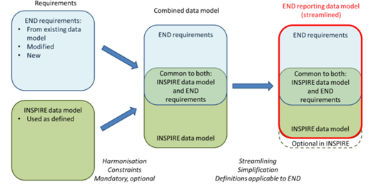
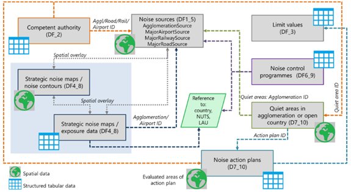

Achtergrond richtlijnen
=======================

Inleiding 
--------------

De richtlijn omgevingslawaai 2002/49/ EG (END) definieert
rapportageverplichtingen voor de beoordeling en beheersing van omgevingslawaai.
Met de introductie van de nieuwe ‘Verordening 2019/1010 van de Europese Unie
(EU) [3] moeten de lidstaten de gegevens ter beschikking stellen zoals vereist
op grond van de END-richtlijn en volgens, in overeenstemming met de
INSPIRE-uitvoeringsbepalingen zoals verwoord in de INSPIRE-richtlijn 2007/2/EG
(zie [Richtlijn INSPIRE](VERWIJZING)). Het huidige rapportagemechanisme waarin
de lidstaten gegevens aanleveren, is niet in overeenstemming met de
INSPIRE-richtlijn. Daarom is door het Europees Milieuagentschap een nieuw
datamodel ontwikkeld dat voldoet aan zowel de END- als de INSPIRE-vereisten.

Dit hoofdstuk geeft een korte toelichting over de richtlijn omgevingslawaai, de
INSPIRE-richtlijn en geeft een overzicht van het nieuwe datamodel dat is
ontwikkeld voor de richtlijn omgevingslawaai om te voldoen aan de vereisten
volgens de INSPIRE-richtlijn en de daarbij behorende [INSPIRE
dataspecificaties](VERWIJZING). In [2.3](VERWIJZING) en [2.4](VERWIJZING) worden
de richtlijn omgevingslawaai (END) en richtlijn INSPIRE toegelicht. In
[2.5](VERWIJZING) staat het nieuwe datamodel dat voor de richtlijn
omgevingslawaai (END) ontwikkeld is beschreven. Paragraaf [2.6]((VERWIJZING)
bevat een mapping van ruimtelijke data uit het END Datamodel op INSPIRE
ruimtelijke thema's.

Naam en Acroniemen
----------------------

**END** - Environmental Noise Directive: dit is de richtlijn inzake de evaluatie
en beheersing van omgevingslawaai. (richtlijn omgevingslawaai)

**INSPIRE** - INfrastructure for SPatial InfoRmation in Europe: dit is de
richtlijn tot oprichting van een infrastructuur voor ruimtelijke informatie in
de Gemeenschap. (Inspire)

Richtlijn omgevingslawaai
-----------------------------

Het doel van de richtlijn omgevingslawaai is: “een gemeenschappelijke aanpak te
bepalen om op basis van prioriteiten de schadelijke gevolgen en hinder van
blootstelling aan omgevingslawaai te vermijden, te voorkomen of te verminderen
”. Om dat te bereiken, moet het niveau van geluidhinder vastgesteld worden en de
nodige maatregelen getroffen worden, zowel op lidstaat- als EU-niveau.

Het nieuwe END-Datamodel is ontwikkeld om de rapportage door de lidstaten in een
gemeenschappelijk formaat te vergemakkelijken en ervoor te zorgen dat zowel aan
de rapportagevereisten van het END als aan INSPIRE wordt voldaan.

De richtlijn omgevingslawaai is van toepassing op geluid waaraan mensen worden
blootgesteld, met name in de bebouwde kom, in openbare parken of andere stille
gebieden in een agglomeratie, in stille gebieden in het open gebied, in de buurt
van scholen, ziekenhuizen en andere geluidgevoelige gebouwen en gebieden.

Het is niet van toepassing op geluid dat wordt veroorzaakt door de blootgestelde
persoon zelf, geluid van huishoudelijke activiteiten, geluid van buren, geluid
op werkplekken, of geluid binnen vervoermiddelen of door militaire activiteiten
in militaire gebieden.

De richtlijn omgevingslawaai bevat verschillende bepalingen die de lidstaten
verplichten om informatie aan de Europese Commissie (EC) te verstrekken over
o.a. de voorbereiding en publicatie van strategische geluidbelastingkaarten en
actieplannen voor geluidbeheer voor:

-   Alle wegen, spoorwegen, luchthavens en industrieterreinen binnen
    agglomeraties met meer dan 100.000 inwoners

-   Belangrijke wegen (meer dan 3 miljoen voertuigen per jaar)

-   Belangrijke spoorwegen (meer dan 30.000 treinen per jaar)

-   Belangrijke luchthavens (meer dan 50.000 bewegingen handelsverkeer per
    jaar).

Om de gestelde doelen uit de richtlijn omgevingslawaai na te streven, richt de
END zich in het bijzonder op het bepalen van de blootstelling aan
omgevingslawaai, het waarborgen van informatie over omgevingslawaai en de
effecten ervan voor het publiek, het voorkomen en verminderen van
omgevingslawaai waar nodig, en het behouden van de kwaliteit van het
omgevingslawaai waar het goed is.

Richtlijn INSPIRE
----------------------

Met de komst van ‘INfrastructure for SPatial Information in Europe’ (INSPIRE) in
2007 wordt op Europees niveau gewerkt aan de beschikbaarheid en
uitwisselbaarheid van geo-informatie voor het sneller en beter ondersteunen van
milieuvraagstukken. De Europese richtlijn INSPIRE leidt tot een Europese
geo-informatie infrastructuur welke onder andere bijdraagt aan verbeterde
informatievoorziening in grens overstijgende beleids- en
dienstverleningsprocessen.

INSPIRE verplicht de Europese lidstaten om ruimtelijke gegevens over 34 thema’s
digitaal vindbaar, bruikbaar en uitwisselbaar te maken. Om dit mogelijk te maken
worden de datasets en diensten gestandaardiseerd en voorzien van metadata. Voor
de vindbaarheid van de gegevens realiseren de Commissie en de lidstaten een
netwerk dat bestaat uit een [Europees INSPIRE Geoportal](VERWIJZING) dat
verbonden is met nationale portalen met netwerkdiensten. In Nederland is het
[Nationaal Georegister](VERWIJZING) (NGR) het nationale portaal.

In 2017 heeft de Europese Commissie een fitness check afgerond over
Environmental Monitoring en Reporting. Daarbij is de INSPIRE-richtlijn
aangewezen als instrument met een groot potentieel om het rapportageproces over
milieurichtlijnen te stroomlijnen. Vanuit INSPIRE is vervolgens aan de lidstaten
gevraagd om ervoor te zorgen dat voor e-reporting relevante datasets via INSPIRE
beschikbaar komen. De Europese Commissie heeft samen met de EEA een lijst
opgesteld van prioritaire datasets rondom e-reporting. De lijst bevat o.a. de
ruimtelijke data met betrekking tot en gerapporteerd onder de richtlijn
omgevingslawaai.

### Wat zijn INSPIRE-verplichtingen?

De INSPIRE-dataproviders moeten ervoor zorgen dat de ruimtelijke gegevens
(dataset) van de juiste beschrijvingen zijn voorzien (metadata), dat ze conform
de INSPIRE datamodellen (geharmoniseerd) beschikbaar zijn en dat ze als
netwerkservice worden ontsloten.

#### Metadata

Elke dataset en netwerkservice dient te worden voorzien van metadata waarmee de
dataset c.q. netwerkservice wordt beschreven. Deze metadata wordt gepubliceerd
in het nationale portaal, het NGR. INSPIRE heeft [juridisch bindende
eisen](VERWIJZING) die aan de inhoud en structuur van de metadata worden
gesteld. In Nederland zijn deze INSPIRE vereisten voor metadata verwerkt in de
[Nederlandse metadataprofielen voor data en services](VERWIJZING).

#### Netwerkservices

De netwerkservices dienen voor de ontsluiting van de INSPIRE-datasets. Er dienen
minimaal twee netwerkservices beschikbaar te komen voor de INSPIRE-datasets:

-   Een Viewservice, waarmee de gegevens op een kaart op het web kunnen worden
    getoond.

-   Een Downloadservice, waarmee de gegevens via het web zijn uit te wisselen.

Er zijn verschillende typen view- en downloadservices mogelijk, afhankelijk van
de data en de voorkeuren van de dataprovider. Aanvullend op de internationale
OGC-standaarden voor deze services, zijn er vanuit INSPIRE specifieke juridisch
bindende vereisten waaraan deze services moeten voldoen. Deze vereisten zijn
uitgewerkt in [technische specificaties](VERWIJZING), waarmee deze vereisten
geïmplementeerd kunnen worden. In Nederland is afgesproken dat de dataproviders
services implementeren, in overeenstemming met deze technische specificaties.

### INSPIRE datamodellen over inhoud en uitwisseling van data

Voor alle 34 INSPIRE thema’s is in juridisch bindende vereisten vastgelegd,
welke data op welke wijze moeten worden uitgewisseld. Voor elk thema is een
bindend datamodel opgesteld met objecten (featuretypes), attributen, datatypes,
waarde lijsten etc. Daarnaast zijn er bindende afspraken over het formaat waarin
uitgewisseld wordt, de encoding1 en het te gebruiken coördinaat referentie
systeem. Ook zijn de laagnamen en stijlen voor de verbeelding in de viewservice
vastgelegd.

Er zijn ook afspraken over identifier management, de manier waarop geometrie kan
worden vastgelegd en hoe er wordt omgegaan met tijdelijkheid. Ook zijn er
aanwijzingen over thema specifieke metadata. In de 34
[dataspecificaties](VERWIJZING) is uitgewerkt hoe deze vereisten geïmplementeerd
kunnen worden. In Nederland is afgesproken dat de dataproviders de data
harmoniseren volgens, in overeenstemming met deze technische specificaties.

Algemene Termen en definities
---------------------------------

Lijst van termen en definities die in deze beschrijving worden gehanteerd,
gesorteerd op alfabetische volgorde. Verder aanvullend hierop wordt de
terminologie van het [MIM]( <https://docs.geostandaarden.nl/mim/mim/>) en
[IMGeluid](https://docs.geostandaarden.nl/cvgg/img/) gevolgd.

| **Term**                                                        | **Definitie**                                                                                                                                                                                                                                                                                                                                                                                                                                                                                                                                       |
|-----------------------------------------------------------------|-----------------------------------------------------------------------------------------------------------------------------------------------------------------------------------------------------------------------------------------------------------------------------------------------------------------------------------------------------------------------------------------------------------------------------------------------------------------------------------------------------------------------------------------------------|
| **Agglomeratie (Agglomeration)**                                | Deel van een grondgebied, afgebakend door de lidstaat, met een bevolking van meer dan 100.000 personen en een bevolkingsdichtheid zodanig dat de lidstaat het als een verstedelijkt gebied beschouwt [END]. De Nederlandse Agglomeraties zijn in de Omgevingsregeling aangewezen.                                                                                                                                                                                                                                                                   |
| **Omgevingslawaai (Environmental noise)**                       | Ongewenst of schadelijk buitengeluid veroorzaakt door menselijke activiteiten, met inbegrip van geluid afkomstig van transportmiddelen, wegverkeer, treinverkeer, luchtverkeer en van locaties van industriële activiteit zoals gedefinieerd in bijlage I bij Richtlijn 96/61/ EG van de Raad van 24 September 1996 betreffende geïntegreerde preventie en bestrijding van verontreiniging [END].                                                                                                                                                   |
| **Data flows**                                                  | Datastromen gerapporteerd door EEA-leden en samenwerkende landen                                                                                                                                                                                                                                                                                                                                                                                                                                                                                    |
| **Eurostat**                                                    | Het statistiekbureau van de Europese Unie. https://ec.europa.eu/eurostat                                                                                                                                                                                                                                                                                                                                                                                                                                                                            |
| **Belangrijke luchthavens (Major airport)**                     | Een door de lidstaat aangewezen burgerluchthaven met meer dan 50.000 bewegingen per jaar (een beweging zijnde een start of een landing), exclusief die voor trainingsdoeleinden op lichte vliegtuigen [END].                                                                                                                                                                                                                                                                                                                                        |
| **Belangrijke spoorwegen (Major railway)**                      | Een spoorweg, aangewezen door de lidstaat, die meer dan 30.000 treinpassages per jaar heeft [END].                                                                                                                                                                                                                                                                                                                                                                                                                                                  |
| **Belangrijke wegen (Major road)**                              | Een door de lidstaat aangewezen regionale, nationale of internationale weg waarop jaarlijks meer dan drie miljoen voertuigen passeren [END].                                                                                                                                                                                                                                                                                                                                                                                                        |
| **Geluidactieplan (Noise action plan**                          | Een plan om geluidproblemen en -effecten te beheersen, inclusief geluidreductie indien nodig [END]. In de END-scope kunnen geluidactieplannen verwijzen naar geïdentificeerde grote geluidbronnen, agglomeraties, stille gebieden of andere specifieke geluidsituaties. De verwijzing wordt geleverd door object-ID's of rechtstreeks als ruimtelijke gegevens.                                                                                                                                                                                     |
| **Stil gebied in agglomeratie(Quiet area in an agglomeration)** | Een gebied, afgebakend door de bevoegde instantie, bijvoorbeeld dat niet wordt blootgesteld aan een waarde van Lden of van een andere geschikte geluidbelasting indicator die hoger is dan een bepaalde waarde die door de lidstaat is vastgesteld, afkomstig van enige geluidbron [END].                                                                                                                                                                                                                                                           |
| **Stil gebied in buitengebied (Quiet area in open country)**    | Een door het bestuursorgaan afgebakend gebied dat niet wordt gestoord door verkeerslawaai, industrie of recreatie [END].                                                                                                                                                                                                                                                                                                                                                                                                                            |
| **Strategische geluidkaart (Strategic noise map)**              | Een kaart die is ontworpen voor de algemene beoordeling van de blootstelling aan lawaai in een bepaald gebied als gevolg van verschillende geluidbronnen of voor algemene voorspellingen voor een dergelijk gebied [END].                                                                                                                                                                                                                                                                                                                           |
| **Geluid contourkaart (Noise contour map)**                     | Presenteert de gegevens over een bestaande of voorspelde geluidsituatie in termen van een geluidbelasting indicator, met vermelding van overschrijding van een relevante geldende grenswaarde, het aantal getroffen mensen in een bepaald gebied of het aantal woningen dat wordt blootgesteld aan bepaalde waarden van een geluidbelasting indicator in een bepaald gebied. Geluidcontouren maken deel uit van de strategische geluidbelastingkaarten. In de END-scope kunnen geluidcontourkaarten worden gepresenteerd als gebieden of isolijnen. |
| **Bevoegde instantie (Competent authority)**                    | Organisatie(s) verantwoordelijk voor het beheren, beperken of reguleren van maatregelen of activiteiten met betrekking tot omgevingslawaai binnen aangewezen agglomeraties, volgens de definitie in de INSPIRE ' Implementing Rules on Interoperability' [END].                                                                                                                                                                                                                                                                                     |
| **Voidable**                                                    | Voor een attribuut- of associatierol kan de waarde ‘void’ ingevuld worden als er geen overeenkomstige waarde is opgenomen in de dataset die door de lidstaten worden bijgehouden of als er geen overeenkomstige waarde kan worden afgeleid uit bestaande waarden tegen redelijke kosten. Als een attribuut- of associatierol niet voidable is, wordt de tabelcel die de voidability specificeert leeg gelaten [INSPIRE].                                                                                                                            |

2.7 Algemene Symbolen en afkortingen
------------------------------------

| **Afkortingen**       | **Betekenissen**                                 |
|-----------------------|--------------------------------------------------|
| **AM**                | Area Management                                  |
| **CMGeluidbelasting** | Conceptueel Model Geluidbelasting                |
| **DF**                | Data flow                                        |
| **EEA**               | European Environment Agency                      |
| **END**               | Environmental Noise Directive                    |
| **HH**                | Human Health                                     |
| **IATA**              | International Air Transport Association          |
| **ICAO**              | The International Civil Aviation Organization    |
| **LAU**               | Lokale administratieve eenheden                  |
| **LBE**               | Lokale bestuurlijke eenheden                     |
| **MS**                | Member State                                     |
| **NAP**               | Noise Action Plan                                |
| **NUTS**              | Nomenclature of Territorial Units for Statistics |
| **TN**                | Transport networks                               |

END-Datamodel 
================

HET nieuwe END-Datamodel
----------------------------

Het END-Datamodel is ontwikkeld om te voldoen aan de rapportageverplichtingen
die in de END richtlijn zijn gespecificeerd. Het is ontwikkeld om de rapportage
door de lidstaten in een gemeenschappelijk formaat te vergemakkelijken.
Tegelijkertijd verwijzen verschillende INSPIRE-thema’s naar use-cases rondom
omgevingslawaai, waaronder de rapportage in kader van de END. Daarom zijn
verschillende overwegingen in acht genomen bij de ontwikkeling van het nieuwe
END-datamodel:

-   Om te zorgen voor overeenstemming met beide richtlijnen, betreffende de
    END-rapportagecycli en de volledige implementatie-routekaart van de
    INSPIRE-richtlijn,

-   Om een meervoudige verstrekking van ruimtelijke gegevens op grond van de
    END- en INSPIRE-richtlijn te voorkomen of op zijn minst te minimaliseren en
    zorgen voor een beter gebruik van nationale infrastructuur voor ruimtelijke
    informatie,

-   Om de harmonisatie en het hergebruik van gegevens te vergroten, fragmentatie
    van gegevensstromen te verminderen,

-   En om nieuwe functionaliteiten van het Reportnet 3.0-platform volledig te
    benutten, zoals een mogelijkheid voor rapportage op regionaal niveau of voor
    gegevensverzameling, bijvoorbeeld door gebruik te maken van
    INSPIRE-netwerkdiensten (nog in ontwikkeling).

De scope van het END-datamodel betreft een reeks gegevens die op grond van de
END aan de Europese Commissie moeten worden gerapporteerd. Tegelijkertijd omvat
het datamodelmodel ruimtelijke data die conceptueel overeenkomen met diverse
INSPIRE-thema’s.

Daarom is om te komen tot het nieuwe END-datamodel het eerdere END-datamodel en
rapportagemechanisme gebruikt als uitgangspunt voor de gegevensmodellering en
als bron van definities van de END-specifieke gegevensvereisten. De
INSPIRE-dataspecificaties zijn gebruikt als bron van een gemeenschappelijke
methodologie voor datamodellering en definities van INSPIRE-concepten.

<figure id="Figuur_1">

<figcaption>Proces van content matching tussen END en INSPIRE om END informatiemodel te ontwikkelen</figcaption>
</figure>

3.2 END datamodel rapportage overzicht
--------------------------------------

Het nieuwe END-informatiemodel omvat voor elke rapportageverplichting een apart
informatiemodel. De informatiemodellen, die ruimtelijke informatie bevatten,
zijn een combinatie van de INSPIRE-datamodellen en de specifieke END-vereisten.
Daarnaast zijn enkele andere modelconcepten, o.a. uit de
INSPIRE-dataspecificaties, gebruikt in verschillende informatiemodellen, zoals
bijvoorbeeld identificatoren, geharmoniseerde datatypen of voorgestelde
alternatieve vereenvoudigde gegevenstypen.

Een schematisch overzicht van het volledige END-datamodel (zie figuur 2) geeft
het gebruik en de combinatie van ruimtelijke data en de gestructureerde
tabelgegevens aan met basisrelaties tussen individuele datamodellen (en de
rapportage gegevensstromen).

<figure id="Figuur_2">

<figcaption>Combinatie van data flows in het END-informatiemodel [4]</figcaption>
</figure>

Het END-Datamodel omvat alle rapportageverplichtingen op grond van de END. In
het model zijn al deze verplichtingen aangemerkt als domeinen. Ieder domein
heeft een eigen UML-diagram (UML: Unified Modeling Language). Een UML-diagram
voor een specifiek domein noemen we een domeinmodel.

De volgende domeinenmodellen zijn gedefinieerd:

-   Geluidbronnen (DF1_5): hoofdwegen, grote spoorwegen, grote luchthavens en
    agglomeraties, zoals gedefinieerd in de END;

-   Bevoegde instantie (DF2): informatie over bevoegde autoriteiten, en/of
    andere instanties die verantwoordelijk zijn voor de uitvoering van de
    richtlijn omgevingslawaai;

-   Grenswaarden (DF3): bepaling van eventuele nationale of lokale grenswaarden
    voor geluid;

-   Strategische geluidbelastingkaart (DF4_8): met informatie over:

-   Gegevens over blootstelling aan lawaai: geschat aantal mensen dat in
    gebieden woont die de END-geluidrapportagedrempels overschrijden;

-   Geluidcontouren: geven de ruimtelijke omvang van de geluidniveaus weer voor
    verschillende geluidbelasting indicatoren;

-   Lawaaibeheersing programma’s (DF6_9): informatie over
    geluidbeheersingsprogramma's die in het verleden zijn uitgevoerd en
    getroffen geluidmaatregelen

-   Geluid actieplannen en Stille gebieden (DF7_10): informatie over

-   Actieplannen om geluidproblemen en de gevolgen daarvan te verminderen en te
    beheersen;

-   Bescherming en behoud van stille gebieden in agglomeraties of in open
    gebied.

De domeinmodellen zijn met elkaar verbonden en maken het mogelijk om de data uit
de verschillende rapportageverplichtingen te combineren.

Voor de *geluidbronnen* (DF1_5) moet de ligging van wegen, spoorwegen,
luchthavens en agglomeraties van elk land in geografisch formaat worden
gerapporteerd, inclusief een aantal akoestische eigenschappen die invloed hebben
op de totale geluidproductie. Van alle akoestische eigenschappen moet
uitsluitend de jaarlijkse verkeersstroom in DF1_5 worden gerapporteerd. Voor
wegverkeer behoren verkeerssamenstelling, snelheden en wegdeksoort daar niet toe
en voor spoorwegen en luchthavens geldt iets soortgelijks. Het verschil tussen
de geluidbronnen (DF1_5) en de geluidgegevens met betrekking tot monitoring in
IMGeluid is uitgelegd in [1.4](VERWIJZING).

Voor de rapportage van bevoegde instanties (DF_2) zijn geen ruimtelijke gegevens
nodig. De bevoegde instanties van wegen en spoorwegen, die verantwoordelijk zijn
voor de geluidbelastingkaarten en/of de actieplanning, kunnen worden
gerapporteerd op landniveau of op weg-/ spoorsegmentniveau[\^2VERWIJZING] (door
middel van identificatoren). Bevoegde instanties van grote luchthavens moeten
worden geïdentificeerd met behulp van ICAO-codes en bevoegde instantie van
agglomeraties met behulp van agglomeratie-identificatoren. Bevoegde instantie
die belast is met de bescherming van stille gebieden mag optioneel worden
aangeleverd, maar het wordt aanbevolen om dit te rapporteren door stilte
gebiedsidentificaties te gebruiken.

[\^2VERWIJZING]: De segmenten van hoofdwegen en spoorwegen zijn ontworpen om te
voldoen aan de END-criteria van de jaarlijkse verkeersstroom.

De grenswaarden van een land of een gedefinieerde rapporteringsregio (DF3)
vereisen geen ruimtelijke informatie. De grenswaarden kunnen op landenniveau
gerapporteerd worden en het is mogelijk om deze grenswaarden apart voor elke
geluidbron of gezamenlijk voor alle bronnen te rapporteren.

De strategische geluidbelastingkaarten (DF4_8) bestaan uit twee soorten
gegevens. De geluidcontouren worden aangeleverd als ruimtelijke data en dienen
aangeleverd te worden met een gesloten lijngeometrie of een polygoon. De
gegevens over de blootstelling van de bevolking aan een verhoogd geluidniveau,
zijn gekoppeld aan ruimtelijke eenheden en kunnen op verschillende
rapportageniveaus worden verstrekt: voor hoofdwegen en spoorwegen kan worden
gerapporteerd op landniveau of met behulp van kleinere territoriale eenheden.
Voor grote luchthavens moeten de gegevens worden gerapporteerd door middel van
de ICAO-code met de mogelijkheid om de blootstelling van de bevolking op lokale
administratieve eenheden (LAU)-niveau weer te geven. De informatie over de
blootstelling van de bevolking binnen agglomeraties voor wegen, spoorwegen,
industrie, hoofdwegen binnen een agglomeratie of grote spoorwegen binnen een
agglomeratie, kan worden gerapporteerd op agglomeratieniveau of door middel van
gebruikmaking van LAU-eenheden. De blootstelling van de bevolking voor
luchthavens of grote luchthavens binnen agglomeraties, kan op agglomeratieniveau
of op LBE-niveau worden gerapporteerd, samen met de respectieve ICAO-code
wanneer informatie over grote luchthavens wordt gerapporteerd.

Lawaaibeheersing programma’s (DF6_9) vereisen geen ruimtelijke gegevens en
kunnen via verschillende rapportageniveaus worden ingediend.

De geluid actieplannen (DF7_10) vereisen de rapportage van ruimtelijke
informatie in de vorm van een polygoon. De informatie van het actieplan moet
worden ingevuld voor elke polygoon of multipolygoon waarvoor het actieplan wordt
opgesteld. Voor grote luchthavens is de ICAO-code ook vereist. Voor belangrijke
wegen en belangrijke spoorwegen is dit een polygoon van Nederland. Voor Schiphol
zou dat misschien ook de meest logische keuze zijn als de koppeling met de
ICAO-code dan kan worden gemaakt.

Stille gebieden zijn opgenomen in de gegevensrapportage DF7_10 en vereisen
rapportage van een polygoon van het gebied dat wordt beschermd tegen
omgevingslawaai. Op nationaal niveau bestaan er twee verschillende stille
gebieden. Dit zijn stille gebieden binnen agglomeraties en stille gebieden in
open gebied. Voor stille gebieden binnen agglomeraties is het vereist om de
agglomeratie-identificatiecode te specificeren. In de praktijk hebben de
agglomeraties tot nu toe nog geen stille gebieden aangewezen. De stille gebieden
in open gebied, ook wel stiltegebieden genoemd, worden door provincies
aangewezen.

3.3 END mapping naar INSPIRE thema's
------------------------------------

De INSPIRE-thema’s en bijbehorende dataspecificaties richten zich op de algemene
kenmerken van ruimtelijke data, die toepasbaar kunnen zijn voor verschillende
use cases. Rapportageverplichtingen zijn daar slechts een voorbeeld van. Daarin
bevatten de INSPIRE-informatiemodellen, gespecifieerd in de dataspecificaties,
meestal algemene informatie, zoals unieke identificatoren en de geometrie van
ruimtelijke objecten, informatie over de levenscyclus van ruimtelijke objecten
met betrekking tot datamanagementprincipes en een reeks andere basiskenmerken
die ruimtelijke objecten beschrijven, zoals naam of specifieke categorie.

Aan de andere kant zijn de gerapporteerde gegevens onder de END-richtlijn
specifiek ontworpen om te voldoen aan de rapportageverplichtingen en -criteria
die door de END zijn gedefinieerd. Deze eisen dienen goed te worden gecombineerd
met de basis INSPIRE-informatiemodellen voor ruimtelijke data.

De lijst met geïdentificeerde ruimtelijke data in het toepassingsgebied van de
END-richtlijn heeft betrekking op de volgende INSPIRE-thema’s, zie onderstaande
tabel. Deze ruimtelijke data dienen ook volgens INSPIRE-vereisten (zie 2.4)
ontsloten te worden.

**Tabel 1. Overzicht van het mapping van ruimtelijke data van END naar de
INSPIRE-thema’s**
| Basis for END spatial data                                   | INSPIRE spatial data thema                                                      | INSPIRE spatial object type            |
|--------------------------------------------------------------|---------------------------------------------------------------------------------|----------------------------------------|
| Belangrijke wegen (DF1_5)                                    | INSPIRE Transport networks (TN) and specific Road Transport Network             | RoadLink                               |
| Belangrijke spoorwegen (DF1_5)                               | INSPIRE Transport networks (TN) and specific Railway Transport Network          | RailwayLink                            |
| Belangrijke luchthavens (DF1_5)                              | INSPIRE Transport networks (TN) and specific Air Transport Network              | AerodromeNode                          |
| Agglomeraties (DF1_5)                                        | INSPIRE Area management / restriction / regulation zones & reporting units (AM) | ManagementRestrictionOrRegu lationZone |
| Geluid contourkaart (DF4_8)                                  | INSPIRE Human health and safety (HH)                                            | EnvHealthDeterminantMeasure (\*)       |
| Stille gebieden in agglomeraties of in buitengebied (DF7_10) | INSPIRE Area management / restriction / regulation zones & reporting units (AM) | ManagementRestrictionOrRegu lationZone |
| Geluid actieplannen (DF7_10)                                 | INSPIRE Area management / restriction / regulation zones & reporting units (AM) | ManagementRestrictionOrRegu lationZone |

\* Het INSPIRE-Datamodel is opgenomen in de herziening van de uitvoeringsregels
inzake interoperabiliteit.

