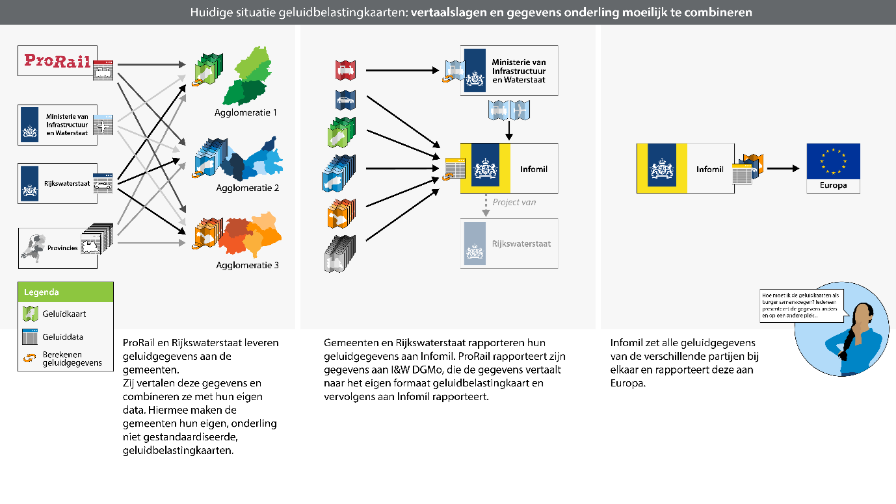
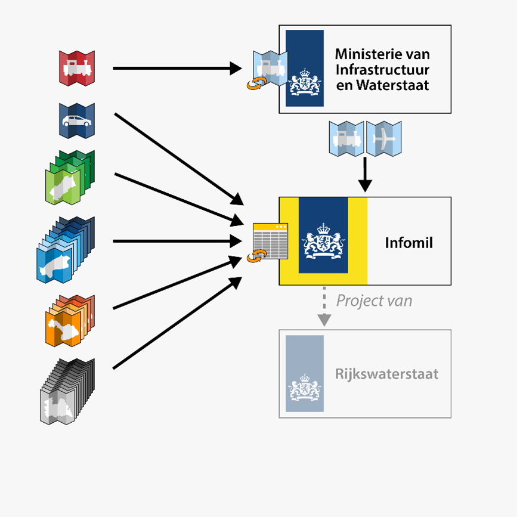

# Huidige situatie: geluidbelastingkaarten en -tabellen

<figure id="Figuur_3">

<figcaption>Huidige situatie rondom rapportage van END geluidbelastingkaarten en-tabellen gevisualiseerd.</figcaption>
</figure>

Om een beeld te schetsen van de huidige situatie zal de situatie worden
omschreven van de laatste rapportage van geluidgegevens aan de Europese
commissie. Zoals eerder vermeld, is iedere Europese lidstaat verplicht deze
rapportage te doen op basis van de Europese richtlijn omgevingslawaai [bron]. Op
basis van de uitgevoerde analyse [interviews], kan worden opgemaakt dat het
huidige proces rondom de rapportage van geluidbelastingkaarten aan Europa, valt
op te delen in drie deelprocessen. Deze drie deelprocessen staan ook
gevisualiseerd in [**Figuur 3**](Figuur_3) van links naar rechts.

1.  Het verzamelen van geluidgegevens en berekenen van geluidbelastingkaarten en
    tabellen.

2.  Het centraal aanleveren van geluidbelastingkaarten aan Infomil.

3.  Het prepareren van een rapportage aan de Europese commissie door Infomil.

Binnen deze deelprocessen worden de informatiestromen zichtbaar gemaakt. In dit
hoofdstuk zal per deelproces hier aandacht aan worden besteed.

Input Verzamelen van geluidgegevens en berekenen van geluidbelastingkaarten en -tabellen
---------------------------------------------------------------------------------------

<figure id="Figuur_4">

<figcaption>Input Verzamelen van geluidgegevens en berekenen van geluidbelastingkaarten en -tabellen.</figcaption>
</figure>

De eerste stap in de het huidige proces voor de rapportage van
geluidbelastingkaarten aan de Europese Commissie, is het verzamelen van de
juiste gegevens om een geluidmodel mee te kunnen maken. Wat de juiste gegevens
zijn wordt bepaald door akoestici in dienst van de bronhouder, een adviesbureau
of een omgevingsdienst binnen de kaders van de Nederlandse rekenmethodieken voor
het uitvoeren van geluidsimulaties [verwijzing naar rekenmethoden].

Voor het samenstellen van een geluidmodel moeten met name agglomeratie-gemeenten
veel stappen ondernemen. Agglomeraties hebben volgens de Europese Richtlijn
Omgevingslawaai [bron] de plicht om geluidbelastingkaarten en -tabellen te
berekenen. In deze kaarten en tabellen moet de geluidbelasting afkomstig van
Industrie, provinciale wegen, hoofdspoorwegen, lokale wegen, hoofdwegen en de
luchtvaart worden meegenomen. Deze gegevens zijn voor een groot deel in beheer
bij andere bronhouders, waardoor er veel informatiestromen ontstaan.

Dit effect wordt versterkt door het feit dat er organisatorisch geen
agglomeratiebestuur bestaat in Nederland. In de plaats hiervan heeft iedere
gemeente die hoort bij een agglomeratie de plicht om zelfstandige een
geluidbelastingkaart en -tabel op te stellen. Samenwerking en onderlinge
uitwisseling van gegevens tussen agglomeratiegemeenten, kan voorkomen op lokaal
initiatief, maar wordt niet door het Rijk gestimuleerd. Dit wordt weergegeven in
de [**Figuur 4**](Figuur_4) aan de hand van verschillende kleuren en kaartjes. Daarnaast
bestaan er ook geen vaste afspraken op landelijk niveau rondom de
beschikbaarstelling van geluidgegevens voor geluidbelastingkaarten. Een
agglomeratiegemeente heeft hierom bijvoorbeeld geen duidelijkheid over het
tijdstip waarop geluidgegevens van Rijkswegen beschikbaar worden gesteld.
Formeel worden er ook geen eisen gesteld aan het formaat waarin
geluidbelastingkaarten worden berekend. Een agglomeratiegemeente is hierom vrij
de kaart in bijvoorbeeld PDF [link] of shape [link] formaat te documenteren.

Centraal aanleveren van kaarten aan infomil
-------------------------------------------
<figure id="Figuur_5">

<figcaption>Centraal aanleveren van kaarten aan infomil.</figcaption>
</figure>

Wanneer de geluidbelastingkaarten en -tabellen berekend zijn, worden deze
gerapporteerd aan Infomil. In het geval van luchthavens van nationaal belang en
hoofdspoorwegen buiten agglomeratiegrenzen, draagt het Ministerie van I&W de
verantwoordelijkheid over de rapportage aan Infomil. In de huidige situatie
worden voor hoofdspoorwegen buiten agglomeratiegrenzen alleen tabellen geleverd.
Alle agglomeratiegemeenten rapporteren zelfstandig geluidbelastingkaarten en
-tabellen aan Infomil. Het verschil tussen publieke geluidbelastingkaarten en de
kaarten voor Europa, is dat op bijvoorbeeld de publieke kaart voor Rijkswegen
ook de wegen binnen agglomeratiegrenzen zijn meegenomen.

Output prepareren van een rapportage aan de Europese commissie
--------------------------------------------------------------

<figure id="Figuur_6">

<figcaption>Output prepareren van een rapportage aan de Europese commissie.</figcaption>
</figure>

In het laatste deelproces zorgt Infomil ervoor dat de door bronhouders
aangeleverde gegevens worden verwerkt tot een rapport aan de Europese Unie.
Hierbij moeten de verschillende geluidbelastingtabellen van
agglomeratiegemeenten worden samengevoegd tot een enkele tabel per agglomeratie.
De geluidbelastingkaarten worden zo goed als mogelijk samengevoegd en
gerapporteerd, maar deze kan nooit geheel compleet zijn, aangezien niet ieder
formaat geluidbelastingkaart met een ander kan worden samengevoegd.
