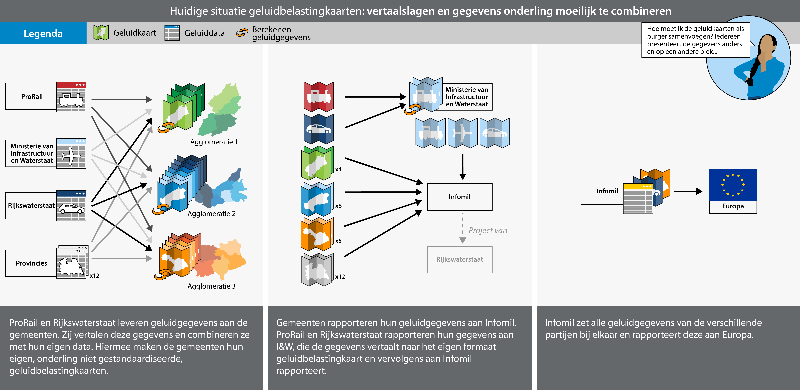
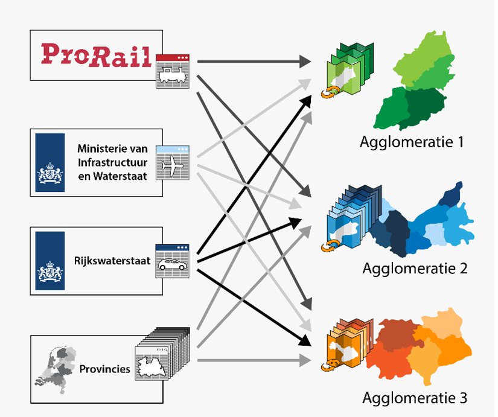
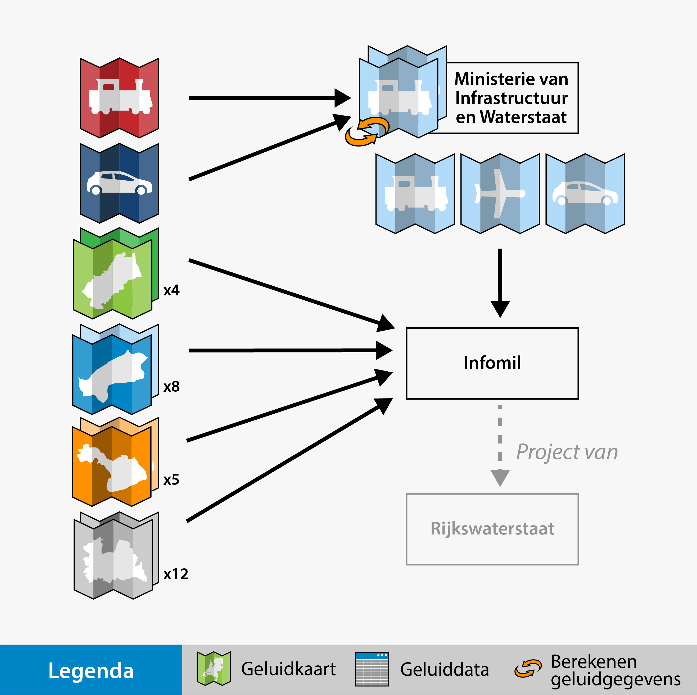
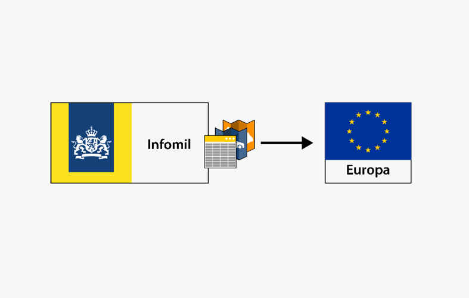

# Huidige situatie: geluidbelastingkaarten en -tabellen

<figure id="Figuur_3">

<figcaption>Huidige situatie rondom rapportage van END geluidbelastingkaarten en-tabellen gevisualiseerd.</figcaption>
</figure>

Om een beeld te schetsen van de huidige situatie zal de situatie worden
omschreven van de laatste rapportage van geluidgegevens aan de Europese
commissie. Zoals eerder vermeld, is iedere Europese lidstaat verplicht deze
rapportage te doen op basis van de [Europese richtlijn
omgevingslawaai](https://eur-lex.europa.eu/LexUriServ/LexUriServ.do?uri=OJ%3AL%3A2002%3A189%3A0012%3A0025%3ANL%3APDF). Op basis van de uitgevoerde analyse,
bureauonderzoek en [interviews](#bijlage-4-verslag-van-de-interviews-met-geluidexperts) kan worden opgemaakt dat het huidige proces
rondom de rapportage van geluidbelastingkaarten aan Europa op te delen is in
drie deelprocessen. Deze drie deelprocessen staan ook gevisualiseerd in [**Figuur 3**](Figuur_3) van links naar rechts.

1.  Het verzamelen van geluidgegevens en berekenen van geluidbelastingkaarten en
    tabellen.

2.  Het centraal aanleveren van geluidbelastingkaarten aan InfoMil.

3.  Het prepareren van een rapportage aan de Europese commissie door InfoMil.

Binnen deze deelprocessen worden de informatiestromen zichtbaar gemaakt. In dit
hoofdstuk zal per deelproces hier aandacht aan worden besteed.

Input Verzamelen van geluidgegevens en berekenen van geluidbelastingkaarten en tabellen
-------------------------------------------------------------------------------------------

<figure id="Figuur_4.1">

<figcaption>Input Verzamelen van geluidgegevens en berekenen van geluidbelastingkaarten en -tabellen.</figcaption>
</figure>

De eerste stap in de het huidige proces voor de rapportage van
geluidbelastingkaarten aan de Europese Commissie, is het verzamelen van de
juiste gegevens om een geluidmodel mee te kunnen maken. Wat de juiste gegevens
zijn wordt bepaald door akoestisch adviseurs in dienst van de bronhouder, een
adviesbureau of een omgevingsdienst binnen de kaders van de Nederlandse
rekenmethodieken voor het uitvoeren van geluidberekeningen. Deze zullen vanaf ingang vanaf de omgevingswet te vinden zijn in [Bijlage IV van de omgevingsregeling](https://www.omgevingsweb.nl/wp-content/uploads/po-assets/379191.pdf).

ProRail, het Ministerie van Infrastructuur en Waterstaat, Rijkswaterstaat en
provincies genereren de geluidcontouren en tabellen voor belangrijke wegen,
spoorwegen en luchthavens buiten agglomeraties. Daarnaast leveren zij een deel
van de input-geluidgegevens voor het genereren van geluidcontouren en tabellen
binnen agglomeraties. Voor het samenstellen van een geluidmodel moeten
agglomeratie-gemeenten veel stappen ondernemen. Agglomeraties hebben volgens de
Europese richtlijn omgevingslawaai [1VERWIJZING] de plicht om
geluidbelastingkaarten en -tabellen te berekenen. In deze kaarten en tabellen
moet de geluidbelasting afkomstig van industrie, provinciale wegen,
hoofdspoorwegen, lokale wegen, hoofdwegen en de luchtvaart worden meegenomen.
Deze gegevens zijn voor een groot deel in beheer bij andere bronhouders,
waardoor er veel informatiestromen ontstaan. Echter, niet voor alle
geluidbelastingkaarten is gegevensuitwisseling vereist. ProRail en RWS
beschikken bijvoorbeeld zelf over de meeste benodigde geluidbrongegevens om
geluidbelastingkaarten op te stellen. Naast de gegevens waar ProRail en RWS zelf
over beschikken, moet er ook een omgevingsmodel worden gemaakt in een strook van
ongeveer 1 km langs het netwerk. Om dit omgevingsmodel te kunnen samenstellen,
zijn ook gegevens over de ligging van stille gebieden en geluidgevoelige
gebouwen nodig.

Het aantal informatiestromen wordt ook beïnvloed door het feit dat er
organisatorisch geen agglomeratiebestuur bestaat in Nederland. In Nederland
heeft iedere gemeente die hoort bij een agglomeratie de plicht om zelfstandig
een geluidbelastingkaart en -tabel voor haar grondgebied op te stellen.
Samenwerking en onderlinge uitwisseling van gegevens tussen
agglomeratiegemeenten onderling en met provincies, komen voor op lokaal
initiatief. Dit wordt weergegeven in [**Figuur 4**](Figuur_4) aan de hand
van verschillende kleuren en kaartjes. Op dit moment werkt het rijk aan
harmonisatie van gegevens door een 3D-omgevingsmodel voor geluid, het Nationaal
Wegenbestand (NWB), en onderzoek of een landelijk bestand met
verkeersintensiteiten haalbaar is. Formeel zijn er tot nog toe geen vaste
afspraken op landelijk niveau rondom de beschikbaarstelling van geluidgegevens
voor geluidbelastingkaarten. In de praktijk worden op initiatief van InfoMil
werkafspraken gemaakt rondom het beschikbaar stellen van geluidgegevens.
Daarnaast is er contact tussen de RWS-bronbeheerder en agglomeratie-gemeenten
wanneer er informatiebehoeften zijn. Wanneer een agglomeratie-gemeente
bijvoorbeeld de informatiebehoefte heeft Rijkswegen toe te voegen aan het
geluidmodel, wisselt RWS deze gegevens op aanvraag in Geomileu-formaat uit. Door
het ontbreken van formele afspraken, weet een agglomeratiegemeente niet van
tevoren wanneer deze gegevens klaar zullen zijn om te worden gedeeld.

Centraal rapporteren van kaarten aan InfoMil
------------------------------------------------
<figure id="Figuur_5">

<figcaption>Centraal aanleveren van kaarten aan InfoMil.</figcaption>
</figure>

Wanneer de geluidbelastingkaarten berekend zijn, worden deze gerapporteerd aan
InfoMil. In het geval van luchthavens van nationaal belang, rijkswegen en
hoofdspoorwegen buiten agglomeratiegrenzen, draagt het Ministerie van I&W de
verantwoordelijkheid over de rapportage aan InfoMil. De geografische kaarten
worden door de bevoegde autoriteit publiek beschikbaar gesteld. Alle
agglomeratiegemeenten rapporteren zelfstandig geluidbelastingkaarten en
-tabellen aan InfoMil. In [Artikel 8 van besluit geluid milieubeheer](https://wetten.overheid.nl/jci1.3:c:BWBR0031477&hoofdstuk=3&paragraaf=1&artikel=8&z=2012-07-01&g=2012-07-01) staat dat geluidbelastingkaarten bestaan uit tabellen en geografische kaarten.
In [artikel 11.9 van de Wet Milieubeheer]([https://wetten.overheid.nl/jci1.3:c:BWBR0003245&hoofdstuk=11&titeldeel=11.2&paragraaf=11.2.2&artikel=11.9&z=2021-01-01&g=2021-01-01)
staat de aanleverplicht voor deze geluidbelastingkaarten omschreven. De
aanleverplicht moet nog worden verankerd in de Omgevingswet. Een verschil tussen
publieke geluidbelastingtabellen en de tabellen voor de EEA, is dat op
bijvoorbeeld de publieke tabel voor Rijkswegen ook de geluidbelasting binnen
agglomeratiegrenzen is meegenomen. Op de geografische geluidbelastingkaarten
voor de EEA worden ook Rijkswegen binnen agglomeratiegrenzen meegenomen. Volgens
de richtlijn omgevingslawaai is het alleen verplicht voor belangrijke wegen,
spoorwegen en luchthavens van nationaal belang om geografische
geluidbelastingkaarten te rapporteren. Voor de geluidbelastingkaarten voor het
publiek, gelden een aantal aanvullende eisen vanuit Nederlandse wetgeving boven
op de eisen uit de richtlijn omgevingslawaai. Een overzicht van deze eisen valt
te vinden in [Bijlage 1](#bijlage-1-de-inhoud-van-geluidbelastingkaarten-volgens-de-omgevingsregeling).

Output prepareren van een rapportage aan de Europese commissie
------------------------------------------------------------------

<figure id="Figuur_6.1">

<figcaption>Output prepareren van een rapportage aan de EEA.</figcaption>
</figure>

In het laatste deelproces zorgt Infomil ervoor dat de door bronhouders
aangeleverde gegevens worden verwerkt tot een rapport aan de Europese Unie.
Hierbij moeten de verschillende geluidbelastingtabellen van
agglomeratiegemeenten worden samengevoegd tot een enkele tabel per agglomeratie.
De geluidbelastingkaarten worden zo goed als mogelijk samengevoegd en
gerapporteerd, maar deze kan nooit geheel compleet zijn, aangezien niet ieder
formaat geluidbelastingkaart met een ander kan worden samengevoegd.
