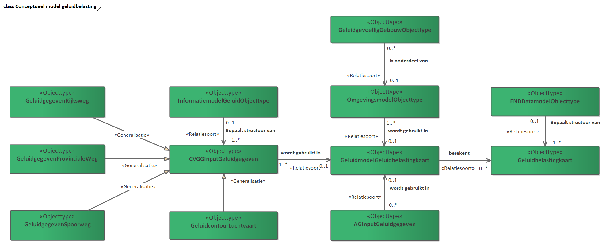

Conceptueel Informatiemodel Geluidbelasting specificatie (CIMGeluidbelasting)
========================================================
<figure id="Figuur_10">

<figcaption>Conceptueel model geluidbelasting.</figcaption>
</figure>

Het conceptuele model geluidbelasting (CMGeluidbelasting) brengt in kaart welke
gegevens een rol kunnen gaan spelen in de toekomstige situatie. Ook positioneert
het CMGeluidbelasting de Objecttypen uit het END-Datamodel en IMGeluid. Voor dit
model zijn twee aannames gemaakt. De mogelijke opties staan toegelicht in
paragraaf 6.2. In dit hoofdstuk worden de objecttypen gedefinieerd en
toegelicht. Het CMGeluidbelasting is een concept kijk op de toekomst. Het doel
van het model is om een overzicht te geven op waar relevante informatie voor het
maken van een geluidbelastingkaart vandaan kan worden gehaald. Dit model wordt
gebruikt om de specifieke uitbreidingen die nodig zijn voor het IMGeluid te
bepalen.

Wat opvalt is dat het model vanuit een hoger
[niveau](https://docs.geostandaarden.nl/mim/mim/\\\#typen-informatiemodellen)
naar de informatie kijkt dan het IMGeluid. Voor het doel van dit model is het
niet nodig om meer gedetailleerd te kijken naar de verschillende objecttypen.
Zie [**figuur 10](\# Figuur_10)** voor een UML weergave van het
CMGeluidbelasting.

Toelichting op CM Geluidbelasting
---------------------------------

In het CM Geluidbelasting staat het Geluidmodel centraal. Op basis van dit model
wordt een geluidbelastingkaart en -tabel berekend. De structuur van deze
geluidbelastingkaart of -tabel, wordt bepaald door DF4 en DF8 van het END
Datamodel. In de geschetste situatie bevat een geluidmodel minstens één
geluidgegeven. Dit geluidgegeven zou uit de CVGG kunnen worden gehaald, wanneer
er op termijn wordt besloten deze ook via de CVGG uit te wisselen. De structuur
van dit Input-geluidgegeven kan in dit geval bepaald worden door IMGeluid. Dit
Input-geluidgegeven kan in deze situatie afkomstig zijn van een rijksweg, een
provinciale weg, een spoorweg, van een agglomeratie-gemeente of van een
luchthaven.

Wanneer het geluidmodel betrekking heeft op een agglomeratie gemeente, zullen
lokale geluidgegeven over wegen, spoorwegen, industrie en overige
geluidbelastende activiteiten worden gebruikt in het geluidmodel. Het
geluidmodel bevat ook een model van de omgeving. In dit omgevingsmodel zitten
bijvoorbeeld hoogtelijnen en geluidgevoelige gebouwen. Deze kunnen door de maker
van het geluidmodel zelf gemodelleerd worden of op een andere manier worden
ingewonnen. Een oplossingsrichting is om een lijst met geluidgevoelige gebouwen
op te nemen in het IMGeluid. Zie voor andere oplossingsrichtingen de Memo over
[geluidgevoelige gebouwen](VERWIJZING).

De cijfers die bij pijlen (relaties) van het type \<\<Relatiesoort\>\> staan in
de vorm [0…\*] (Multipliciteiten), maken het mogelijk om het model op
verschillende manieren te doorlopen. Deze Multipliciteiten geven grenzen aan van
hoe vaak het ene object mag verwijzen naar het andere object in de relatie.
Bijvoorbeeld: 1 of meerdere [1..\*] input geluidgegeven(s) worden gebruikt in 0
of meerdere [0..\*] Geluidmodellen. Het andere type relatie dat wordt gebruikt
in het CMGeluidbelasting is de \<\<Generalisatie\>\>. Deze relatie wordt gelegd
tussen twee Objecttypen om aan te geven dat het ene object generaliseerd in het
andere. Een geluidgegeven Rijksweg is bijvoorbeeld een specifiek soort
Input-geluidgegeven.

Om deze principes toe te lichten zullen we het CM Geluidbelasting een keer
geheel doorlopen voor de geluidbelastingkaarten van Rijkswegen. Zie **Figuur**
11 voor een visualisatie hiervan. We beginnen linksboven in het model bij het
Objecttype Geluidgegeven Rijksweg. Laten we er voor dit voorbeeld vanuit gaan
dat we een geluidbelastingkaart willen maken van 100 wegdelen. Om te bepalen hoe
deze wegdelen eruitzien, kijken we naar het IMGeluid object WegdeelGPP in dit
hypothetische geval. In dit geval is ieder WegdeelGPP een Input-geluidgegeven
dat wordt gebruikt in een geluidmodel. De relatiesoort tussen de objecttypen
Input-geluidgegeven en Geluidmodel geluidbelastingkaart geeft nu aan dat 100
wegdelen worden gebruikt in 1 geluidmodel. De Multipliciteiten die hier gelden
staan dit toe. Vervolgens worden er 5 geluidgevoelige gebouwen toegevoegd aan
het omgevingsmodel en 5 omgevingsmodel objecten (dit zouden bijvoorbeeld
hoogtelijnen kunnen zijn) om de omgeving te modelleren. Deze 10 objecten worden
toegevoegd aan het geluidmodel. Uit dit ene geluidmodel worden 2 verschillende
kaarten berekend. Eén kaart is voor de Lden situatie en één voor de Lnight
situatie. De geluidcontouren op beide kaarten worden opgeslagen volgens, in
overeenstemming met het Objecttype (featureType) met de naam
“EnvHealthDeterminantMeasure” afkomstig uit het END Datamodel (zie figure 41.
Streamlined data model for noise contour maps (DF4_8)). Bij een
geluidbelastingkaart horen ook gegevens over blootstelling aan lawaai. De kaart
voor het publiek wordt door Rijkswaterstaat nog aangevuld met een aantal
Referentie geluidbronnen. Deze referentie geluidbronnen bevatten extra
informatie over de context die handig is voor het publiek. De ligging van 49
major Road Source Objecttypen wordt op de kaart afgebeeld samen met de
afbakening van een stil gebied.

<figure id="Figuur_11">

<figcaption>Voorbeeld uitwerking van het Conceptueel model geluidbelasting.</figcaption>
</figure>

Het inwinningsvraagstuk voor aanvullende informatie op publieke geluidbelastingkaarten
--------------------------------------------------------------------------------------

In hoofdstuk 5 werd al genoemd dat I&W meerdere denkbare scenario’s heeft
uitgewerkt voor de toekomst van geluidberekeningen met betrekking tot
geluidbelastingkaarten. Een scenario waar in dit rapport nog minder aandacht aan
is besteed, is het centraal berekenen van geluidbelastingkaarten. In dit
scenario kan de CVGG centraal geluidbelastingkaarten berekenen. In dit scenario
hoeven de bronhouders alleen de geluidgegevens waarover zij zelf beschikken aan
te leveren en doet de CVGG de rest. Maar deze geluidgegevens moeten dan wel
volledig en precies volgens het IMGeluid worden aangeleverd. Het belangrijkste
werk is daarmee al verricht. Dit scenario zal aantrekkelijk worden, wanneer het
met forse besparing op de rekentijden gepaard zal gaan, of met besparing op
licentiekosten voor rekensoftware. Dit scenario betekent ook dat de CVGG over
voldoende informatie moet beschikken, om geluidbelastingkaarten voor het publiek
op te stellen.

Geluidbelastingkaarten voor het publiek bevatten vaak nog aanvullende gegevens
om de kaart beter leesbaar te maken. Dit zijn bijvoorbeeld gegevens over de
ligging van industrieterreinen of andere geluidbelastende activiteiten. Wanneer
in de toekomst voor dit scenario wordt gekozen, is het daarom ook belangrijk om
na te denken over het inwinningsvraagstuk dat achter deze gegevens zit. Mogelijk
kunnen alle aanvullende gegevens uit het DSO (Digitaal Stelsel Omgevingswet)
worden ingewonnen, maar dit is tot op heden onzeker. Het blijft daarom een optie
dat deze ontbrekende gegevens, optioneel worden opgenomen in het IMGeluid.

Definities CMGeluidbelasting
----------------------------

### Objecttype CVGG Input Geluidgegeven
### Objecttype CVGG Input Geluidgegeven

| **Naam**        | Input-geluidgegeven                                                                                                                                                                                                  |
|-----------------|----------------------------------------------------------------------------------------------------------------------------------------------------------------------------------------------------------------------|
| **Definitie**   | Geluidgegeven dat wordt gebruikt in een geluidmodel voor geluidbelastingkaarten te berekenen, dat kan worden afgenomen vanuit de CVGG.                                                                               |
| **Toelichting** | Het gaat hier om geluidgegevens m.b.t. rijkswegen, provinciale wegen, lokale wegen, spoorwegen, industrie en Luchtvaart. De structuur van deze gegevens wordt binnen de uitbreiding van het IMGeluid gespecificeerd. |
| **Abstract**    | **Ja**. Dit betekent dat dit modelelement niet op zichzelf bestaat, maar dat het altijd een GeluidgegevenRijksweg, GeluidgegevenProvincialeWeg, GeluidgegevenHoofdpoorweg of een GeluidcontourLuchtvaart betreft.    |
| **Herkomst**    | CMGeluidbelasting                                                                                                                                                                                                    |

### Objecttype Geluidgegeven rijksweg

| **Naam**        | Geluidgegeven Rijksweg                                                                                                                                                                                                                                                                                                                                                                                                                                       |
|-----------------|--------------------------------------------------------------------------------------------------------------------------------------------------------------------------------------------------------------------------------------------------------------------------------------------------------------------------------------------------------------------------------------------------------------------------------------------------------------|
| **Definitie**   | Geluidgegeven afkomstig van een stukje rijksweg met een verkeersintensiteit van meer dan 3 miljoen motorvoertuigen per jaar, dat wordt gebruikt in een geluidmodel voor geluidbelastingkaarten te berekenen.                                                                                                                                                                                                                                                 |
| **Toelichting** | Het gaat hier om geluidgegevens die Rijkswaterstaat in beheer heeft. Deze gegevens zijn wat betreft betekenis (semantiek) anders dan de gegevens in WegdeelGPP uit IMGeluid, dus zullen een eigen objecttype moeten krijgen binnen IMGeluid. Dit zal waarschijnlijk gaan om een aangepaste versie van GPPWegdeel. Dit objecttype heeft een aangepaste definitie en bevat een aantal extra attribuutsoorten om te kunnen rekenen met de CNOSSOS rekenmethode. |
| **Abstract**    | Nee.                                                                                                                                                                                                                                                                                                                                                                                                                                                         |
| **Herkomst**    | CMGeluidbelasting                                                                                                                                                                                                                                                                                                                                                                                                                                            |

### Objecttype Geluidgegeven Provinciale Weg

| **Naam**        | Geluidgegeven provinciale weg                                                                                                                                                                                                                                                                                                                                                                                                                              |
|-----------------|------------------------------------------------------------------------------------------------------------------------------------------------------------------------------------------------------------------------------------------------------------------------------------------------------------------------------------------------------------------------------------------------------------------------------------------------------------|
| **Definitie**   | Geluidgegeven afkomstig van een stukje provinciale weg met een verkeersintensiteit van meer dan 3 miljoen motorvoertuigen per jaar, dat wordt gebruikt in een geluidmodel voor geluidbelastingkaarten te berekenen.                                                                                                                                                                                                                                        |
| **Toelichting** | Het gaat hier om geluidgegevens die een Provincie in beheer heeft. Deze gegevens zijn wat betreft betekenis (semantiek) anders dan de gegevens in WegdeelGPP uit IMGeluid, dus zullen een eigen objecttype moeten krijgen binnen IMGeluid. Dit zal waarschijnlijk gaan om een aangepaste versie van GPPWegdeel. Dit objecttype heeft een aangepaste definitie en bevat een aantal extra attribuutsoorten om te kunnen rekenen met de CNOSSOS rekenmethode. |
| **Abstract**    | **Nee**.                                                                                                                                                                                                                                                                                                                                                                                                                                                   |
| **Herkomst**    | CMGeluidbelasting                                                                                                                                                                                                                                                                                                                                                                                                                                          |

### Objecttype Geluidgegeven spoorweg

| **Naam**        | GeluidgegevenSpoorweg                                                                                                                                                                                                                                                                                                                                                                                                                                                                                                                                                                               |
|-----------------|-----------------------------------------------------------------------------------------------------------------------------------------------------------------------------------------------------------------------------------------------------------------------------------------------------------------------------------------------------------------------------------------------------------------------------------------------------------------------------------------------------------------------------------------------------------------------------------------------------|
| **Definitie**   | Geluidgegeven afkomstig van een stukje hoofdspoorweg, of een Lokale spoorwegen met een verkeersintensiteit van meer dan 30.000 treinen per jaar, dat wordt gebruikt in een geluidmodel voor geluidbelastingkaarten te berekenen.                                                                                                                                                                                                                                                                                                                                                                    |
| **Toelichting** | Het gaat hier om geluidgegevens die ProRail in beheer heeft in het geval van Hoofdspoorwegen. De provincies beheren Lokale spoorwegen met een verkeersintensiteit van meer dan 30.000 treinen per jaar. Deze gegevens zijn wat betreft betekenis (semantiek) anders dan de gegevens in SpoordeelGPP uit IMGeluid, dus zullen een eigen objecttype moeten krijgen binnen IMGeluid. Dit zal waarschijnlijk gaan om een aangepaste versie van SpoordeelGPP. Dit objecttype heeft een aangepaste definitie en bevat een aantal extra attribuutsoorten om te kunnen rekenen met de CNOSSOS-rekenmethode. |
| **Abstract**    | **Nee.**                                                                                                                                                                                                                                                                                                                                                                                                                                                                                                                                                                                            |
| **Herkomst**    | CMGeluidbelasting                                                                                                                                                                                                                                                                                                                                                                                                                                                                                                                                                                                   |

### Objecttype Geluidcontour Luchtvaart

| **Naam**        | GeluidcontourLuchtvaart                                                                                                                                                                                                                                                                                                                                                                                                                                                                                                                                                                                                                 |
|-----------------|-----------------------------------------------------------------------------------------------------------------------------------------------------------------------------------------------------------------------------------------------------------------------------------------------------------------------------------------------------------------------------------------------------------------------------------------------------------------------------------------------------------------------------------------------------------------------------------------------------------------------------------------|
| **Definitie**   | Geluidcontour afkomstig van burgerluchthavens van nationale betekenis met meer dan 50.000 vliegtuigbewegingen, oefenvluchten met lichte vliegtuigen niet meegerekend.                                                                                                                                                                                                                                                                                                                                                                                                                                                                   |
| **Toelichting** | Het gaat hier om geluidcontouren opgevraagd door afdeling DG Luchtvaart en Maritieme Zaken van het Ministerie van Infrastructuur en Waterstaat, bij burgerluchthavens met nationale betekenis. Aangezien het bij geluidbrongegevens voor luchtvaart vaak gaat om commercieel gevoelige informatie, hoeven alleen de contouren gebruikt te worden als input voor een geluidberekening. Deze contouren kunnen worden opgeslagen in de CVGG als een nieuwe aanlevering in overeenstemming met IMGeluid. Een nieuwe aanlevering is nodig omdat het in dit geval gaat om het gerealiseerde aantal vluchten en niet om een vergunde situatie. |
| **Abstract**    | **Nee**.                                                                                                                                                                                                                                                                                                                                                                                                                                                                                                                                                                                                                                |
| **Herkomst**    | CMGeluidbelasting                                                                                                                                                                                                                                                                                                                                                                                                                                                                                                                                                                                                                       |

### Objecttype Geluidmodel Geluidbelastingkaart

| **Naam**        | GeluidmodelGeluidbelastingkaart                                                                                                                                                                                                                                                                                                                                                                                                |
|-----------------|--------------------------------------------------------------------------------------------------------------------------------------------------------------------------------------------------------------------------------------------------------------------------------------------------------------------------------------------------------------------------------------------------------------------------------|
| **Definitie**   | Een geluidmodel van een bepaald gebied, bestaande uit Input-geluidgegevens, dat wordt gebruikt om geluidbelastingkaarten mee te bereken.                                                                                                                                                                                                                                                                                       |
| **Toelichting** | Het geluidmodel wordt samengesteld door akoestisch experts volgens, in overeenstemming met de CNOSSOS-rekenmethode. Het doel van het geluidmodel is om zo goed mogelijk de geluidbelasting in een bepaald gebied te simuleren. Welk gebied dit betreft is afhankelijk van het bestuursorgaan dat de opdracht geeft om een geluidmodel te maken. Dit zou bijvoorbeeld het geluidmodel van een agglomeratie-gemeente kunnen zijn |
| **Abstract**    | **Nee**.                                                                                                                                                                                                                                                                                                                                                                                                                       |
| **Herkomst**    | CMGeluidbelasting                                                                                                                                                                                                                                                                                                                                                                                                              |

### Objecttype Lokaal input-geluidgegeven

| **Naam**        | Lokaal input-geluidgegeven                                                                                                                                                                                                                                                                                                                                                                                        |
|-----------------|-------------------------------------------------------------------------------------------------------------------------------------------------------------------------------------------------------------------------------------------------------------------------------------------------------------------------------------------------------------------------------------------------------------------|
| **Definitie**   | Geluidgegeven dat wordt gebruikt in een geluidmodel voor geluidbelastingkaarten te berekenen, opgehaald door een agglomeratie-gemeente vanuit lokale bronnen.                                                                                                                                                                                                                                                     |
| **Toelichting** | Niet alle geluidgegevens worden door agglomeraties opgevraagd bij andere overheden. Over de meeste lokale gegevens over geluidbelastende activiteiten, beschikt de gemeente zelf. In een beperkt volume vindt soms uitwisseling tussen agglomeratie-gemeenten plaats. Wanneer een agglomeratie-gemeente een geluidbelastingkaart of -tabel gaat berekenen worden deze geluidgegevens gebruikt in een geluidmodel. |
| **Abstract**    | **Ja**. Dit betekent dat dit modelelement niet op zichzelf bestaat, maar dat het altijd wordt ingevuld door een meer specifiek objecttype. In dit geval zijn de specifiekere Objecttypen met de Generalisatie relatie zichtbaar in het model.                                                                                                                                                                     |
| **Herkomst**    | CMGeluidbelasting                                                                                                                                                                                                                                                                                                                                                                                                 |

### Objecttype Industrie geluidgegeven

| **Naam**        | Industrie geluidgegeven                                                                                                                                                                                                                                                                                                                                                                                                                                                                                                                                                                                                                                                                                                     |
|-----------------|-----------------------------------------------------------------------------------------------------------------------------------------------------------------------------------------------------------------------------------------------------------------------------------------------------------------------------------------------------------------------------------------------------------------------------------------------------------------------------------------------------------------------------------------------------------------------------------------------------------------------------------------------------------------------------------------------------------------------------|
| **Definitie**   | Een lokaal input-geluidgegeven met betrekking tot geluidbelastende activiteiten die te maken hebben met industrielawaai.                                                                                                                                                                                                                                                                                                                                                                                                                                                                                                                                                                                                    |
| **Toelichting** | Het gaat hier om geluidbelastende activiteiten en verzamelingen van activiteiten: Activiteiten op industrieterreinen met gpp’s waarvoor het geluid van dat industrieterrein meer is dan 55 dB Lden of 50 dB Lnight Activiteiten in gebieden met een hogere waarde voor geluid, waarvoor de geluidbelasting door die activiteiten op omliggende geluidgevoelige gebouwen meer kan zijn dan 55 dB Lden of 50 dB Lnight; Activiteiten buiten industrieterreinen met gpp’s met een ten hoogste toegelaten geluidbelasting door de activiteit meer is dan 55 dB Lden of 50 dB Lnight Wanneer een agglomeratie-gemeente een geluidbelastingkaart of -tabel gaat berekenen worden deze geluidgegevens gebruikt in een geluidmodel. |
| **Abstract**    | **Ja** Dit betekent dat dit modelelement niet op zichzelf bestaat, maar dat het altijd wordt ingevuld door een meer specifiek objecttype. In dit geval zijn de specifiekere Objecttypen met de Generalisatie relatie zichtbaar in het model.                                                                                                                                                                                                                                                                                                                                                                                                                                                                                |
| **Herkomst**    | CMGeluidbelasting                                                                                                                                                                                                                                                                                                                                                                                                                                                                                                                                                                                                                                                                                                           |

### Objecttype Gegeven gezoneerde industrie

| **Naam**        | Gegeven gezoneerde industrie                                                                                                                                                                                                 |
|-----------------|------------------------------------------------------------------------------------------------------------------------------------------------------------------------------------------------------------------------------|
| **Definitie**   | Een geluidgegeven met betrekking op activiteiten op industrieterreinen met gpp’s waarvoor het geluid van dat industrieterrein meer is dan 55 dB Lden of 50 dB Lnight.                                                        |
| **Toelichting** | Tot deze gegevens behoren bijvoorbeeld geluidbronnen binnen een industrieterrein met GPP’s. Het gaat hier wel om een andere situatie dan die in de CVGG staat geregistreerd. In de CVGG staat namelijk de vergunde situatie. |
| **Abstract**    | **Nee**.                                                                                                                                                                                                                     |
| **Herkomst**    | CMGeluidbelasting                                                                                                                                                                                                            |

### Objecttype Gegeven aangewezen gebieden

| **Naam**        | Gegeven aangewezen gebieden                                                                                                                                                                                                                                                                                       |
|-----------------|-------------------------------------------------------------------------------------------------------------------------------------------------------------------------------------------------------------------------------------------------------------------------------------------------------------------|
| **Definitie**   | Een geluidgegeven met betrekking op activiteiten in gebieden met een hogere waarde voor geluid, waarvoor de geluidbelasting door die activiteiten op omliggende geluidgevoelige gebouwen meer kan zijn dan 55 dB Lden of 50 dB Lnight.                                                                            |
| **Toelichting** | Het beeld is dat tot deze aangewezen gebieden voornamelijk horeca concentratiegebieden behoren. Echter is het toegestaan als gemeente zelf invulling te geven aan deze categorie. Het is daarom enige mate van onzekerheid over welke andere soorten aangewezen gebieden precies worden gebruikt in het werkveld. |
| **Abstract**    | **Nee**.                                                                                                                                                                                                                                                                                                          |
| **Herkomst**    | CMGeluidbelasting                                                                                                                                                                                                                                                                                                 |

### Objecttype Industrie geluidgegeven

| **Naam**        | Gegeven groot bedrijf                                                                                                                                                                                                                                                                                                                                                  |
|-----------------|------------------------------------------------------------------------------------------------------------------------------------------------------------------------------------------------------------------------------------------------------------------------------------------------------------------------------------------------------------------------|
| **Definitie**   | Een geluidgegeven met betrekking op activiteiten buiten industrieterreinen met gpp’s met een ten hoogste toegelaten geluidbelasting door de activiteit meer is dan 55 dB Lden of 50 dB Lnight.                                                                                                                                                                         |
| **Toelichting** | Het gaat hier om grote bedrijven die buiten een gezoneerd industrieterrein met GPP’s liggen. Grote bedrijven die mogelijk meer geluid produceren dan is toegestaan, moeten voor een vergunningaanvraag akoestisch onderzoek laten uitvoeren. Het beeld van I&W hierbij is daarom dat de precieze invulling van deze categorie bekend is bij de agglomeratie-gemeenten. |
| **Abstract**    | **Ja**                                                                                                                                                                                                                                                                                                                                                                 |
| **Herkomst**    | CMGeluidbelasting                                                                                                                                                                                                                                                                                                                                                      |

### Objecttype Lokale weg / spoorweg geluidgegeven

| **Naam**        | Lokale weg / spoorweg geluidgegeven                                                                                                                                                                                                                                                                                                                                                                                                                                                                                                                 |
|-----------------|-----------------------------------------------------------------------------------------------------------------------------------------------------------------------------------------------------------------------------------------------------------------------------------------------------------------------------------------------------------------------------------------------------------------------------------------------------------------------------------------------------------------------------------------------------|
| **Definitie**   | Lokaal input-geluidgegeven over geluidbelastende activiteiten die te maken hebben met lokale wegen of spoorwegen.                                                                                                                                                                                                                                                                                                                                                                                                                                   |
| **Toelichting** | Het gaat hier om geluidgegevens met betrekking tot lokale wegen en spoorwegen waarvan een agglomeratie-gemeente bronhouder is. Deze gegevens zijn wat betreft betekenis (semantiek) anders dan de gegevens in WegdeelBGE en SpoordeelBGE uit IMGeluid, dus zullen een eigen objecttype moeten krijgen binnen IMGeluid. Dit zal waarschijnlijk gaan om aangepaste versies van SpoordeelBGE en WegdeelBGE. Deze objecttypen hebben een aangepaste definitie en bevat een aantal extra attribuutsoorten om te kunnen rekenen met CNOSSOS-rekenmethode. |
| **Abstract**    | **Nee**.                                                                                                                                                                                                                                                                                                                                                                                                                                                                                                                                            |
| **Herkomst**    | CMGeluidbelasting                                                                                                                                                                                                                                                                                                                                                                                                                                                                                                                                   |

### Objecttype Omgevingsmodel Objecttype

| **Naam**        | OmgevingsmodelObjecttype                                                                                                                                                                                                                                             |
|-----------------|----------------------------------------------------------------------------------------------------------------------------------------------------------------------------------------------------------------------------------------------------------------------|
| **Definitie**   | Objecttype afkomstig uit een omgevingsmodel geschikt voor geluidberekeningen.                                                                                                                                                                                        |
| **Toelichting** | Dit omgevingsmodel kan gemaakt zijn door het bestuursorgaan of er kan gebruik worden gemaakt van een landelijk model, zoals bijvoorbeeld het 3D omgevingsmodel geluid. Dit omgevingsmodel bevat ook geluidgevoellige gebouwen zoals bedoeld in Artikel 3.20 van BKL. |
| **Abstract**    | **Nee**.                                                                                                                                                                                                                                                             |
| **Herkomst**    | CMGeluidbelasting                                                                                                                                                                                                                                                    |

### Objecttype IMGeluid Objecttype

| **Naam**        | IMGeluid Objecttype                                                                                                                                                                                                                                                                                                    |
|-----------------|------------------------------------------------------------------------------------------------------------------------------------------------------------------------------------------------------------------------------------------------------------------------------------------------------------------------|
| **Definitie**   | Een objecttype afkomstig uit het Informatiemodel Geluid.                                                                                                                                                                                                                                                               |
| **Toelichting** | Dit is een objecttype uit het IMGeluid dat mogelijk kan worden gebruikt om de structuur van de input-geluidgegevens te bepalen. Deze input-geluidgegevens kunnen worden gebruikt om een geluidbelastingkaart te berekenen. Niet elk objecttype uit het IMGeluid is hiervoor geschikt. Het is afhankelijk van een keuze |
| **Abstract**    | **Ja**. Dit betekent dat dit modelelement niet op zichzelf bestaat, maar dat het altijd een objecttype is afkomstig uit het IMGeluid.                                                                                                                                                                                  |
| **Herkomst**    | IMGeluid                                                                                                                                                                                                                                                                                                               |

### Objecttype END Datamodel Objecttype

| **Naam**        | END Datamodel DF_4_8 Objecttype                                                                                                                  |
|-----------------|--------------------------------------------------------------------------------------------------------------------------------------------------|
| **Definitie**   | Een objecttype afkomstig uit het datamodel van de Environmental Noise Directive.                                                                 |
| **Toelichting** | In de specifieke relatie die hier zichtbaar is zou dit hier gaan om verschillende objecttypen uit de DF4_8 domeinmodellen van het END Datamodel. |
| **Abstract**    | **Ja**. Dit betekent dat dit modelelement niet op zichzelf bestaat, maar dat het altijd een objecttype is afkomstig uit het END Datamodel.       |
| **Herkomst**    | END Datamodel                                                                                                                                    |

### Objecttype Geluidgevoellig Gebouw Objecttype

| **Naam**        | GeluidgevoelligGebouwObjecttype                                                                                                                                                                                                        |
|-----------------|----------------------------------------------------------------------------------------------------------------------------------------------------------------------------------------------------------------------------------------|
| **Definitie**   | Een objecttype dat een geluidgevoellig gebouw, zoals bedoeld in artikel 3.20 van BKL representeert, inclusief alle in de regelgeving bepaalde eigenschappen.                                                                           |
| **Toelichting** | Voor de geluidgevoelige gebouwen kan de BAG als uitgangspunt worden genomen. Echter kan niet alle informatie uit de BAG worden gehaald. Waar deze informatie wel vandaan kan worden gehaald wordt omschreven in [de memo](VERWIJZING). |
| **Abstract**    | **Nee**.                                                                                                                                                                                                                               |
| **Herkomst**    | CMGeluidbelasting                                                                                                                                                                                                                      |

### Objecttype Geluidbelastingkaart

| **Naam**        | Geluidbelastingkaart                                                                                                                                                |
|-----------------|---------------------------------------------------------------------------------------------------------------------------------------------------------------------|
| **Definitie**   | Een geluidbelastingkaart zoals bedoeld in de Environmental Noise Directive in overeenstemming met het END Datamodel.                                                |
| **Toelichting** | De geluidbelastingkaart wordt berekend uit een GeluidmodelGeluidbelastingkaart in opdracht van bestuursorgaan. Een geluidbelastingkaart bevat de volgende gegevens: |
| **Abstract**    | **Nee**.                                                                                                                                                            |
| **Herkomst**    | CMGeluidbelasting                                                                                                                                                   |

-   De geluidbelasting Lden en de geluidbelasting Lnight door de geluidbronnen
    in het kalenderjaar voorafgaand aan dat van de vaststelling van een
    geluidbelastingkaart, weer te geven met 5 dB-contouren; en

-   Het aantal geluidgevoelige gebouwen en bewoners van woningen dat aan bij
    ministeriele regeling vastgestelde waarden van de geluidbelasting Lden en de
    geluidbelasting Lnight wordt blootgesteld, weer te geven in tabellen met
    geluidbelastingklassen van telkens 5 dB.

Los van de verplichte geluidbelastingkaarten en -tabellen die aan Europa moeten
worden gerapporteerd, worden er ook kaarten gemaakt om het publiek te
informeren. Voor deze kaarten voor het publiek is soms aanvullende informatie
vereist.

### Objecttype Referentie geluidbron

| **Naam**        | Referentie geluidbron                                                                                                                                                                                                                                                                                                                                                                                                                                                                                                                                                                                                                                                                                                                                       |
|-----------------|-------------------------------------------------------------------------------------------------------------------------------------------------------------------------------------------------------------------------------------------------------------------------------------------------------------------------------------------------------------------------------------------------------------------------------------------------------------------------------------------------------------------------------------------------------------------------------------------------------------------------------------------------------------------------------------------------------------------------------------------------------------|
| **Definitie**   | Een geometrische afbakening van een gebied of locatie die relevante informatie toevoegt over de geluidbron aan geluidbelastingkaarten voor het publiek.                                                                                                                                                                                                                                                                                                                                                                                                                                                                                                                                                                                                     |
| **Toelichting** | Dit Objecttype bevat bijvoorbeeld de afbakening van een Industrieterrein, een horeca concentratiegebied of een ander aangewezen gebied. Een referentie gebiedsafbakening kent mogelijke een stuk meer invullingen. Binnen een geluidbelastingkaart bedoeld voor het publiek, vervult deze afbakening een informerende rol. In de geluidbelastingkaarten die aan de EEA gerapporteerd worden, spelen deze gebiedsafbakeningen geen rol. Een Referentie geluidbron is **niet per se** hetzelfde als een input-geluidgegeven of een geluidbrongegeven. Het gaat in dit geval namelijk niet om een geluidgegeven dat wordt gebruikt in een geluidberekening, maar om een afbakening die voor het publiek betekenisvolle informatie toevoegt over de geluidbron. |
| **Abstract**    | **Ja**. Dit betekent dat dit modelelement niet op zichzelf bestaat, maar dat het altijd wordt ingevuld door een meer specifiek objecttype. In dit geval is het nog niet precies bekend welke specifieke referentie gebiedsaanwijzingen er worden gebruikt in het werkveld.                                                                                                                                                                                                                                                                                                                                                                                                                                                                                  |
| **Herkomst**    | CMGeluidbelasting                                                                                                                                                                                                                                                                                                                                                                                                                                                                                                                                                                                                                                                                                                                                           |

### Objecttype END Datamodel DF1_5 Objecttype

| **Naam**        | END Datamodel DF1_5 Objecttype                                                                                                                                                                                                                                                   |
|-----------------|----------------------------------------------------------------------------------------------------------------------------------------------------------------------------------------------------------------------------------------------------------------------------------|
| **Definitie**   | Objecttype afkomstig uit het END Datamodel dat extra bruikbare informatie toevoegt voor het publiek.                                                                                                                                                                             |
| **Toelichting** | De “Noise sources” (DF1_5) zijn objecttype afkomstig uit het END Datamodel. De Nederlandse vertaling hiervan, “geluidbronnen”, gebruiken we hier niet om verwarring te voorkomen met de input-geluidgegevens die worden gebruikt voor het berekenen van de geluidbelastingkaart. |
| **Abstract**    | **Nee**                                                                                                                                                                                                                                                                          |
| **Herkomst**    | END Datamodel                                                                                                                                                                                                                                                                    |

### Objecttype Stil gebied

| **Naam**        | Stil gebied                                                                                                                                                                                         |
|-----------------|-----------------------------------------------------------------------------------------------------------------------------------------------------------------------------------------------------|
| **Definitie**   | Afbakening van een stil gebied zoals bedoeld in de Europese richtlijn omgevingslawaai.                                                                                                              |
| **Toelichting** | Deze stille gebieden worden ook als DF7_10 gerapporteerd aan de EEA. In deze context zijn alleen de afbakening en het type stil gebied (**quietAreaType)** relevant voor de kaart voor het publiek. |
| **Abstract**    | **Nee**.                                                                                                                                                                                            |
| **Herkomst**    | END Datamodel                                                                                                                                                                                       |

Oplossingsrichtingen ten grondslag aan het CMGeluidbelasting
------------------------------------------------------------

In deze paragraaf staan een aantal oplossingsrichtingen omschreven die aan de
grondslag van het CMGeluidbelasting liggen. In de oplossingsrichtingen is de
opgehaalde input vanuit het werkveld opgenomen.

>   Bij het maken van de oplossingsrichtingen, zijn de volgende uitgangspunten
>   gehanteerd:

1.  Het achterliggende doel van de uitbreiding van het IMGeluid, is om de
    uitwisseling van geluidgegevens m.b.t. het opstellen van
    geluidbelastingkaarten zo efficiënt mogelijk te maken.

2.  Om de uitwisseling zo efficiënt mogelijk te maken, moet de uitbreidingen van
    het IMGeluid en de CVGG zorgen voor zo min mogelijk extra complexiteit.
    [REFERENCE The IT Complexity Crisis: Danger and Opportunity door Roger
    Sessions. November 8, 2009.]

    1.  Hierbij moet ook rekening worden gehouden met de Governance van het
        IMGeluid en de CVGG. Een complex beheerproces zorgt voor exponentieel
        meer kosten en meer kans op fouten.

>   In de rest van deze paragraaf zal aan deze uitgangspunten gerefereerd worden
>   met uitgangspunt [1] en uitgangspunt [2] respectievelijk.

### Geluidgeggevens voor agglomeratie gemeenten

Relevante geluidgegevens voor agglomeratie gemeenten m.b.t. hoofdwegen,
provinciale wegen, spoorwegen en luchthavens, kunnen uit de CVGG worden gehaald.
Vervolgens kunnen de gemeenten deze gebruiken importeren binnen hun
geluidberekening software. Deze zullen worden gecombineerd met lokale
geluidgegevens tot een model geschikt voor geluidsimulaties met CNOSSOS. Onder
lokale geluidgegevens verstaan we gegevens met betrekking op geluidbelastende
activiteiten en verzamelingen van activiteiten zoals:

-   Activiteiten op industrieterreinen met gpp’s waarvoor het geluid van dat
    industrieterrein meer is dan 55 dB Lden of 50 dB Lnight

-   Activiteiten in gebieden met een hogere waarde voor geluid, waarvoor de
    geluidbelasting door die activiteiten op omliggende geluidgevoelige gebouwen
    meer kan zijn dan 55 dB Lden of 50 dB Lnight;

-   Activiteiten buiten industrieterreinen met gpp’s met een ten hoogste
    toegelaten geluidbelasting door de activiteit meer is dan 55 dB Lden of 50
    dB Lnight

Deze afbakening van lokale geluidgegevens is breed. Uit de interviews is
gebleken dat lokale geluidgegevens zich lastig laten generaliseren. Het is sterk
afhankelijk van lokale experts om te bepalen welke activiteiten een hogere
geluidbelasting dan 55 dB Lden of 50 dB Lnight veroorzaken. Ook is gebleken dat
deze gegevens maar in enkele gevallen tussen agglomeratie-gemeenten wordt
uitgewisseld. In de gevallen dat dit wel het geval is, dan is er al een lokaal
systeem om deze gegevens uit te wisselen. Ook werd duidelijk dat samenwerking
voor geluidbelastingkaarten op agglomeratie niveau niet verplicht is. Als gevolg
hiervan kan het beleid op het gebied van geluidbelastingkaarten, per gemeente
binnen een agglomeratie afwijken .

Wanneer agglomeraties worden verplicht om deze lokale geluidgegevens m.b.t.
geluidbelasting aan te leveren aan de CVGG, dan zorgt dit voor extra
complexiteit. Op basis van de interviews wordt ingeschat, dat de toegevoegde
waarde van deze gegevens voor andere afnemers van de CVGG minimaal is. Daarnaast blijkt uit de interviews dat het hier gaat om het grootste volume aan geluidgegevens, wat de
complexiteit alleen maar groter maakt.

Met de komst van het END datamodel zullen kaarten van agglomeraties makkelijker
te combineren worden. Dit datamodel hoeft niet voor extra complexiteit te
zorgen, wanneer de softwareleveranciers exporteren naar END formaat mogelijk
maken. De CVGG zou vervolgens de opdracht kunnen krijgen om aanleveren volgens
het END datamodel te ondersteunen als module binnen het uploadportaal.
Daarnaast, zullen waarschijnlijk nog aanvullende softwaremodules moeten worden
gemaakt, om bijvoorbeeld de kaarten van agglomeratie gemeente samen te voegen
tot 1 kaart. Wat de impact hiervan is op de Centrale Voorziening, moet nog
blijken uit de impact analyse van de CVGG. Op basis van uitgangspunten [1] en
[2] luidt stelling:

> **Agglomeratie-gemeenten hoeven, in ieder geval initieel, geen geluidgegevens aan
> te leveren aan de CVGG t.b.v. geluidbelastingkaarten. (wel
> geluidbelastingkaarten & -tabellen)**

### Geluidgevoellige gebouwen

Met een koppeling tussen de contouren en de BAG kunnen de aantallen
geluidgevoelige gebouwen binnen de contouren worden bepaald. Hiervoor moet een
gegeven uit het BAG worden gebruikt dat niet geheel overeenkomt met de functies
die volgens artikel 3.20 Bkl geluidgevoelig zijn:

>   Artikel 3.20 Bkl (voorjaarsversie Aanvullingsbesluit geluid)
>
>   1. Een geluidgevoelig gebouw is een gebouw of een gedeelte van een gebouw met
>   een:
>
>   a. woonfunctie en nevengebruiksfuncties daarvan;
>
>   b. onderwijsfunctie en nevengebruiksfuncties daarvan;
>
>   c. gezondheidszorgfunctie met bedgebied en nevengebruiksfuncties daarvan; of
>
>   d. bijeenkomstfunctie voor kinderopvang met bedgebied en
>   nevengebruiksfuncties daarvan.
>   
>   2. Het eerste lid geldt niet voor een gedeelte van een gebouw als het
>   omgevingsplan in dat gedeelte van het gebouw geen geluidgevoelige ruimten
>   toelaat, tenzij het gebouw een woonschip of woonwagen is.
>   
>   3. Onder een geluidgevoelig gebouw wordt ook verstaan een geluidgevoelig gebouw
>   dat nog niet aanwezig is, maar op grond van het omgevingsplan of een
>   omgevingsvergunning voor een omgevingsplanactiviteit mag worden gebouwd.

In de BAG is het gegeven ‘Gebruiksdoel’ opgenomen. Voor de
gezondheidszorgfunctie wordt daarin echter niet opgenomen of die met of zonder
bedgebied is, en voor een bijeenkomst-functie wordt niet opgenomen of dit voor
kinderopvang met bedgebied is. Voor externe veiligheid bestaat er een bestand
waar dit type gebouwen wel wordt onderscheiden. RWS heeft daaruit een bestand
gemaakt met de geluidgevoelige gebouwen met gezondheidszorgfunctie en
bijeenkomstfunctie voor kinderopvang.

Het IMGeluid zou de plek kunnen zijn waar gegevens uit de BAG gecombineerd
worden met andere meer gedetailleerde gegevens over het Gebruiksdoel. Echter
wordt iets vergelijkbaars ook al bij het Register Externe Veiligheid gedaan. Met
de komst van de omgevingswet is het niet ondenkbaar dat er meer vergelijkbare
uitbreidingen op de BAG mogelijk zijn. Om al deze uitbreidingen dan decentraal
op te slaan binnen verschillende informatieproducten zou op termijn kunnen
leiden tot inefficiëntie. Er is bijvoorbeeld een situatie denkbaar waarbij een
bronhouder vergelijkbare gegevens over gebouwen moet aanleveren aan meerdere
“informatieproducten” binnen het Digitaal Stelsel Omgevingswet. Op basis van
uitgangspunten [1] en [2] luidt de stelling:

> **Stelling: Een uitbreiding op de BAG is de beste plek om gegevens over
> geluidgevoelige gebouwen aan het werkveld beschikbaar te stellen**.

Deze stelling wil Geonovum graag verder onderzoeken door in gesprek te gaan met
het werkveld tijdens de eerste klankbordsessie en met Kadaster.

### De rol van de CVGG

> **Stelling: De CVGG is ondersteunend in de rol die Infomil heeft bij het
> verzamelen van gegevens en het aanleveren aan de EC.**

Tijdens de interviews zijn al een aantal vragen gesteld over de wensen rondom de
rol voor van de CVGG bij de aanlevering van gegevens aan de Europese Commissie.
Tijdens de klankbordsessie wordt de mogelijkheid geboden aan belanghebbende hun
visie hierover te delen.

Voorziene veranderingen aan IMGeluid
------------------------------------

Op basis van het conceptueel informatiemodel is een overzicht gemaakt van de
uitbreidingen die nodig zijn voor IMGeluid. Op basis van de stellingen zullen
een aantal wijzigingen wel of niet nodig zijn. Deze afhankelijkheid wordt
aangegeven via een verwijzing. De stellingen zijn als volgt genummerd:

1.  Agglomeratie-gemeenten hoeven, in ieder geval initieel, geen geluidgegevens
    aan te leveren aan de CVGG t.b.v. geluidbelastingkaarten. (wel
    geluidbelastingkaarten & -tabellen)

2.  Een uitbreiding op de BAG is de beste plek om gegevens over geluidgevoelige
    gebouwen aan het werkveld beschikbaar te stellen aan het werkveld.

3.  De CVGG is ondersteunend in de rol die Infomil heeft bij het verzamelen van
    gegevens en het aanleveren aan de EC.

Over het algemeen zijn dit wijzigingen die te maken hebben met het eerder
benoemde verschil tussen de CNOSSOS rekenmethode en het Nederlandse reken en
meet voorschrift. In [Bijlage 1](https://geonovum.github.io/IMG/END/#bijlage-1) is een tabel opgenomen met daarin dit
overzicht op conceptueel niveau. Een meer gedetailleerde lijst met
wijzigingsvoorstellen zal na verdere analyse worden gemaakt. Wat belangrijk is
om bij deze analyse te bekijken staat ook kort toegelicht.

