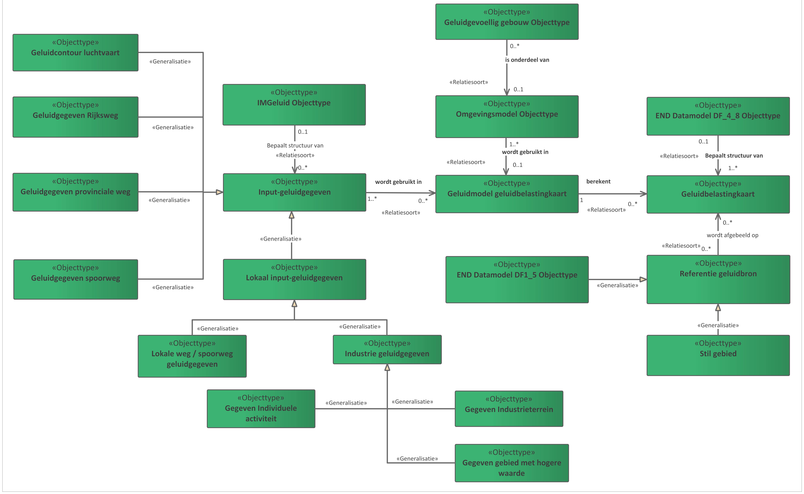
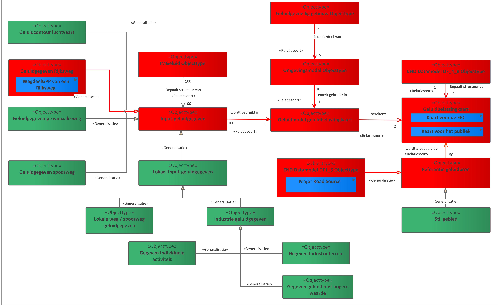

Conceptueel Model Geluidbelastingkaarten specificatie (CMGeluidbelastingkaarten)
========================================================
<figure id="Figuur_10">

<figcaption>Conceptueel model geluidbelastingkaarten.</figcaption>
</figure>

Het Conceptueel Model Geluidbelastingkaarten (CMGeluidbelastingkaarten) brengt in kaart welke
gegevens een rol kunnen gaan spelen in de toekomstige situatie. Ook positioneert
het CMGeluidbelastingkaarten de Objecttypen uit het END-Datamodel en IMGeluid. In dit hoofdstuk worden de objecttypen gedefinieerd en
toegelicht. Het CMGeluidbelastingkaarten is een concept perspectief op de toekomst. Het doel
van het model is om een overzicht te geven op waar relevante informatie voor het
maken van een geluidbelastingkaart vandaan kan worden gehaald. Dit model wordt
gebruikt om de specifieke uitbreidingen die nodig zijn voor het IMGeluid te
bepalen.

Wat opvalt is dat het model vanuit een hoger
[niveau](https://docs.geostandaarden.nl/mim/mim/\\\#typen-informatiemodellen)
naar de informatie kijkt dan het IMGeluid. Voor het doel van dit model is het
niet nodig om meer gedetailleerd te kijken naar de verschillende objecttypen.
Zie [**figuur 10](#Figuur_10)** voor een UML weergave van het
CMGeluidbelastingkaarten.

Toelichting op CM Geluidbelastingkaarten
---------------------------------

In het CM Geluidbelasting staat het Geluidmodel centraal. Op basis van dit model
wordt een geluidbelastingkaart berekend. De structuur van deze
geluidbelastingkaart, wordt bepaald door DF4_8 van het END
Datamodel. In de geschetste situatie bevat een geluidmodel minstens één
geluidgegeven. Dit geluidgegeven zou uit de CVGG kunnen worden gehaald, wanneer
er op termijn wordt besloten deze ook via de CVGG uit te wisselen. De structuur
van dit Input-geluidgegeven kan in dit geval bepaald worden door IMGeluid. Dit
Input-geluidgegeven kan in deze situatie afkomstig zijn van een rijksweg, een
provinciale weg, een spoorweg, van een agglomeratie-gemeente of van een
luchthaven.

Wanneer het geluidmodel betrekking heeft op een agglomeratie gemeente, zullen
lokale geluidgegeven over wegen, spoorwegen, industrie en overige
geluidbelastende activiteiten worden gebruikt in het geluidmodel. Het
geluidmodel bevat ook een model van de omgeving. In dit omgevingsmodel zitten
bijvoorbeeld hoogtelijnen en geluidgevoelige gebouwen. Deze kunnen door de maker
van het geluidmodel zelf gemodelleerd worden of op een andere manier worden
ingewonnen. Een oplossingsrichting is om een lijst met geluidgevoelige gebouwen
op te nemen in de CVGG. 

De cijfers die bij pijlen (relaties) van het type \<\<Relatiesoort\>\> staan in
de vorm [0…\*] (Multipliciteiten), maken het mogelijk om het model op
verschillende manieren te doorlopen. Deze Multipliciteiten geven grenzen aan van
hoe vaak het ene object mag verwijzen naar het andere object in de relatie.
Bijvoorbeeld: 1 of meerdere [1..\*] input geluidgegeven(s) worden gebruikt in 0
of meerdere [0..\*] Geluidmodellen. Het andere type relatie dat wordt gebruikt
in het CMGeluidbelastingkaarten is de \<\<Generalisatie\>\>. Deze relatie wordt gelegd
tussen twee Objecttypen om aan te geven dat het ene object generaliseerd in het
andere. Een geluidgegeven Rijksweg is bijvoorbeeld een specifiek soort
Input-geluidgegeven.

Om deze principes toe te lichten zullen we het CM Geluidbelastingkaarten een keer
geheel doorlopen voor de geluidbelastingkaarten van Rijkswegen. Zie [**Figuur 11**](#Figuur_11)
 voor een visualisatie hiervan. We beginnen linksboven in het model bij het
Objecttype Geluidgegeven Rijksweg. Laten we er voor dit voorbeeld vanuit gaan
dat we een geluidbelastingkaart willen maken van 100 wegdelen. Om te bepalen hoe
deze wegdelen eruitzien, kijken we naar het IMGeluid object WegdeelGPP in dit
hypothetische geval. In dit geval is ieder WegdeelGPP een Input-geluidgegeven
dat wordt gebruikt in een geluidmodel. De relatiesoort tussen de objecttypen
Input-geluidgegeven en Geluidmodel geluidbelastingkaart geeft nu aan dat 100
wegdelen worden gebruikt in 1 geluidmodel. De Multipliciteiten die hier gelden
staan dit toe. Vervolgens worden er 5 geluidgevoelige gebouwen toegevoegd aan
het omgevingsmodel en 5 omgevingsmodel objecten (dit zouden bijvoorbeeld
hoogtelijnen kunnen zijn) om de omgeving te modelleren. Deze 10 objecten worden
toegevoegd aan het geluidmodel. Uit dit ene geluidmodel worden 2 verschillende
kaarten berekend. Eén kaart is voor de Lden situatie en één voor de Lnight
situatie. De geluidcontouren op beide kaarten worden opgeslagen in
overeenstemming met het Objecttype (featureType) met de naam
“EnvHealthDeterminantMeasure” afkomstig uit het END Datamodel (zie figure 41.
Streamlined data model for noise contour maps (DF4_8)). Bij een
geluidbelastingkaart horen ook gegevens over blootstelling aan lawaai. De kaart
voor het publiek wordt door Rijkswaterstaat nog aangevuld met een aantal
Aanvullende geluidgegevens. Deze Aanvullende geluidgegevens bevatten extra
informatie over de context die handig is voor het publiek. De ligging van 49
major Road Source Objecttypen wordt op de kaart afgebeeld samen met de
afbakening van een stil gebied.

<figure id="Figuur_11">

<figcaption>Voorbeeld uitwerking van het Conceptueel model Geluidbelastingkaarten.</figcaption>
</figure>

Centraal rekenen en publieke geluidbelastingkaarten
--------------------------------------------------------------------------------------

In hoofdstuk 5 werd al genoemd dat IenW meerdere denkbare scenario’s heeft
uitgewerkt voor de toekomst van geluidberekeningen met betrekking tot
geluidbelastingkaarten. Een scenario waar in dit rapport nog minder aandacht aan
is besteed, is het centraal berekenen van geluidbelastingkaarten. In dit
scenario kan de CVGG centraal geluidbelastingkaarten berekenen. In dit scenario
hoeven de bronhouders alleen de geluidgegevens waarover zij zelf beschikken aan
te leveren en doet de CVGG de rest. Maar deze geluidgegevens moeten dan wel
volledig en precies volgens het IMGeluid worden aangeleverd. Het belangrijkste
werk is daarmee al verricht. Dit scenario zal aantrekkelijk worden, wanneer het
met forse besparing op de rekentijden gepaard zal gaan, of met besparing op
licentiekosten voor rekensoftware. In combinatie met aanvullende gegevens, bijvoorbeeld in de Atlas Leefomgeving, zouden de geluidbelastingkaarten ook gebruikt kunnen worden voor de informatievoorziening aan het publiek.

Geluidbelastingkaarten voor het publiek bevatten vaak nog aanvullende gegevens
om de kaart beter leesbaar te maken. Dit zijn bijvoorbeeld gegevens over de
ligging van industrieterreinen of andere geluidbelastende activiteiten. Wanneer
in de toekomst voor dit scenario wordt gekozen, is het daarom ook belangrijk om
na te denken over het inwinningsvraagstuk dat achter deze gegevens zit. Mogelijk
kunnen alle aanvullende gegevens uit het DSO (Digitaal Stelsel Omgevingswet)
worden ingewonnen, maar dit is tot op heden onzeker. Het blijft daarom een optie
dat deze ontbrekende gegevens, optioneel worden opgenomen in het IMGeluid zodat ze aangeleverd kunnen worden aan de CVGG.

Definities CMGeluidbelastingkaarten
----------------------------

### Objecttype Input-geluidgegeven

| **Naam**        | Input-geluidgegeven                                                                                                                                                                                                  |
|-----------------|----------------------------------------------------------------------------------------------------------------------------------------------------------------------------------------------------------------------|
| **Definitie**   | Geluidgegeven dat wordt gebruikt in een geluidmodel voor geluidbelastingkaarten te berekenen, dat kan worden afgenomen vanuit de CVGG.                                                                               |
| **Toelichting** | Het gaat hier om geluidgegevens m.b.t. rijkswegen, provinciale wegen, lokale wegen, spoorwegen, industrie en Luchtvaart. De structuur van deze gegevens wordt binnen de uitbreiding van het IMGeluid gespecificeerd. |
| **Abstract**    | **Ja**. Dit betekent dat dit modelelement niet op zichzelf bestaat, maar dat het altijd een GeluidgegevenRijksweg, GeluidgegevenProvincialeWeg, GeluidgegevenHoofdpoorweg of een GeluidcontourLuchtvaart betreft.    |
| **Herkomst**    | CMGeluidbelastingkaarten                                                                                                                                                                                                    |

### Objecttype Geluidgegeven rijksweg

| **Naam**        | Geluidgegeven rijksweg                                                                                                                                                                                                                                                                                                                                                                                                                                       |
|-----------------|--------------------------------------------------------------------------------------------------------------------------------------------------------------------------------------------------------------------------------------------------------------------------------------------------------------------------------------------------------------------------------------------------------------------------------------------------------------|
| **Definitie**   | Geluidgegeven afkomstig van een stukje rijksweg met een verkeersintensiteit van meer dan 3 miljoen motorvoertuigen per jaar, dat wordt gebruikt in een geluidmodel voor geluidbelastingkaarten te berekenen.                                                                                                                                                                                                                                                 |
| **Toelichting** | Het gaat hier om geluidgegevens die Rijkswaterstaat in beheer heeft. Deze gegevens zijn wat betreft betekenis (semantiek) anders dan de gegevens in WegdeelGPP uit IMGeluid, dus zullen een eigen objecttype moeten krijgen binnen IMGeluid. Dit zal waarschijnlijk gaan om een aangepaste versie van GPPWegdeel. Dit objecttype heeft een aangepaste definitie en bevat een aantal extra attribuutsoorten om te kunnen rekenen met de CNOSSOS rekenmethode. |
| **Abstract**    | Nee.                                                                                                                                                                                                                                                                                                                                                                                                                                                         |
| **Herkomst**    | CMGeluidbelastingkaarten                                                                                                                                                                                                                                                                                                                                                                                                                                            |

### Objecttype Geluidgegeven Provinciale Weg

| **Naam**        | Geluidgegeven provinciale weg                                                                                                                                                                                                                                                                                                                                                                                                                              |
|-----------------|------------------------------------------------------------------------------------------------------------------------------------------------------------------------------------------------------------------------------------------------------------------------------------------------------------------------------------------------------------------------------------------------------------------------------------------------------------|
| **Definitie**   | Geluidgegeven afkomstig van een stukje provinciale weg met een verkeersintensiteit van meer dan 3 miljoen motorvoertuigen per jaar, dat wordt gebruikt in een geluidmodel voor geluidbelastingkaarten te berekenen.                                                                                                                                                                                                                                        |
| **Toelichting** | Het gaat hier om geluidgegevens die een Provincie in beheer heeft. Deze gegevens zijn wat betreft betekenis (semantiek) anders dan de gegevens in WegdeelGPP uit IMGeluid, dus zullen een eigen objecttype moeten krijgen binnen IMGeluid. Dit zal waarschijnlijk gaan om een aangepaste versie van GPPWegdeel. Dit objecttype heeft een aangepaste definitie en bevat een aantal extra attribuutsoorten om te kunnen rekenen met de CNOSSOS rekenmethode. |
| **Abstract**    | **Nee**.                                                                                                                                                                                                                                                                                                                                                                                                                                                   |
| **Herkomst**    | CMGeluidbelastingkaarten                                                                                                                                                                                                                                                                                                                                                                                                                                          |

### Objecttype Geluidgegeven spoorweg

| **Naam**        | Geluidgegeven spoorweg                                                                                                                                                                                                                                                                                                                                                                                                                                                                                                                                                                               |
|-----------------|-----------------------------------------------------------------------------------------------------------------------------------------------------------------------------------------------------------------------------------------------------------------------------------------------------------------------------------------------------------------------------------------------------------------------------------------------------------------------------------------------------------------------------------------------------------------------------------------------------|
| **Definitie**   | Geluidgegeven afkomstig van een stukje hoofdspoorweg, of een Lokale spoorwegen met een verkeersintensiteit van meer dan 30.000 treinen per jaar, dat wordt gebruikt in een geluidmodel voor geluidbelastingkaarten te berekenen.                                                                                                                                                                                                                                                                                                                                                                    |
| **Toelichting** | Het gaat hier om geluidgegevens die ProRail in beheer heeft in het geval van Hoofdspoorwegen. De provincies beheren Lokale spoorwegen met een verkeersintensiteit van meer dan 30.000 treinen per jaar. Deze gegevens zijn wat betreft betekenis (semantiek) anders dan de gegevens in SpoordeelGPP uit IMGeluid, dus zullen een eigen objecttype moeten krijgen binnen IMGeluid. Dit zal waarschijnlijk gaan om een aangepaste versie van SpoordeelGPP. Dit objecttype heeft een aangepaste definitie en bevat een aantal extra attribuutsoorten om te kunnen rekenen met de CNOSSOS-rekenmethode. |
| **Abstract**    | **Nee.**                                                                                                                                                                                                                                                                                                                                                                                                                                                                                                                                                                                            |
| **Herkomst**    | CMGeluidbelastingkaarten                                                                                                                                                                                                                                                                                                                                                                                                                                                                                                                                                                                   |

### Objecttype Geluidcontour luchtvaart

| **Naam**        | GeluidcontourLuchtvaart                                                                                                                                                                                                                                                                                                                                                                                                                                                                                                                                                                                                                 |
|-----------------|-----------------------------------------------------------------------------------------------------------------------------------------------------------------------------------------------------------------------------------------------------------------------------------------------------------------------------------------------------------------------------------------------------------------------------------------------------------------------------------------------------------------------------------------------------------------------------------------------------------------------------------------|
| **Definitie**   | Geluidcontour afkomstig van burgerluchthavens van nationale betekenis met meer dan 50.000 vliegtuigbewegingen, oefenvluchten met lichte vliegtuigen niet meegerekend.                                                                                                                                                                                                                                                                                                                                                                                                                                                                   |
| **Toelichting** | Het gaat hier om geluidcontouren opgevraagd door afdeling DG Luchtvaart en Maritieme Zaken van het Ministerie van Infrastructuur en Waterstaat, bij burgerluchthavens met nationale betekenis. Aangezien het bij geluidbrongegevens voor luchtvaart vaak gaat om commercieel gevoelige informatie, hoeven alleen de contouren gebruikt te worden als input voor een geluidberekening. Deze contouren kunnen worden opgeslagen in de CVGG als een nieuwe aanlevering in overeenstemming met IMGeluid. Een nieuwe aanlevering is nodig omdat het in dit geval gaat om het gerealiseerde aantal vluchten en niet om een vergunde situatie. |
| **Abstract**    | **Nee**.                                                                                                                                                                                                                                                                                                                                                                                                                                                                                                                                                                                                                                |
| **Herkomst**    | CMGeluidbelastingkaarten                                                                                                                                                                                                                                                                                                                                                                                                                                                                                                                                                                                                                       |

### Objecttype Geluidmodel geluidbelastingkaart

| **Naam**        | Geluidmodel geluidbelastingkaart                                                                                                                                                                                                                                                                                                                                                                                                |
|-----------------|--------------------------------------------------------------------------------------------------------------------------------------------------------------------------------------------------------------------------------------------------------------------------------------------------------------------------------------------------------------------------------------------------------------------------------|
| **Definitie**   | Een geluidmodel van een bepaald gebied, bestaande uit Input-geluidgegevens en een omgevingsmodel, dat wordt gebruikt om geluidbelastingkaarten mee te berekenen.                                                                                                                                                                                                                                                                                       |
| **Toelichting** | Het geluidmodel wordt samengesteld door akoestisch experts in overeenstemming met de CNOSSOS-rekenmethode. Het doel van het geluidmodel is om zo goed mogelijk de geluidbelasting in een bepaald gebied te berekenen. Welk gebied dit betreft is afhankelijk van het bestuursorgaan dat de opdracht geeft om een geluidmodel te maken. Dit zou bijvoorbeeld het geluidmodel van een agglomeratie-gemeente kunnen zijn |
| **Abstract**    | **Nee**.                                                                                                                                                                                                                                                                                                                                                                                                                       |
| **Herkomst**    | CMGeluidbelastingkaarten                                                                                                                                                                                                                                                                                                                                                                                                              |

### Objecttype Lokaal input-geluidgegeven

| **Naam**        | Lokaal input-geluidgegeven                                                                                                                                                                                                                                                                                                                                                                                        |
|-----------------|-------------------------------------------------------------------------------------------------------------------------------------------------------------------------------------------------------------------------------------------------------------------------------------------------------------------------------------------------------------------------------------------------------------------|
| **Definitie**   | Geluidgegeven dat wordt gebruikt in een geluidmodel voor geluidbelastingkaarten te berekenen, opgehaald door een agglomeratie-gemeente vanuit lokale bronnen.                                                                                                                                                                                                                                                     |
| **Toelichting** | Niet alle geluidgegevens worden door agglomeraties opgevraagd bij andere overheden. Over de meeste lokale gegevens over geluidbelastende activiteiten, beschikt de gemeente zelf. In een beperkt volume vindt soms uitwisseling tussen agglomeratie-gemeenten plaats. Wanneer een agglomeratie-gemeente een geluidbelastingkaart gaat berekenen worden deze geluidgegevens gebruikt in een geluidmodel. |
| **Abstract**    | **Ja**. Dit betekent dat dit modelelement niet op zichzelf bestaat, maar dat het altijd wordt ingevuld door een meer specifiek objecttype. In dit geval zijn de specifiekere Objecttypen met de Generalisatie relatie zichtbaar in het model.                                                                                                                                                                     |
| **Herkomst**    | CMGeluidbelastingkaarten                                                                                                                                                                                                                                                                                                                                                                                                 |

### Objecttype Industrie geluidgegeven

| **Naam**        | Industrie geluidgegeven                                                                                                                                                                                                                                                                                                                                                                                                                                                                                                                                                                                                                                                                                                     |
|-----------------|-----------------------------------------------------------------------------------------------------------------------------------------------------------------------------------------------------------------------------------------------------------------------------------------------------------------------------------------------------------------------------------------------------------------------------------------------------------------------------------------------------------------------------------------------------------------------------------------------------------------------------------------------------------------------------------------------------------------------------|
| **Definitie**   | Een lokaal input-geluidgegeven met betrekking tot geluidbelastende activiteiten die te maken hebben met industrielawaai.                                                                                                                                                                                                                                                                                                                                                                                                                                                                                                                                                                                                    |
| **Toelichting** | Het gaat hier om geluidbelastende activiteiten en verzamelingen van activiteiten: Activiteiten op industrieterreinen met gpp’s waarvoor het geluid van dat industrieterrein meer is dan 55 dB Lden of 50 dB Lnight Activiteiten in gebieden met een hogere waarde voor geluid, waarvoor de geluidbelasting door die activiteiten op omliggende geluidgevoelige gebouwen meer kan zijn dan 55 dB Lden of 50 dB Lnight; Activiteiten buiten industrieterreinen met gpp’s met een ten hoogste toegelaten geluidbelasting door de activiteit meer is dan 55 dB Lden of 50 dB Lnight Wanneer een agglomeratie-gemeente een geluidbelastingkaart gaat berekenen worden deze geluidgegevens gebruikt in een geluidmodel. |
| **Abstract**    | **Ja** Dit betekent dat dit modelelement niet op zichzelf bestaat, maar dat het altijd wordt ingevuld door een meer specifiek objecttype. In dit geval zijn de specifiekere Objecttypen met de Generalisatie relatie zichtbaar in het model.                                                                                                                                                                                                                                                                                                                                                                                                                                                                                |
| **Herkomst**    | CMGeluidbelastingkaarten                                                                                                                                                                                                                                                                                                                                                                                                                                                                                                                                                                                                                                                                                                           |

### Objecttype Gegeven industrieterrein

| **Naam**        | Gegeven industrieterrein                                                                                                                                                                                                 |
|-----------------|------------------------------------------------------------------------------------------------------------------------------------------------------------------------------------------------------------------------------|
| **Definitie**   | Een geluidgegeven met betrekking op activiteiten op industrieterreinen met gpp’s waarvoor het geluid van dat industrieterrein meer is dan 55 dB Lden of 50 dB Lnight.                                                        |
| **Toelichting** | Tot deze gegevens behoren bijvoorbeeld geluidbronnen binnen een industrieterrein met GPP’s. Het gaat hier wel om een andere situatie dan die in de CVGG staat geregistreerd. In de CVGG staat namelijk de vergunde situatie. |
| **Abstract**    | **Nee**.                                                                                                                                                                                                                     |
| **Herkomst**    | CMGeluidbelastingkaarten                                                                                                                                                                                                            |

### Objecttype Gegeven aangewezen gebieden

| **Naam**        | Gegeven aangewezen gebieden                                                                                                                                                                                                                                                                                       |
|-----------------|-------------------------------------------------------------------------------------------------------------------------------------------------------------------------------------------------------------------------------------------------------------------------------------------------------------------|
| **Definitie**   | Een geluidgegeven met betrekking op activiteiten in gebieden met een hogere waarde voor geluid, waarvoor de geluidbelasting door die activiteiten op omliggende geluidgevoelige gebouwen meer kan zijn dan 55 dB Lden of 50 dB Lnight.                                                                            |
| **Toelichting** | Het beeld is dat tot deze aangewezen gebieden voornamelijk horeca concentratiegebieden behoren. Echter is het toegestaan als gemeente zelf invulling te geven aan deze categorie. Het is daarom enige mate van onzekerheid over welke andere soorten aangewezen gebieden precies worden gebruikt in het werkveld. |
| **Abstract**    | **Nee**.                                                                                                                                                                                                                                                                                                          |
| **Herkomst**    | CMGeluidbelastingkaarten                                                                                                                                                                                                                                                                                                 |

### Objecttype Industrie geluidgegeven

| **Naam**        | Gegeven groot bedrijf                                                                                                                                                                                                                                                                                                                                                  |
|-----------------|------------------------------------------------------------------------------------------------------------------------------------------------------------------------------------------------------------------------------------------------------------------------------------------------------------------------------------------------------------------------|
| **Definitie**   | Een geluidgegeven met betrekking op activiteiten buiten industrieterreinen met gpp’s met een ten hoogste toegelaten geluidbelasting door de activiteit meer is dan 55 dB Lden of 50 dB Lnight.                                                                                                                                                                         |
| **Toelichting** | Het gaat hier om grote bedrijven die buiten een gezoneerd industrieterrein met GPP’s liggen. Grote bedrijven die mogelijk meer geluid produceren dan is toegestaan, moeten voor een vergunningaanvraag akoestisch onderzoek laten uitvoeren. Het beeld van I&W hierbij is daarom dat de precieze invulling van deze categorie bekend is bij de agglomeratie-gemeenten. |
| **Abstract**    | **Ja**                                                                                                                                                                                                                                                                                                                                                                 |
| **Herkomst**    | CMGeluidbelastingkaarten                                                                                                                                                                                                                                                                                                                                                      |

### Objecttype Lokale weg / spoorweg geluidgegeven

| **Naam**        | Lokale weg / spoorweg geluidgegeven                                                                                                                                                                                                                                                                                                                                                                                                                                                                                                                 |
|-----------------|-----------------------------------------------------------------------------------------------------------------------------------------------------------------------------------------------------------------------------------------------------------------------------------------------------------------------------------------------------------------------------------------------------------------------------------------------------------------------------------------------------------------------------------------------------|
| **Definitie**   | Lokaal input-geluidgegeven over geluidbelastende activiteiten die te maken hebben met lokale wegen of spoorwegen.                                                                                                                                                                                                                                                                                                                                                                                                                                   |
| **Toelichting** | Het gaat hier om geluidgegevens met betrekking tot lokale wegen en spoorwegen waarvan een agglomeratie-gemeente bronhouder is. Deze gegevens zijn wat betreft betekenis (semantiek) anders dan de gegevens in WegdeelBGE en SpoordeelBGE uit IMGeluid, dus zullen een eigen objecttype moeten krijgen binnen IMGeluid. Dit zal waarschijnlijk gaan om aangepaste versies van SpoordeelBGE en WegdeelBGE. Deze objecttypen hebben een aangepaste definitie en bevat een aantal extra attribuutsoorten om te kunnen rekenen met CNOSSOS-rekenmethode. |
| **Abstract**    | **Nee**.                                                                                                                                                                                                                                                                                                                                                                                                                                                                                                                                            |
| **Herkomst**    | CMGeluidbelastingkaarten                                                                                                                                                                                                                                                                                                                                                                                                                                                                                                                                   |

### Objecttype Omgevingsmodel Objecttype

| **Naam**        | Omgevingsmodel Objecttype                                                                                                                                                                                                                                             |
|-----------------|----------------------------------------------------------------------------------------------------------------------------------------------------------------------------------------------------------------------------------------------------------------------|
| **Definitie**   | Objecttype afkomstig uit een omgevingsmodel geschikt voor geluidberekeningen.                                                                                                                                                                                        |
| **Toelichting** | Dit omgevingsmodel kan gemaakt zijn door het bestuursorgaan of er kan gebruik worden gemaakt van een landelijk model, zoals bijvoorbeeld het 3D omgevingsmodel geluid. Dit omgevingsmodel bevat ook geluidgevoelige gebouwen zoals bedoeld in Artikel 3.20 van BKL. |
| **Abstract**    | **Nee**.                                                                                                                                                                                                                                                             |
| **Herkomst**    | CMGeluidbelastingkaarten                                                                                                                                                                                                                                                    |

### Objecttype IMGeluid Objecttype

| **Naam**        | IMGeluid Objecttype                                                                                                                                                                                                                                                                                                    |
|-----------------|------------------------------------------------------------------------------------------------------------------------------------------------------------------------------------------------------------------------------------------------------------------------------------------------------------------------|
| **Definitie**   | Een objecttype afkomstig uit het Informatiemodel Geluid.                                                                                                                                                                                                                                                               |
| **Toelichting** | Dit is een objecttype uit het IMGeluid dat mogelijk kan worden gebruikt om de structuur van de input-geluidgegevens te bepalen. Deze input-geluidgegevens kunnen worden gebruikt om een geluidbelastingkaart te berekenen. Niet elk objecttype uit het IMGeluid is hiervoor geschikt. Het is afhankelijk van een keuze |
| **Abstract**    | **Ja**. Dit betekent dat dit modelelement niet op zichzelf bestaat, maar dat het altijd een objecttype is afkomstig uit het IMGeluid.                                                                                                                                                                                  |
| **Herkomst**    | IMGeluid                                                                                                                                                                                                                                                                                                               |

### Objecttype END Datamodel Objecttype

| **Naam**        | END Datamodel DF_4_8 Objecttype                                                                                                                  |
|-----------------|--------------------------------------------------------------------------------------------------------------------------------------------------|
| **Definitie**   | Een objecttype afkomstig uit het datamodel van de Environmental Noise Directive.                                                                 |
| **Toelichting** | In de specifieke relatie die hier zichtbaar is zou dit hier gaan om verschillende objecttypen uit de DF4_8 domeinmodellen van het END Datamodel. |
| **Abstract**    | **Ja**. Dit betekent dat dit modelelement niet op zichzelf bestaat, maar dat het altijd een objecttype is afkomstig uit het END Datamodel.       |
| **Herkomst**    | END Datamodel                                                                                                                                    |

### Objecttype Geluidgevoelig gebouw Objecttype

| **Naam**        | Geluidgevoelig gebouw Objecttype                                                                                                                                                                                                        |
|-----------------|----------------------------------------------------------------------------------------------------------------------------------------------------------------------------------------------------------------------------------------|
| **Definitie**   | Een objecttype dat een geluidgevoelig gebouw, zoals bedoeld in artikel 3.20 van BKL representeert, inclusief alle in de regelgeving bepaalde eigenschappen.                                                                           |
| **Toelichting** | IenW wil op basis van een deelverzameling van kwetsbare gebouwen uit het REV en het Landelijk Register Kinderopvang een eigen bestand maken. Dit bestand wordt beschikbaar gesteld aan de bronhouders. |
| **Abstract**    | **Nee**.                                                                                                                                                                                                                               |
| **Herkomst**    | CMGeluidbelastingkaarten                                                                                                                                                                                                                      |

### Objecttype Geluidbelastingkaart

| **Naam**        | Geluidbelastingkaart                                                                                                                                                |
|-----------------|---------------------------------------------------------------------------------------------------------------------------------------------------------------------|
| **Definitie**   | Een geluidbelastingkaart zoals bedoeld in de Environmental Noise Directive in overeenstemming met het END Datamodel.                                                |
| **Toelichting** | De geluidbelastingkaart wordt berekend uit een GeluidmodelGeluidbelastingkaart in opdracht van bestuursorgaan. Een geluidbelastingkaart bevat de volgende gegevens: |
| **Abstract**    | **Nee**.                                                                                                                                                            |
| **Herkomst**    | CMGeluidbelastingkaarten                                                                                                                                                   |

-   De geluidbelasting Lden en de geluidbelasting Lnight door de geluidbronnen
    in het kalenderjaar voorafgaand aan dat van de vaststelling van een
    geluidbelastingkaart, weer te geven met 5 dB-contouren; en

-   Het aantal geluidgevoelige gebouwen en bewoners van woningen dat aan bij
    ministeriele regeling vastgestelde waarden van de geluidbelasting Lden en de
    geluidbelasting Lnight wordt blootgesteld, weer te geven in tabellen met
    geluidbelastingklassen van telkens 5 dB.

Los van de verplichte geluidbelastingkaarten die aan Europa moeten
worden gerapporteerd, worden er ook kaarten gemaakt om het publiek te
informeren. Voor deze kaarten voor het publiek is soms aanvullende informatie
vereist.

### Objecttype Aanvullend geluidgegeven

| **Naam**        | Aanvullend geluidgegeven                                                                                                                                                                                                                                                                                                                                                                                                                                                                                                                                                                                                                                                                                                                                       |
|-----------------|-------------------------------------------------------------------------------------------------------------------------------------------------------------------------------------------------------------------------------------------------------------------------------------------------------------------------------------------------------------------------------------------------------------------------------------------------------------------------------------------------------------------------------------------------------------------------------------------------------------------------------------------------------------------------------------------------------------------------------------------------------------|
| **Definitie**   | Een geometrische afbakening van een gebied of locatie die volgens de Nederlandse regelgeving relevante informatie toevoegt over de geluidbron aan geluidbelastingkaarten voor het publiek.                                                                                                                                                                                                                                                                                                                                                                                                                                                                                                                                                                                                     |
| **Toelichting** | Dit Objecttype bevat bijvoorbeeld de afbakening van een Industrieterrein, een horeca concentratiegebied of een ander aangewezen gebied. Een aanvullend geluidgegeven kent mogelijke een stuk meer invullingen. Binnen een geluidbelastingkaart bedoeld voor het publiek, vervult deze afbakening een informerende rol. De Nederlandse regelgeving stelt een aantal aanvullende geluidgegevens verplicht. In [bijlage A](#bijlage-1-de-inhoud-van-geluidbelastingkaarten-volgens-de-omgevingsregeling) staat een overzicht over wat de NL-regelgeving verplicht stelt. In de geluidbelastingkaarten die aan de EEA gerapporteerd worden, spelen deze gebiedsafbakeningen geen rol. Een Aanvullend geluidgegeven is **niet per se** hetzelfde als een input-geluidgegeven of een geluidbrongegeven. Het gaat in dit geval namelijk niet om een geluidgegeven dat wordt gebruikt in een geluidberekening, maar om een afbakening die voor het publiek betekenisvolle informatie toevoegt over de geluidbron. |
| **Abstract**    | **Ja**. Dit betekent dat dit modelelement niet op zichzelf bestaat, maar dat het altijd wordt ingevuld door een meer specifiek objecttype. In dit geval is het nog niet precies bekend welke specifieke referentie gebiedsaanwijzingen er worden gebruikt in het werkveld.                                                                                                                                                                                                                                                                                                                                                                                                                                                                                  |
| **Herkomst**    | CMGeluidbelastingkaarten                                                                                                                                                                                                                                                                                                                                                                                                                                                                                                                                                                                                                                                                                                                                           |

### Objecttype END Datamodel DF1_5 Objecttype

| **Naam**        | END Datamodel DF1_5 Objecttype                                                                                                                                                                                                                                                   |
|-----------------|----------------------------------------------------------------------------------------------------------------------------------------------------------------------------------------------------------------------------------------------------------------------------------|
| **Definitie**   | Objecttype afkomstig uit het END Datamodel dat extra bruikbare informatie toevoegt voor het publiek.                                                                                                                                                                             |
| **Toelichting** | De “Noise sources” (DF1_5) zijn objecttype afkomstig uit het END Datamodel. De Nederlandse vertaling hiervan, “geluidbronnen”, gebruiken we hier niet om verwarring te voorkomen met de input-geluidgegevens die worden gebruikt voor het berekenen van de geluidbelastingkaart. |
| **Abstract**    | **Nee**                                                                                                                                                                                                                                                                          |
| **Herkomst**    | END Datamodel                                                                                                                                                                                                                                                                    |

### Objecttype Stil gebied

| **Naam**        | Stil gebied                                                                                                                                                                                         |
|-----------------|-----------------------------------------------------------------------------------------------------------------------------------------------------------------------------------------------------|
| **Definitie**   | Afbakening van een stil gebied zoals bedoeld in de Europese richtlijn omgevingslawaai.                                                                                                              |
| **Toelichting** | Deze stille gebieden worden ook als DF7_10 gerapporteerd aan de EEA. In deze context zijn alleen de afbakening en het type stil gebied (**quietAreaType)** relevant voor de kaart voor het publiek. |
| **Abstract**    | **Nee**.                                                                                                                                                                                            |
| **Herkomst**    | END Datamodel                                                                                                                                                                                       |
