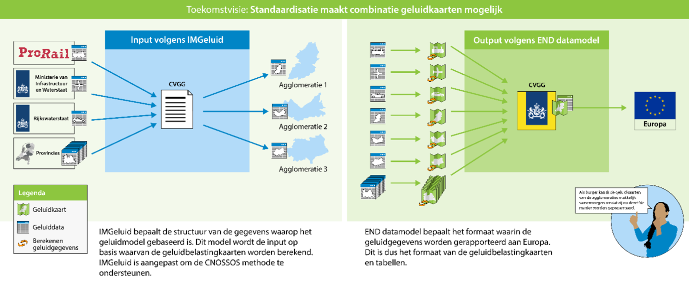
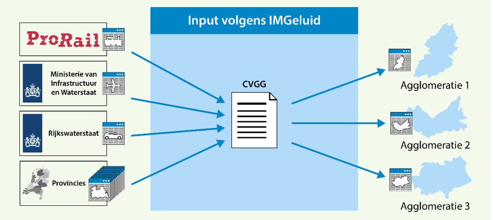

Toekomstvisie: geluidbelastingkaarten en -tabellen
=============

<figure id="Figuur_7">

<figcaption>Toekomstvisie rondom rapportage van geluidbelastingkaarten en -tabellen gevisualiseerd.</figcaption>
</figure>

In de toekomstvisie wordt op basis van de interviews een invulling gegeven aan de
situatie na de komst van het END Datamodel. In dit beeld zijn de wensen van de
opdrachtgever I&W en geïnterviewde stakeholders meegenomen. Onder deze toekomstvisie liggen een aantal afwegingen. Bij deze afwegingen wordt er gestreefd naar een
zo effectief mogelijke uitkomst, waarbij zowel technische als bestuurskundige
aspecten zijn meegenomen. Technische aspecten en bestuurskundige aspecten hangen
vaak met elkaar samen. Zo kan een standaard die complex is in beheer,
bijvoorbeeld ook voor veel extra kosten zorgen. In dit hoofdstuk zal de
toekomstvisie worden omscheven. De rationale achter deze afwegingen, is te vinden
in het [CIMGeluidbelasting](#IMGeluidbelasting).

In [**Figuur 7**](#Figuur_7) staat de toekomstvisie afgebeeld zoals uit interviews naar voren is gekomen. Het
proces voor het aanleveren van geluidbelastingkaarten en -tabellen valt op te delen in drie
deelprocessen:

1.  Het verzamelen van geluidgegevens en berekenen van geluidbelastingkaarten en
    tabellen.

2.  Het centraal aanleveren van geluidbelastingkaarten aan de CVGG.

3.  Het aanleveren van een rapportage aan de Europese commissie door de CVGG.

Input Verzamelen van geluidgegevens volgens IMGeluid
----------------------------------------------------

<figure id="Figuur_8">

<figcaption>Input Verzamelen van geluidgegevens volgens IMGeluid.</figcaption>
</figure>

Op de linker plaat valt te zien dat agglomeratie-gemeenten de CVGG kunnen
gebruiken om geluidgegevens af te nemen die dienen als input voor het berekenen
van geluidbelastingkaarten. Deze gegevens worden conform IMGeluid aangeleverd
door ProRail, Rijkswaterstaat, de provincies en I&W. Het gaat hierbij
respectievelijk om geluidgegevens t.b.v. hoofdspoor, rijkswegen, provinciale
wegen en luchthavens. Wanneer agglomeratie gemeenten de enige afnemer hiervan
zijn, hoeven alleen de geluidgegevens, die zich binnen de agglomeratiegrenzen
bevinden te worden aangeleverd aan de CVGG. Uit de interviews blijkt dat het voor agglometatie gemeenten een beperkt voordeel oplevert, wanneer alle geluidgegevens t.b.v. geluidbelastingkaarten aan de CVGG kunnen worden aangeleverd. De afweging die
hierachter ligt wordt nader toegelicht in [afwegingen ten grondslag aan het
CIMGeluidbelasting](#stellingen-ten-grondslag-aan-het-cimgeluidbelasting).

De geluidgegevens ten behoeve van het berekenen van geluidbelastingkaarten zijn
een aparte set van gegevens. Deze moeten, naast geluidgegevens voor monitoring,
apart worden aangeleverd door bronhouders. Dit is noodzakelijk aangezien twee
verschillende rekenmethode hiervoor worden gebruikt. Het IMGeluid zal worden
uitgebreid om deze aparte aanlevering te ondersteunen. De geluidgegevens die
door de agglomeratie-gemeenten worden gebruikt, kunnen in een formaat conform
IMGeluid uit de CVGG worden gehaald om vervolgens te importeren in hun
rekkenpakket.

Centraal aanleveren van kaarten aan de CVGG
-------------------------------------------

<figure id="Figuur_9">

<figcaption>Centraal aanleveren van kaarten aan de CVGG.</figcaption>
</figure>

De geluidbelastingkaarten worden berekend door de bronhouders. Het rekenpakket
zorgt ervoor dat de output van een geluidbelastingberekening kan worden
geëxporteerd conform het END Datamodel in geopackage formaat. Uit de interviews
is gebleken dat dit voor geluidexperts niet voor problemen zal zorgen. Het idee
is dat de verschillende stakeholders dit bestand vervolgens via het
uploadportaal van de CVGG uploaden. Echter staat het nog niet vast wat precies
de rol van de CVGG gaat worden, aangezien hier met de
CVGG nog geen afspraken over zijn vastgelegd.

Centraal aanleveren van kaarten en tabellen aan europa/het publiek
------------------------------------------------------------------

Er is een belangrijk verschil tussen de geluidbelastingkaarten die voor de
burgers worden gemaakt en de geluidbelastingkaarten die voor de EU worden
gemaakt: het rijk en de provincies nemen in de kaarten voor burgers ook de
gegevens op van de (spoor)wegen die liggen in agglomeraties, maar in de kaarten
voor de EU worden deze gegevens weggelaten om dubbelingen te voorkomen. Of dit
ook betekent of er twee kaarten aan de CVGG zullen moeten worden aangeleverd, of
dat de CVGG dit doet door de voorziening door te ontwikkelen, moet nog worden
afgesproken.

Mogelijk zou het van toegevoegde waarde kunnen zijn om achter het uploadportaal
een systeem te bouwen, dat geautomatiseerd volgens het END Datamodel de output
geluidgegevens, in de vorm van Geluidbelastingkaarten en-tabellen (en misschien
zelfs Major Noise sources), omzet tot een rapportage aan de Europa. Echter is er
niet voldoende onderzoek gedaan naar de impact hiervan op de CVGG om hier
uitspraken over te kunnen doen.

Uit de interviews kwam naar voren, dat er vraag is naar meer duidelijke
afspraken over wanneer welke geluidgegevens beschikbaar moeten zijn. Daarnaast
is er vraag naar meer communicatie tussen overheden. De CVGG werd aangewezen als
een potentieel geschikte organisator hiervoor, aangezien hier ook de benodigde
kennis over geluidsimulaties zit. Uit gesprekken met de CVGG is gebleken dat er
momenteel geen opdracht is om deze landelijke geluid community te organiseren.
