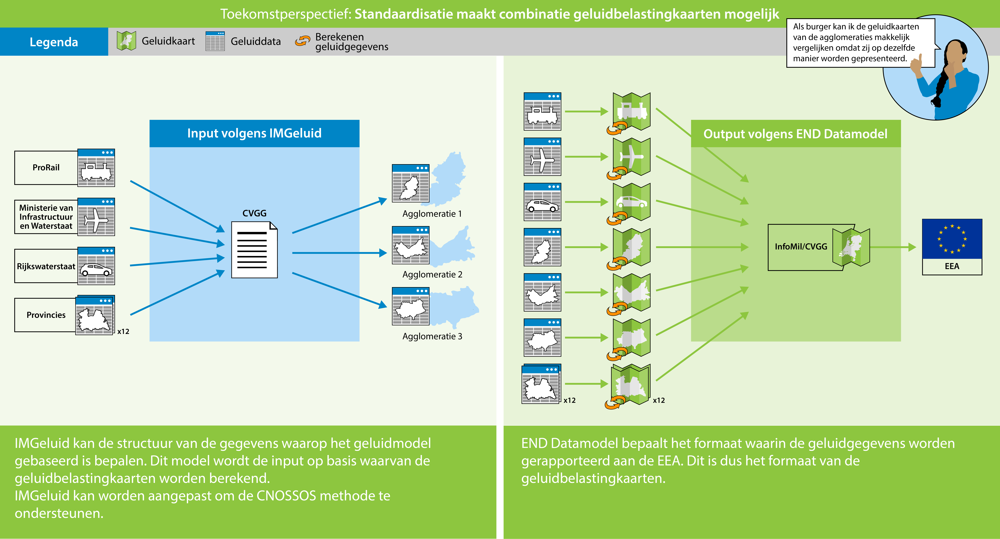
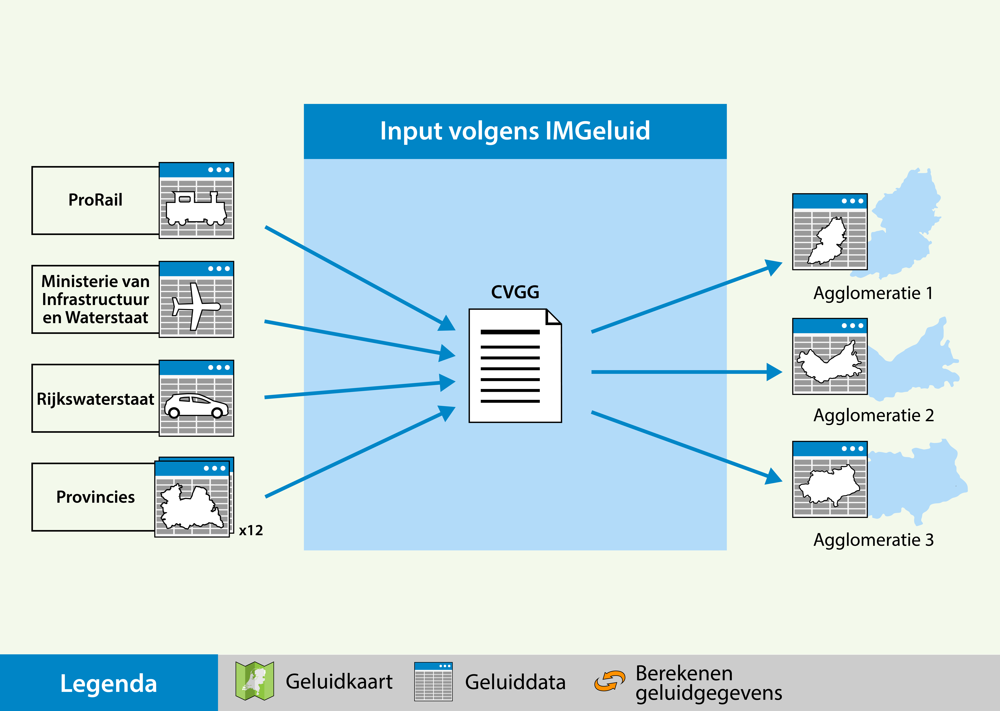
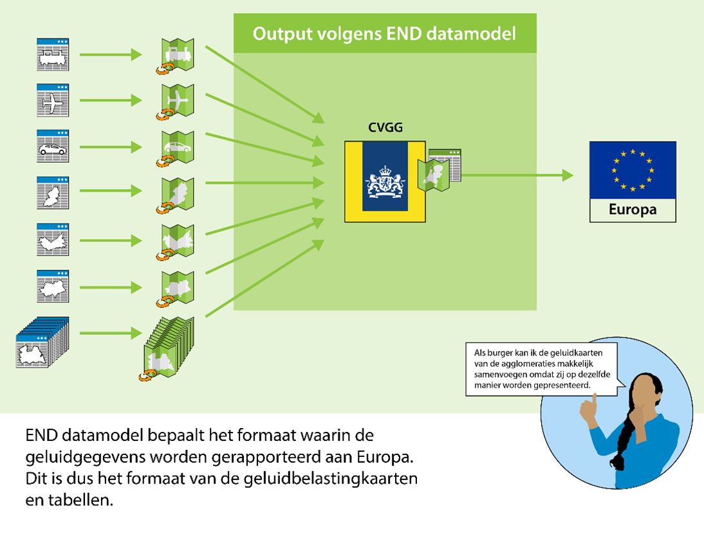

Toekomstperspectief: geluidbelastingkaarten en -tabellen
=============

<figure id="Figuur_7">

<figcaption>Toekomstvisie rondom rapportage van geluidbelastingkaarten en -tabellen gevisualiseerd. Open afbeelding in een nieuw tabblad om de afbeelding groter te zien.</figcaption>
</figure>

De opdrachtgever I&W heeft verschillende scenario’s voor de toekomst van
geluidberekeningen met betrekking tot geluidbelastingkaarten uitgewerkt. Het
gaat hier om scenario’s waar centraal rekenen bij de CVGG in verschillende mate
een rol speelt. In het toekomstperspectief wordt op basis van de interviews een
invulling gegeven aan de situatie na de komst van het END Datamodel. In dit
perspectief ligt de nadruk op het scenario waar decentraal wordt gerekend, maar
dit betekent niet dat centraal rekenen geen denkbaar scenario blijft voor de
toekomst. In dit beeld zijn de wensen van de opdrachtgever I&W en geïnterviewde
stakeholders meegenomen. Onder dit toekomstperspectief ligt een aantal
afwegingen. Bij deze afwegingen wordt er gestreefd naar een zo effectief
mogelijke uitkomst, waarbij zowel technische als bestuurskundige aspecten zijn
meegenomen. Technische aspecten en bestuurskundige aspecten hangen vaak met
elkaar samen. Zo kan een standaard die complex is in beheer, bijvoorbeeld ook
voor veel extra kosten zorgen. In dit hoofdstuk zal het toekomstperspectief
worden omschreven. De rationale achter deze afwegingen, is te vinden in het
[CMGeluidbelastingkaarten](#IMGeluidbelasting).

In [**Figuur 7**](\#Figuur_7) staat een toekomstperspectief afgebeeld
zoals uit interviews naar voren is gekomen. Het proces voor het aanleveren van
geluidbelastingkaarten en -tabellen valt op te delen in drie deelprocessen:

1.  Het verzamelen van geluidgegevens en berekenen van geluidbelastingkaarten en
    tabellen.

2.  Het centraal aanleveren van geluidbelastingkaarten aan de CVGG.

3.  Het aanleveren van een rapportage aan de Europese commissie door de CVGG en
    InfoMil.

Input verzamelen van geluidgegevens volgens IMGeluid
----------------------------------------------------

<figure id="Figuur_8">

<figcaption>Input Verzamelen van geluidgegevens volgens IMGeluid. Open afbeelding in een nieuw tabblad om de afbeelding groter te zien.</figcaption>
</figure>

ProRail, Rijkswaterstaat, de provincies en I&W verzamelen gegevens voor het
berekeningen van geluidbelastingkaarten. Daarnaast, zoals op de
linker plaat valt te zien, leveren ze deze gegevens ook aan CVGG. De
agglomeratie-gemeenten kunnen de CVGG gebruiken om geluidgegevens af te nemen
die, naast hun eigen verzamelde gegevens, dienen als input voor het berekenen
van geluidbelastingkaarten. Het gaat hierbij respectievelijk om geluidgegevens
t.b.v. hoofdspoor, rijkswegen, provinciale wegen en luchthavens. De partijen die
agglomeraties vertegenwoordigden in de interviews, gaven de indicatie dat het
centraal aanleveren van geluidbrongegevens t.b.v. geluidbelastingkaarten geen voordeel voor agglomeratiegemeenten oplevert. Daarentegen vergt het
weer een extra inspanning van de rijksbronbeheerders om de geluidbrongegevens op
te moeten “knippen” voor iedere agglomeratiegemeente, met de kans op fouten. Iedere agglomeratiegemeente moet immers ook de rijkswegen, provinciale wegen en spoorwegen opnemen in geluidbelastingkaarten. Het hele netwerk uitleveren is
volgens de rijksbronbeheerder de efficiëntste oplossing.

De geluidgegevens ten behoeve van het berekenen van geluidbelastingkaarten zijn
een aparte verzameling van gegevens met een eigen geluidmodel. Voor het grootste
deel is de opbouw van deze brongegevens hetzelfde als voor monitoring, maar er
zijn verschillen. [Bijlage 2](#bijlage-2-verschillen-cnossos-en-nederlandse-rmg) geeft een samenvatting van deze
verschillen. Wanneer er in de toekomst voor een optie wordt gekozen met centraal
aanleveren, moeten deze geluidbrongegevens apart worden aangeleverd. Dit is
noodzakelijk aangezien twee verschillende rekenmethode hiervoor worden gebruikt.
Het IMGeluid zal in dit geval kunnen worden uitgebreid om deze aparte
aanlevering te ondersteunen. De geluidgegevens die door de agglomeratiegemeenten
worden gebruikt, kunnen in een formaat in overeenstemming met IMGeluid
uit de CVGG worden gehaald om vervolgens te importeren in hun rekenpakket. Op basis van een impactanalyse van het RIVM is besloten om de CVGG voorlopig niet te gebruiken om deze uitwisseling te ondersteunen. 

Centraal rapporteren van kaarten aan de CVGG
-------------------------------------------

<figure id="Figuur_9.1">

<figcaption>Centraal aanleveren van kaarten aan de CVGG. Open afbeelding in een nieuw tabblad om de afbeelding groter te zien.</figcaption>
</figure>

De geluidbelastingkaarten worden berekend door de bronhouders. Het rekenpakket
zorgt ervoor dat de output van een geluidbelastingberekening kan worden
geëxporteerd in overeenstemming met het END Datamodel in GeoPackage
formaat. Uit de interviews is gebleken dat dit voor geluidexperts niet voor problemen zal zorgen. Het idee is dat de verschillende stakeholders dit bestand vervolgens via het uploadportaal van de CVGG uploaden.

Centraal rapporteren van kaarten en tabellen aan de EEA en het publiek
------------------------------------------------------------------

Er is een belangrijk verschil tussen de geluidbelastingkaarten die voor de
burgers worden gemaakt en de geluidbelastingkaarten die voor de EU worden
gemaakt: het rijk en de provincies nemen in de kaarten voor burgers ook de
gegevens op van de (spoor)wegen die liggen in agglomeraties, maar in de
geluidbelastingtabellen voor de EEA worden deze gegevens weggelaten om dubbele
waarden te voorkomen. Dit zou in de toekomst vanuit een enkele
geluidbelastingkaart gedaan worden, door de agglomeraties automatisch uit de
kaarten van de rijksbronbeheerder te knippen. Daarnaast hebben kaarten voor het
publiek meer duiding en context nodig. Hoe deze context goed in beeld kan worden
gebracht, wordt geduid vanuit de wetgeving. Zie [bijlage 1](#bijlage-1-de-inhoud-van-geluidbelastingkaarten-volgens-de-omgevingsregeling) voor een
duiding van deze gegevens.

De CVGG kan InfoMil gaan ondersteunen bij het rapportageproces van
geluidbelastingkaarten. Dit zou kunnen door het uploadportaal van de CVGG
geschikt te maken voor het END-Datamodel. Op het moment van publicatie van dit
rapport heeft de CVGG hier de opdracht voor gekregen.

Landelijk bestand met geluidgevoelige gebouwen
--------------------------------------------------------------
In het Besluit kwaliteit leefomgeving (Bkl) staan 3 categorieën voor de
bescherming voor verschillende soorten gebouwen en locaties: zeer kwetsbaar,
kwetsbaar en beperkt kwetsbaar. De gemeente moet regels opnemen in het
omgevingsplan om deze gebouwen en locaties te beschermen vanwege externe
veiligheidsrisico's.

De gegevens van EV kwetsbare objecten zijn opgenomen in de risicokaart.
Provincies maken en beheren de risicokaart op basis van aangeleverde gegevens
door gemeenten, Rijk en provincies zelf [(Zie atlas van de Leefomgeving)](https://www.atlasleefomgeving.nl/kwetsbare-objecten) De gegevens worden o.m. als
[WFS](http://servicespub.risicokaart.nl/rk_services_pub/services/WFS-risicokaart) **beschikbaar gesteld [opmerking 13]**. De populatie [kwetsbare objecten voor Externe
Veiligheid](https://iplo.nl/thema/externe-veiligheid/kwetsbare-gebouwen/) is ruimer dan de populatie van **geluidgevoelige gebouwen voor domein Geluid [opmerking 14]**. Toepassing van het bestand Kwetsbare objecten van EV voor
geluidberekeningen rekent dus met iets ruimere populatie. IenW wil op basis van een deelverzameling van kwetsbare gebouwen uit het REV en het Landelijk Register Kinderopvang een eigen bestand maken. Dit bestand wordt beschikbaar gesteld aan de bronhouders.