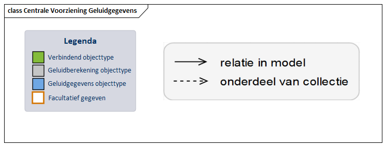

Inleiding en leeswijzer.
==========================

Inleiding informatiemodel
-------------------------------

De Centrale Voorziening Geluidgegevens (CVGG) wordt het digitale systeem om
geluidgegevens uit te wisselen. De bronhouders zijn het rijk, de provincies, de
gemeenten en de waterschappen. Zij gaan geluidgegevens leveren aan de
voorziening. Geluidgegevens zijn geluidbrongegevens, zoals verkeersgegevens, en
berekende geluidwaarden, zoals geluidproductieplafonds en
monitoringswaarden. In het Informatiemodel Geluid staan de afspraken en technische
eisen waaraan de gegevens moeten voldoen. Om te komen tot een gedragen Informatiemodel is deze opgesteld in overleg met bronhouders en gebruikers. 
Een informatiemodel (IM) is nodig om op
een interoperabele manier informatie uit te wisselen. Het bevat de formele
definitie van objecten, attributen, relaties en regels in een bepaald
toepassingsdomein, inclusief de eisen aan de structuur en inhoud (semantiek) van
de gegevens die worden uitgewisseld binnen dit domein. Het toepassingsdomein is
in dit geval beheersing van het geluid van wegen, spoorwegen, en
industrieterreinen; en gegevensuitwisseling ten behoeve van akoestisch
onderzoek. Het doel van het Informatiemodel Geluid is dat:

-   alle relevante gegevens voor de beheersing van het geluid van wegen,
    spoorwegen, en industrieterreinen; en alle geluidbrongegevens voor
    akoestisch onderzoek en cumulatieberekeningen op gelijke, eenduidige, vooraf
    vastgestelde wijze aangeleverd kunnen worden;

-   gegevens op een eenduidige geautomatiseerde wijze ontsloten kunnen worden
    naar de afnemers, waaronder geluidexperts en belanghebbenden.

De afspraken uit het IMGeluid zijn vastgelegd in dit document, de IMGeluid
catalogus. In deze catalogus is de laatste versie van het informatiemodel te
vinden. Dit informatiemodel bestaat uit objecten die in relatie staan met
elkaar. Voor ieder object worden alle eigenschappen (attributen), die in de
werkelijkheid relevant zijn, opgenomen in het informatiemodel. Het
informatiemodel in deze catalogus is gemodelleerd conform het Metamodel
Informatie Modellering [[MIM]] met behulp van de modelleertaal UML [[uml]]. Het
MIM bevat modelleerregels waar het IMGeluid aan moet voldoen. Daarnaast sluit IMGeluid ook aan op het Basismodel Geo-informatie [[NEN3610]]. In deze catalogus zijn de objecttypen en attribuutsoorten
voorzien van definities, en waar nodig nadere toelichtingen, zodat het
informatiemodel ook te begrijpen is zonder kennis van UML.

Leeswijzer
----------------

Dit document is gestructureerd in 5 hoofdstukken. Hoofdstuk 2
beschrijft het toepassingsgebied of onderwerp waar deze catalogus op van
toepassing is. Hoofdstuk 3 geeft een beschrijving van dit
toepassingsgebied en hoe deze catalogus wordt toegepast in een
informatie- en data-uitwisselingsproces. In dit hoofdstuk zijn ook de normatieve
referenties opgenomen en de lijst met algemene termen, definities en
afkortingen. Hoofdstuk 4 is een korte samenvatting en identificatie van de
catalogus in tabelvorm. In hoofdstuk 5 is staat het Informatiemodel Geluid gespecificeerd in UML. In paragraaf 5.0 staan eerst alle diagrammen onder elkaar. Door op objecttypen in de diagrammen te klikken, kan meer gedetailleerde informatie in tabelvorm worden weergegeven. Hoofdstuk 6 bevat de inhoud van alle bij de gegevensuitwisseling gebruikte waardenlijsten.

De bijlage geeft een overzicht van de wijzigingen in het informatiemodel ten opzichte van de vorige versie. 

### Diagram leeswijzer

Hoe deze catalogus kan worden gelezen wordt [in deze video verder toegelicht](https://www.youtube.com/watch?v=2UiJ38_QdRU). 
Objecttypen worden binnen IMGeluid gecategoriseert als Administratief objecttype, Geluidberekening objecttype of Geluidgegevens objecttype. Deze categorisering wordt aangegeven in het diagram aan de hand van de kleuren in de legenda. 

| Categorie              | Omschrijving                                                                                                                                                             |
|-----------------------------|-----------------------------------------------------------------------------------------------------------------------------------------------------------------------|
| Administratief objecttype   | Het objecttype bevat administratieve gegevens die onder andere zorgen voor de herleidbaarheid van geluidberekening objecttypes, door samenhang te creëren met zowel geluidgegevens objecttypes als externe documenten. |
| Geluidberekening objecttype | Het objecttype heeft te maken met de uitkomst van een geluidberekening.                                                                                               |
| Geluidgegevens objecttype   | Het objecttype heeft te maken met akoestische gegevens die gebruikt kunnen worden bij een geluidberekening.                                                           |

