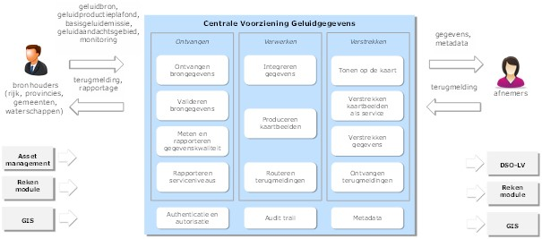
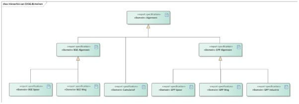

Overzicht 
============

Naam en Acroniemen
------------------------

IMG2020 – Dataspecificatie voor Centrale Voorziening Geluidgegevens (CVGG).

Informele beschrijving
---------------------------

Definitie
-----------------

RIVM ontwikkelt in opdracht van het ministerie van Infrastructuur en Waterstaat
een Centrale Voorziening Geluidgegevens om de nieuwe regelgeving te
ondersteunen. Het geeft een invulling aan wat in het Aanvullingsbesluit het
“geluidregister” wordt genoemd. De voorziening is een voortzetting en
uitbreiding van de geluidregisters die al bestaan voor rijkswegen en hoofdspoor.
In de voorziening moeten gegevens worden vastgelegd over de
geluidproductieplafonds, de basisgeluidemissies, de brongegevens op basis
waarvan deze zijn berekend, geluidaandachtsgebieden en de monitoringswaarden.
Hierdoor zijn geluidgegevens voor iedereen op één plaats, uniform en
laagdrempelig beschikbaar. Dat zorgt enerzijds voor transparantie over hoe
waarden tot stand zijn gekomen. Daarnaast moeten de brongegevens bij een
geluidproductieplafond ook verplicht gebruikt worden bij het berekenen van
geluidbelasting. Deze gegevens kunnen dan ook laagdrempelig worden verkregen uit
de centrale voorziening.

Beschrijving
--------------------

**Centrale Voorziening Geluidgegevens**

RIVM ontwikkelt in opdracht van het ministerie van I en W een Centrale
Voorziening Geluidgegevens om de nieuwe regelgeving te ondersteunen. Het geeft
een invulling aan wat in het Aanvullingsbesluit het “geluidregister” wordt
genoemd. De voorziening is een voortzetting en uitbreiding van de
geluidregisters die al bestaan voor rijkswegen en hoofdspoor. In de voorziening
moeten gegevens worden vastgelegd over de geluidproductieplafonds, de
basisgeluidemissies, de brongegevens op basis waarvan deze zijn berekend,
geluidaandachtsgebieden en de monitoringswaarden. Hierdoor zijn geluidgegevens
voor iedereen op één plaats, uniform en laagdrempelig beschikbaar. Dat zorgt
enerzijds voor transparantie over hoe waarden tot stand zijn gekomen. Daarnaast
moeten de brongegevens bij een geluidproductieplafond ook verplicht gebruikt
worden bij het berekenen van geluidbelasting. Deze gegevens kunnen dan ook
laagdrempelig worden verkregen uit de centrale voorziening.

Figuur 3 geeft een schets van de architectuur van de Centrale Voorziening
Geluidgegevens. Hierin is zichtbaar dat zowel rijk, provincies, gemeenten als
waterschappen bronhouder zijn. Zij zullen de relevante gegevens zelf halen uit
bijvoorbeeld asset management systemen, geluidrekenmodules of geografische
informatiesystemen. De voorziening ontvangt, valideert en integreert de gegevens
om ze vervolgens in verschillende vormen beschikbaar te stellen. Zo is er in
ieder geval voorzien dat een deel ervan beschikbaar is in een kaartviewer, dat
de kaartbeelden ook als geo-services beschikbaar zijn en dat er REST API’s
beschikbaar zullen komen om de gegevens in gestructureerde vorm op te vragen. De
voorziening zal ook functionaliteit beschikbaar stellen aan bronhouders voor het
controleren van allerlei kwaliteitsregels die inzicht geven in de plausibiliteit
van de gegevens. Het is de verantwoordelijkheid van de bronhouders zelf om
eventuele correcties in de gegevens aan te brengen

Om betekenisvolle en uniforme uitwisseling van geluidgegevens mogelijk te maken,
is in samenwerking met Geonovum een informatiemodel geluid ontwikkeld. Dit
informatiemodel zorgt ervoor dat alle gegevens die de voorziening beschikbaar
stelt eenduidig interpreteerbaar zijn en op een standaard manier kunnen worden
uitgewisseld met andere systemen. De nadruk van het informatiemodel ligt op het
beschrijven van de gegevens die noodzakelijk zijn om akoestische berekeningen
uit te voeren. Hierdoor ontstaat een geluidspecifiek beeld van onder meer wegen,
spoorwegen en industrieterreinen.

*Bron: RIVM: “Geluid op de kaart”;*

**Informatie Model Geluid**

IMG2020 vormt het gemeenschappelijke begrippenkader voor de uitwisseling van
informatie van verschillende bestaande en nieuwe geluidregisters. IMG2020 is
gemodelleerd conform de specificaties van het Metamodel Informatie Modellering
(MIM). Voor de uitleg van betekenis van entiteiten binnen het informatiemodel
wordt daarom verwezen naar de MIM catalogus (link:
https://geonovum.github.io/MIM-Werkomgeving/\#bijlagen). Binnen de scope van de
CVGG vallen dan ook verschillende geluiddomeinen. Om technische en
informatiekundige redenen, is de dataspecificatie opgedeeld in 9 domeinen. De
domeinen staan hieronder beschreven en hebben elk een apart domeinmodel binnen
de dataspecificatie (zie Hoofdstuk 5).

| Domeinnaam    | Omschrijving                                                                                                                                                                                                                                                                                                                                                                                                                                                                                                               |
|---------------|----------------------------------------------------------------------------------------------------------------------------------------------------------------------------------------------------------------------------------------------------------------------------------------------------------------------------------------------------------------------------------------------------------------------------------------------------------------------------------------------------------------------------|
| Algemeen      | In domeinmodel Algemeen staan objecten, attributen en relaties die relevant zijn voor akoestisch onderzoek bij alle domeinen binnen IMG2020. Vanuit andere domeinen wordt vaak verwezen naar objecten binnen dit domein, deze verwijzing is vaak in de vorm van een link. In sommige gevallen wordt er een domein specifieke specialisatie gemaakt van een Algemeen object. Dit wordt gedaan door gebruik te maken van een generalisatierelatie. (het omgekeerde van een generalisatierelatie is een specialisatierelatie) |
| BGE Algemeen  | In domeinmodel BGE Algemeen staan objecten, attributen en relaties die relevant zijn voor akoestisch onderzoek bij alle basisgeluidemissie (BGE) domeinen binnen IMG2020.                                                                                                                                                                                                                                                                                                                                                  |
| BGE Spoor     | In domeinmodel BGE Spoor staan objecten, attributen en relaties die nodig zijn voor akoestisch onderzoek bij lokale spoorwegen waarvoor de basisgeluidemissie regeling geld.                                                                                                                                                                                                                                                                                                                                               |
| BGE Weg       | In domeinmodel BGE Weg staan objecten, attributen en relaties die nodig zijn voor akoestisch onderzoek bij gemeentelijke wegen waarvoor de basisgeluidemissie regeling geld.                                                                                                                                                                                                                                                                                                                                               |
| GPP Algemeen  | In domeinmodel GPP Algemeen staan objecten, attributen en relaties die relevant zijn voor akoestisch onderzoek bij alle GPP domeinen binnen IMG2020.                                                                                                                                                                                                                                                                                                                                                                       |
| GPP Industrie | In domeinmodel GPP Industrie staan objecten, attributen en relaties die nodig zijn voor akoestisch onderzoek bij industrieterreinen waarvoor de geluidproductieplafond regeling geld.                                                                                                                                                                                                                                                                                                                                      |
| GPP Spoor     | In domeinmodel GPP Spoor staan objecten, attributen en relaties die nodig zijn voor akoestisch onderzoek bij spoorwegen waarvoor de geluidproductieplafond regeling geld.                                                                                                                                                                                                                                                                                                                                                  |
| GPP Weg       | In domeinmodel GPP Weg staan objecten, attributen en relaties die nodig zijn voor akoestisch onderzoek bij wegen waarvoor de geluidproductieplafond regeling geld.                                                                                                                                                                                                                                                                                                                                                         |
| Cumulatief    | In domeinmodel Cumulatief staan objecten, attributen en relaties die nodig zijn voor akoestisch onderzoek bij luchthavens, militaire oefenterreinen en windturbines. Voor luchthavens en militaire oefenterreinen hoeven alleen geluidcontouren te worden opgenomen, maar voor windturbines op een industrieterrein moeten ook brongegevens worden opgenomen.                                                                                                                                                              |

Niet ieder domein staat op hetzelfde hiërarchische niveau. Hiermee is bedoeld
dat sommige domeinen objecten over nemen uit andere domeinen. Dit is gedaan om
ervoor te zorgen dat objecten niet redundant in de dataspecificatie hoeven
worden opgenomen. In de afbeelding hieronder is gemodelleerd hoe de hiërarchie
in elkaar zit aan de hand van de UML generalisatie relatie.

**Aanleverplicht**

IMG2020 zal samen met de AREG een juridische status krijgen. Dit houd in dat het
wettelijk zal worden vastgesteld welke brongegevens moeten worden aangeleverd.
Vooralsnog zal de AREG bepalen welke brongegevens dit zijn. Momenteel wordt
gekeken of deze regels ook in het informatiemodel kunnen worden opgenomen.

**Uitgangspunten toegepast bij modelleren van IMG2020**

-   IMG2020 is gemodelleerd conform het Metamodel Informatie Modellering.

-   IMG2020 gaat uit van een Nederlandse syntax.

-   IMG2020 ondersteunt de huidige werkprocessen en is niet bedoeld om die te
    harmoniseren. Wanneer vanuit gebruik de behoefte bestaat aan aanvullende
    informatie bovenop het wettelijke verplichte minimum, dan kan dat uit
    oogpunt van dienstverlening worden opgenomen.

Normatieve referenties. 
----------------------------

De volgende documenten zijn onmisbaar voor de totstandkoming van dit document:

-   MIM – [Metamodel Informatie Modellering](https://geonovum.github.io/MIM-Werkomgeving/#bijlagen)

-   [Raamwerk van geo-standaarden 3.0](https://www.geonovum.nl/uploads/documents/Raamwerk%20Geo-Standaarden%20v3.0.pdf)

-   NEN 3610:2011/A1:2016 Basismodel Geo-informatie. (Versie goed?)

-   ISO19107: Geographic information – Spatial schema . (Versie?)

-   Geomilieu handleiding?

-   RIVM: PSA Centrale Voorziening Geluidgegevens 1.03?

-   AREG - Aanvullingsregeling geluid_200113

Totstandkoming. 
--------------------

Deze specificatie is opgesteld door Geonovum en is gebaseerd op ??.

| Documenttitel      | IMG2020 – Dataspecificatie Centrale Voorziening Geluidgegevens |
|--------------------|----------------------------------------------------------------|
| Referentiedatum    | 2020-01-29                                                     |
| Auteur(s)          | Gerard Trouborst, Joeri van Es, Linda van den Brink            |
| Betrokken partijen | Ministerie van I&W, RIVM en Geonovum                           |
| Taal               | Nederlands                                                     |

Mapping met bestaande standaarden
-------------------------------------

Algemene Termen en definities. 
-----------------------------------

Lijst van termen en definities die in deze beschrijving worden gehanteerd,
gesorteerd op alfabetische volgorde per domein.

### Geluiddomein

| **Termen**                                                                               | Definities                                                                                                                                                                                                                                                                                                                                                                                                                                                                                                                                                                                                            |
|------------------------------------------------------------------------------------------|-----------------------------------------------------------------------------------------------------------------------------------------------------------------------------------------------------------------------------------------------------------------------------------------------------------------------------------------------------------------------------------------------------------------------------------------------------------------------------------------------------------------------------------------------------------------------------------------------------------------------|
| **Actieplannen**                                                                         | Plannen bedoeld voor de beheersing van lawaai-uitstoot en lawaai-effecten, waar nodig met inbegrip van lawaaivermindering (bron: EU-richtlijn omgevingslawaai).                                                                                                                                                                                                                                                                                                                                                                                                                                                       |
| **Afschermende objecten**                                                                | Ter verbetering van de kwaliteit van het milieu direct langs een weg of spoorweg geplaatste wallen en schermen (bron: regeling geluid milieubeheer).                                                                                                                                                                                                                                                                                                                                                                                                                                                                  |
| **Autoweg**                                                                              | Op grond van de Wegenverkeerswet 1994 aangeduide autoweg (bron: Omgevingswet).                                                                                                                                                                                                                                                                                                                                                                                                                                                                                                                                        |
| **Basisgeluidemissie**                                                                   | Basisgeluidemissie als bedoeld in artikel 3.25 (bron: Aanvullingsbesluit geluid). Basisgeluidemissies gelden voor gemeentewegen, waterschapswegen en lokaal spoor.                                                                                                                                                                                                                                                                                                                                                                                                                                                    |
| **Emissie**                                                                              | Directe of indirecte uitstoot, uit puntbronnen of diffuse bronnen, van stoffen, trillingen, warmte of geluid in de lucht, het water of de bodem behoort (bron: Omgevingswet).                                                                                                                                                                                                                                                                                                                                                                                                                                         |
| **Geluid**                                                                               | Met het menselijk oor waarneembare luchttrillingen (bron: Wet milieubeheer).                                                                                                                                                                                                                                                                                                                                                                                                                                                                                                                                          |
| **Geluidaandachtsgebied als bedoeld in artikel 3.19 (bron: Aanvullingsbesluit geluid).** | Een geluidaandachtsgebied is een locatie langs een weg of spoorweg of rond een industrieterrein waarbinnen het geluid hoger kan zijn dan de standaardwaarde in Lden. (bron: artikel 3.19 van het Aanvullingsbesluit geluid).                                                                                                                                                                                                                                                                                                                                                                                          |
| **Geluidbeperkende maatregel**                                                           | Maatregel die het geluid op een geluidgevoelig gebouw verlaagt (bron: Aanvullingsbesluit geluid).                                                                                                                                                                                                                                                                                                                                                                                                                                                                                                                     |
| **Geluidbron**                                                                           | Een object in de fysieke leefomgeving dat geluid produceert. In de context van de aanvullingswet geluid wordt daarbij specifiek gesproken over wegen, spoorwegen, industrieterreinen met activiteiten die in aanzienlijke mate geluid kunnen veroorzaken, windturbines en militaire schietterreinen.                                                                                                                                                                                                                                                                                                                  |
| **Geluidbrongegevens**                                                                   | Bij ministeriële regeling aangewezen gegevens, benodigd voor de vaststelling van het geluid vanwege een geluidbronsoort (bron: Aanvullingsbesluit geluid).                                                                                                                                                                                                                                                                                                                                                                                                                                                            |
| **Geluidbronsoort**                                                                      | Het geheel van geluidbronnen, bestaande uit:                                                                                                                                                                                                                                                                                                                                                                                                                                                                                                                                                                          |
| **Geluidgevoelig gebouw**                                                                | Geluidgevoelig gebouw als bedoeld in artikel 3.20 (bron: Aanvullingsbesluit geluid). Een geluidgevoelig gebouw is een gebouw of gedeelte daarvan met een woonfunctie, onderwijsfunctie, gezondheidszorgfunctie met bedgebied, bijeenkomstfunctie voor kinderopvang met bedgebied en nevengebruiksfuncties daarvan.                                                                                                                                                                                                                                                                                                    |
| **Geluidhinder**                                                                         | Gevaar, schade of hinder, als gevolg van geluid (bron: Wet milieubeheer).                                                                                                                                                                                                                                                                                                                                                                                                                                                                                                                                             |
| **Geluidproductieplafond**                                                               | Een omgevingswaarde met het oog op het beschermen van de gezondheid (bron: artikel 2.29a Ow / Aanvullingswet geluid). Een geluidproductieplafond als omgevingswaarde is een resultaatsverplichting (bron: artikel 3.42 Bkl / Aanvullingsbesluit geluid). Een geluidproductieplafond geeft de maximaal toegestane geluidproductie weer op een vast fictief punt (geluidreferentiepunt) op korte afstand van de geluidbron. Geluidproductieplafonds worden gedefinieerd voor rijksinfra (rijkswegen, spoor), provinciale wegen, lokale spoorwegen waarvoor de provincie het bevoegd gezag heeft, en industrieterreinen. |
| **Geluidreferentiepunt**                                                                 | Locatie waar een geluidproductieplafond van toepassing is (bron: Aanvullingsbesluit geluid).                                                                                                                                                                                                                                                                                                                                                                                                                                                                                                                          |
| **Geluidsbelastingkaart**                                                                | Weergave van gegevens omtrent een bestaande of voorspelde geluidssituatie in termen van een geluidsbelastingsindicator, overschrijding van een geldende relevante grenswaarde, aantal blootgestelde personen in een bepaald gebied, aantal woningen dat in een bepaald gebied blootgesteld is aan bepaalde waarden van een geluidsbelastingsindicator (bron: EU-richtlijn omgevingslawaai).                                                                                                                                                                                                                           |
| **Geluidwerende maatregel**                                                              | Fysieke maatregel aan een gebouw die de geluidwering van de uitwendige scheidingsconstructie verhoogt (bron: Aanvullingsbesluit geluid).                                                                                                                                                                                                                                                                                                                                                                                                                                                                              |
| **Gemeenteweg**                                                                          | Weg in beheer bij een gemeente (bron: Aanvullingsbesluit geluid).                                                                                                                                                                                                                                                                                                                                                                                                                                                                                                                                                     |
| **Grenswaarde**                                                                          | Een grens waarvan alleen bij uitzondering en alleen in aangegeven gevallen (zoals bij “zwaarwegende belangen”) kan worden afgeweken. (bron: NvT Aanvullingsbesluit geluid).                                                                                                                                                                                                                                                                                                                                                                                                                                           |
| **Lden**                                                                                 | De Lden (Engels: Level day-evening-night) is een Europese maat om de geluidsbelasting door omgevingslawaai over een hele dag uit te drukken. (Bron: <https://nl.wikipedia.org/wiki/Lden>)                                                                                                                                                                                                                                                                                                                                                                                                                             |
| **Omgevingslawaai**                                                                      | Ongewenst of schadelijk geluid buitenshuis dat door menselijke activiteiten wordt veroorzaakt, inclusief lawaai dat wordt voortgebracht door vervoermiddelen, wegverkeer, spoorwegverkeer, luchtverkeer en locaties van industriële activiteiten als beschreven in bijlage I van Richtlijn 96/61/EG van de Raad van 24 september 1996 inzake geïntegreerde preventie en bestrijding van verontreiniging (2) (bron: EU-richtlijn omgevingslawaai).                                                                                                                                                                     |
| **Plafondcorrectiewaarde**                                                               | Getal waarmee de geluidemissie wordt vermeerderd met betrekking tot een daarbij aangegeven gedeelte van een weg of spoorweg ten behoeve van het bepalen van de geluidproductie dan wel de geluidsbelasting (bron: regeling geluid milieubeheer).                                                                                                                                                                                                                                                                                                                                                                      |
| **Provinciale weg**                                                                      | Weg in beheer bij een provincie (bron: Aanvullingsbesluit geluid).                                                                                                                                                                                                                                                                                                                                                                                                                                                                                                                                                    |
| **Rijksweg**                                                                             | Weg in beheer bij het Rijk (bron: Aanvullingsbesluit geluid).                                                                                                                                                                                                                                                                                                                                                                                                                                                                                                                                                         |
| **Rijstrook**                                                                            | Strook van de rijbaan van een weg, welke voldoende plaats biedt aan een enkele rij rijdende motorvoertuigen op meer dan drie wielen, of, indien door middel van markering een bredere strook als rijstrook is aangegeven, die strook (bron: Wet geluidhinder).                                                                                                                                                                                                                                                                                                                                                        |
| **Spoorweg**                                                                             | weg bestemd voor verkeer over spoorstaven of geleiderails (bron: Spoorwegwet).                                                                                                                                                                                                                                                                                                                                                                                                                                                                                                                                        |
| **Standaardwaarde**                                                                      | Een geaccepteerd vertrekpunt (niveau) waarvan gemotiveerd kan worden afgeweken (bron: NvT Aanvullingsbesluit geluid). De standaardwaarde voor geluid vertegenwoordigt een “geaccepteerd geluidniveau”: als aan de standaardwaarde voldaan wordt, is geen nadere afweging of besluitvorming nodig (tenzij bevoegd gezag hier meer specifieke regels voor heeft gespecificeerd).                                                                                                                                                                                                                                        |
| **Uitwendige scheidingsconstructie**                                                     | Uitwendige scheidingsconstructie als bedoeld in bijlage I bij het Besluit bouwwerken leefomgeving (bron: Aanvullingsbesluit geluid). Constructie die de scheiding vormt tussen een voor personen toegankelijke besloten ruimte van een gebouw en de buitenlucht, de grond of het water, inclusief de op die constructie aansluitende delen van andere constructies, voor zover die delen van invloed zijn op het voldoen van die scheidingsconstructie aan een in dit besluit gestelde eis (bron: bijlage I van het Besluit bouwwerken leefomgeving).                                                                 |
| **Waterschapsweg**                                                                       | Weg in beheer bij een waterschap (bron: Aanvullingsbesluit geluid).                                                                                                                                                                                                                                                                                                                                                                                                                                                                                                                                                   |
| **Weg**                                                                                  | Voor het openbaar rij- of ander verkeer openstaande weg of openstaand pad, met inbegrip van de daarin liggende bruggen of duikers, alsmede een spoorweg die niet is aangegeven op de kaart, bedoeld in artikel 106, of de geluidplafondkaart (bron: Wet geluidhinder).                                                                                                                                                                                                                                                                                                                                                |

Bron: RIVM: PSA Centrale Voorziening Geluidgegevens 1.03

### Informatiemodeldomein

| **Termen**                                                   | **Definities**                                                                                                                                                                                                                                                                                   |
|--------------------------------------------------------------|--------------------------------------------------------------------------------------------------------------------------------------------------------------------------------------------------------------------------------------------------------------------------------------------------|
| **annotatie**                                                | Elke toevoeging op een kaartbeeld voor verduidelijking                                                                                                                                                                                                                                           |
| **applicatieschema**                                         | informatiemodel dat gegevens beschrijft die worden gebruikt door een of meer applicaties OPMERKING IMKL is met UML beschreven in een applicatieschema.                                                                                                                                           |
| **associatie of relatie \<UML\>**                            | semantische relatie tussen twee of meer klassen die de connectie tussen hun instanties weergeeft                                                                                                                                                                                                 |
| **attribuut**                                                | kenmerk van een object                                                                                                                                                                                                                                                                           |
| **attribuutwaarde (value)**                                  | waarde die een attribuut aanneemt                                                                                                                                                                                                                                                                |
| **coördinaat**                                               | getal in een sequentie van n getallen om de positie van een punt in een n-dimensionale ruimte te bepalen                                                                                                                                                                                         |
| **coördinaatreferentiesysteem**                              | coördinaatsysteem dat aan een object is gerelateerd door een datum.                                                                                                                                                                                                                              |
| **coördinaatsysteem**                                        | set van wiskundige regels voor het toekennen van coördinaten aan punten                                                                                                                                                                                                                          |
| **datatype**                                                 | gestructureerde gegevens zonder identiteit                                                                                                                                                                                                                                                       |
| **datum**                                                    | parameter of set van parameters voor het definiëren van het nulpunt, de schaal en de oriëntatie van een coördinaatsysteem                                                                                                                                                                        |
| **diepte**                                                   | Afstand van een punt tot een gekozen referentievlak neerwaarts gemeten langs een lijn welke loodrecht op dat referentievlak staat.                                                                                                                                                               |
| **Domeinmodel**                                              | formele definitie van een subset van objecten, attributen, relaties en regels in een bepaald domein                                                                                                                                                                                              |
| **download service**                                         | service that enables copies of spatial data sets, or parts of such sets, to be downloaded and, where practicable, accessed directly. INSPIRE                                                                                                                                                     |
| **extensie (van informatiemodel)**                           | Een informatiemodel als uitbreiding op een ander informatiemodel                                                                                                                                                                                                                                 |
| **geo-informatie (geo-information, geographic information)** | informatie met een directe of indirecte referentie naar een plaats ten opzichte van de aarde (bijvoorbeeld ten opzichte van het aardoppervlak) OPMERKING Geo-informatie is synoniem aan geografische informatie.                                                                                 |
| **geo-object (geographic feature type, feature class)**      |  abstractie van een fenomeen in de werkelijkheid dat direct of indirect is geassocieerd met een locatie relatief ten opzichte van de aarde (bijvoorbeeld ten opzichte van het aardoppervlak)                                              |
| **georeferentie (georeference)**                             | locatie van een ruimtelijk object vastgelegd in een ruimtelijk referentiesysteem                                                                                                                                                                                                                 |
| **informatiemodel (conceptual model, conceptual scheme)**    | formele definitie van objecten, attributen, relaties en regels in een bepaald domein OPMERKING Domein is in dit verband: een kennisgebied of activiteit gekarakteriseerd door een verzameling van concepten en begrippen                                                                         |
| **instantie (instance, occurrence)**                         | benoemd, identificeerbaar object uit een objectklasse                                                                                                                                                                                                                                            |
| **label**                                                    | tekst of getal dat een eigenschap omschrijft of kwantificeert en als annotatie op een kaartbeeld wordt afgebeeld                                                                                                                                                                                 |
| **namespace**                                                | collectie van namen die in XML documenten gebruikt worden als element en attribuutnamen OPMERKING Een namespace wordt geïdentificeerd door een URI.                                                                                                                                              |
| **netwerk service**                                          | application running at the network application layer and above, that provides data storage, manipulation, presentation, communication or other capability which is often implemented using a client-server or peer-to-peer architecture based on application layer network protocols (Wikipedia) |
| **netwerktopologie**                                         | beschrijving van de plaats van de knooppunten en de onderlinge verbindingen in een netwerk                                                                                                                                                                                                       |
| **objectklasse (feature class)**                             | verzameling van objecten met dezelfde eigenschappen                                                                                                                                                                                                                                              |
| **presentatie**                                              | presentatie van informatie aan mensen OPMERKING Presentatie van informatie door visualisatie, hoorbaar maken, tastbaar maken (tactiel) of combinaties hiervan.                                                                                                                                   |
| **productmodel**                                             | informatiemodel afgeleid van een ander informatiemodel om de toepassing in een dataproduct te realiseren                                                                                                                                                                                         |
| **rasterformaat**                                            | representatie van beeld middel een gewoonlijk rechthoekig patroon van parallelle lijnen (v)                                                                                                                                                                                                      |
| **registratie**                                              | op nationaal niveau geïdentificeerde en erkende gegevensverzameling OPMERKING Een basisregistratie is een registratie.                                                                                                                                                                           |
| **registratiehouder**                                        | organisatie verantwoordelijk voor het houden van de registratie OPMERKING de registratiehouder is de organisatie die unieke objectidentificaties toekent voor objecten in een registratie                                                                                                        |
| **representatie**                                            | inhoudelijk vastleggen van de werkelijkheid. OPMERKING Het informatiemodel is een representatie van de werkelijkheid.                                                                                                                                                                            |
| **ruimtelijk referentiesysteem**                             | model (systeem) voor identificatie van een positie (locatie) in de werkelijkheid OPMERKING Identificatie van een positie kan door coördinaten (directe locatie) en door geografische identificatoren (indirecte locatie).                                                                        |
| **sectormodel**                                              | model voor beschrijving van de werkelijkheid binnen het domein van een beleidsveld                                                                                                                                                                                                               |
| **symbool**                                                  | presentatieprimitieve van grafische, audio of tactiele aard of een combinatie hiervan                                                                                                                                                                                                            |
| **temporeel referentiesysteem**                              | Referentiesysteem waarin de tijd is bepaald.                                                                                                                                                                                                                                                     |
| **vectorformaat**                                            | representatie van geometrie middels geometrische primitieven                                                                                                                                                                                                                                     |
| **void, nl**                                                 | object, of kenmerk van een object, dat syntactisch of semantisch is vereist, maar dat in de gegeven instantie geen informatie bevat                                                                                                                                                              |
| **waardelijst**                                              | lijst van waarden                                                                                                                                                                                                                                                                                |
| **werkelijkheid**                                            | beeld van de echte of hypothetische wereld die alles van belang omvat                                                                                                                                                                                                                            |

Algemene Symbolen en afkortingen. 
--------------------------------------

Lijst van afkortingen en acroniemen die worden gehanteerd in deze
dataspecificatie.

| **Afkortingen** | **Betekenissen**                                                                                                                                                                                                                                                                                        |
|-----------------|---------------------------------------------------------------------------------------------------------------------------------------------------------------------------------------------------------------------------------------------------------------------------------------------------------|
| **AREG**        | Aanvullingsregeling geluid                                                                                                                                                                                                                                                                              |
| **BAG**         | Basisregistratie Adressen en Gebouwen                                                                                                                                                                                                                                                                   |
| **BGE**         | Basisgeluidemissie                                                                                                                                                                                                                                                                                      |
| **CVGG**        | Centrale Voorziening Geluidgegevens                                                                                                                                                                                                                                                                     |
| **GML**         | Geography Markup Language                                                                                                                                                                                                                                                                               |
| **GPP**         | Geluidproductieplafond                                                                                                                                                                                                                                                                                  |
| **INSPIRE**     | Infrastructure for Spatial Information in Europe. De INSPIRE-richtlijn verplicht de Europese lidstaten geo-informatie over 34 thema's te voorzien van metadata, te harmoniseren en beschikbaar te stellen via het INSPIRE-portaal volgens leveringsvoorwaarden die het gebruik niet onnodig belemmeren. |
| **MIM**         | Metamodel Informatie Modellering                                                                                                                                                                                                                                                                        |
| **RIVM**        | Rijksinstituut voor Volksgezondheid en Milieu                                                                                                                                                                                                                                                           |
| **UML**         | Unified Modeling Language                                                                                                                                                                                                                                                                               |
| **WFS**         | Web Feature Service                                                                                                                                                                                                                                                                                     |
| **XML**         | Extensible Markup Language                                                                                                                                                                                                                                                                              |

