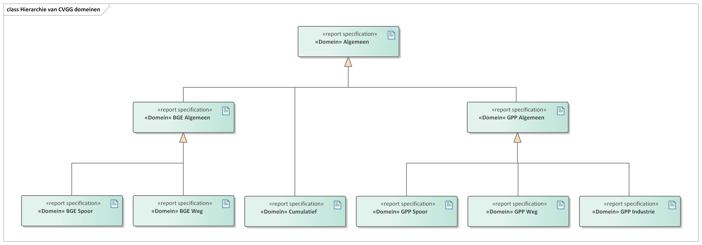
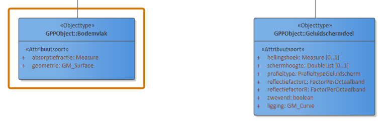
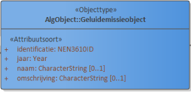

Overzicht
============

Naam en Acroniemen
------------------------

IMGeluid – Dataspecificatie voor Centrale Voorziening Geluidgegevens (CVGG).

Definitie
-----------------

In de Centrale Voorziening Geluidgegevens (CVGG) worden de gegevens vastgelegd die nodig zijn om de nieuwe geluidregelgeving binnen de Omgevingswet te ondersteunen. Het Informatiemodel Geluid zorgt ervoor dat alle gegevens die de voorziening beschikbaar
stelt eenduidig interpreteerbaar zijn en op een standaard manier kunnen worden
uitgewisseld met andere systemen.

Beschrijving
--------------------

### Centrale Voorziening Geluidgegevens

RIVM ontwikkelt in opdracht van het ministerie van Infrastructuur en Waterstaat
de Centrale Voorziening Geluidgegevens in het kader van het aanvullingsspoor geluid. Het CVGG geeft een invulling aan wat in het
Aanvullingsbesluit geluid Omgevingswet het “geluidregister” wordt genoemd. De
voorziening is een voortzetting en uitbreiding van de geluidregisters die al
bestaan voor rijkswegen en hoofdspoor. In de voorziening moeten gegevens worden
vastgelegd over de geluidproductieplafonds, de basisgeluidemissies, de
geluidbrongegevens op basis waarvan deze zijn berekend, geluidaandachtsgebieden, monitoringswaarden en gegevens ten behoeve van cumulatieberekeningen. Hierdoor zijn geluidgegevens voor iedereen op één
plaats, uniform en laagdrempelig beschikbaar. Dat zorgt enerzijds voor
transparantie over hoe waarden tot stand zijn gekomen. Daarnaast moeten de
geluidbrongegevens bij een geluidproductieplafond ook verplicht gebruikt worden
bij het berekenen van geluidbelasting. Deze gegevens kunnen dan ook
laagdrempelig worden verkregen uit de centrale voorziening.

### Informatiemodel Geluid
Om betekenisvolle en uniforme uitwisseling van geluidgegevens mogelijk te maken,
is in samenwerking met Geonovum een informatiemodel geluid ontwikkeld. Dit
informatiemodel zorgt ervoor dat alle gegevens die de voorziening beschikbaar
stelt eenduidig interpreteerbaar zijn en op een standaard manier kunnen worden
uitgewisseld met andere systemen. De nadruk van het informatiemodel ligt op het
beschrijven van de gegevens die noodzakelijk zijn om akoestische berekeningen
uit te voeren. Hierdoor ontstaat een geluidspecifiek beeld van onder meer wegen,
spoorwegen en industrieterreinen.

IMGeluid vormt het gemeenschappelijke begrippenkader voor de uitwisseling van
informatie van verschillende bestaande en nieuwe geluidregisters. IMGeluid is
gemodelleerd conform de specificaties van het Metamodel Informatie Modellering
[[MIM]]. Voor de uitleg van betekenis van entiteiten binnen het informatiemodel
wordt verwezen naar [MIM hoofdstuk 2: Metamodel Algemeen](https://docs.geostandaarden.nl/mim/mim/#metamodel-algemeen). 

Binnen de scope van de CVGG vallen verschillende geluiddomeinen. Om technische en
informatiekundige redenen, is de dataspecificatie opgedeeld in 7 domeinen. De
domeinen staan hieronder beschreven en hebben elk een apart domeinmodel binnen
de dataspecificatie (zie [Hoofdstuk 5 Gegevensdefinitie](#cat)).

| Domeinnaam    | Omschrijving                                                                                                                                                                                                                                                                                                                                                                                                                                                                                                                                                                                                                                                                                                                                                                                                                                                                                                                                                                                                                                                                                                                                                                             |
|---------------|------------------------------------------------------------------------------------------------------------------------------------------------------------------------------------------------------------------------------------------------------------------------------------------------------------------------------------------------------------------------------------------------------------------------------------------------------------------------------------------------------------------------------------------------------------------------------------------------------------------------------------------------------------------------------------------------------------------------------------------------------------------------------------------------------------------------------------------------------------------------------------------------------------------------------------------------------------------------------------------------------------------------------------------------------------------------------------------------------------------------------------------------------------------------------------------|
| Algemeen      | De module Algemeen, het Basismodel vormt de samenhang tussen alle domeinen van het IMGeluid. Alle objecttypen en relaties uit het IMGeluid komen samen in een Geluidgegevenscollectie. Binnen het IMGeluid worden geluidbrongegevens die gebruikt worden voor GPP en BGE berekeningen, gemodelleerd als een Geluidemissie of Geluidoverdrachtobject. De resultaten van GPP of BGE berekeningen worden opgeslagen in een Geluidgegevenscollectie. De onderliggende juridische vastleggingen, vaststellingen, of monitoringsverslagen van deze omgevings- of monitoringswaarden, worden ook opgeslagen in dezelfde Geluidgegevenscollectie. Per geluidbron per toepassing kan er een Geluidgegevenscollectie bestaan. Deze kan geassocieerd worden met maximaal 1 Geluidaandachtsgebied. Wanneer geluidgegevens met betrekking tot cumulatieberekeningen worden aangeleverd, bevat een Geluidgegevenscollectie geen Geluidaandachtsgebied.                                                                                                                                                                                                                                                                                     |
| GPP Algemeen  | GPP Algemeen bevat objecttypen en relaties met in ieder geval betrekking tot geluidproductieplafonds, onderliggende geluidbrongegevens en juridische vaststellingen. GPP algemeen omvat drie subdomeinen: GPP Industie, GPP Wegen en GPP Spoor. Een aantal objecttypen zijn al eerder verschenen in het Basismodel, maar worden hier verder gespecificeerd. Zo worden binnen dit domein een aantal Geluidoverdrachtobjecten gespecificeerd. Een voorbeeld hiervan is het Geluidschermdeel dat in alle GPP domeinen gebruikt wordt.                                                                                                                                                                                                                                                                                                                                                                                                                                                                                                                                                                                                                                                         |
| GPP Industrie | In domeinmodel GPP Industrie staan objecttypen en relatiesoorten die relevant zijn voor geluidbronbeheersing van industrieterreinen waarvoor de geluidproductieplafond regeling geldt; en die nodig zijn voor akoestisch onderzoek binnen het geluidaandachtsgebied van het industrieterrein. Alle geluidbronnen op een industrieterrein worden opgeslagen als puntbronnen in het objecttype  "GeluidbronIndustrie". Indien binnen geluidrekensoftware gebruik is gemaakt van lijn- of vlakgeometrie voor het uitdrukken van geluidbronnen kan dit worden opgeslagen als optionele informatie conform de objecttypen "Geluidbronlijn" en "Geluidbronvlak ". Voor ieder "Geluidproductieplafondobject" rondom het industrieterrein, valt te herleiden op welke geluidberekening de geluidproductieplafondwaarde gebaseerd is. Deze informatie wordt bijgehouden conform het "Geluidberekeningobject". Ook valt er te herleiden welke geluidbrongegevens gebruikt zijn bij een geluidberekening. Deze geluidbrongegevens zijn samen met het "Geluidberekeningsobject" terug te vinden in een  "Geluidgegevenscollectie" in de vorm van gespecialiseerde geluidemissie- en geluidoverdrachtsobjecttypen. |
| GPP Weg       | In domeinmodel GPP Weg staan objecttypen en relatiesoorten die relevant zijn voor geluidbronbeheersing van wegen waarvoor de geluidproductieplafond regeling geldt; en die nodig zijn voor akoestisch onderzoek binnen het geluidaandachtsgebied van wegen. Geluidbronnen binnen GPP Weg worden opgeslagen als lijnbron conform het objecttype “Wegdeel”. Voor ieder "Geluidproductieplafondobject" langs een Provinciale weg of Rijksweg, valt te herleiden op welke geluidberekening de geluidproductieplafondwaarde gebaseerd is. Deze informatie wordt bijgehouden conform het "Geluidberekeningobject". Ook valt er te herleiden welke geluidbrongegevens gebruikt zijn bij een geluidberekening. Deze geluidbrongegevens zijn samen met het "Geluidberekeningsobject" terug te vinden in een  "Geluidgegevenscollectie" in de vorm van gespecialiseerde geluidemissie- en geluidoverdrachtsobjecttypen.                                                                                                                                                                                                                                                                                         |
| GPP Spoor     | In domeinmodel GPP Spoor staan objecttypen en relatiesoorten die relevant zijn voor geluidbronbeheersing van spoorwegen waarvoor de geluidproductieplafond regeling geldt; en die nodig zijn voor akoestisch onderzoek binnen het geluidaandachtsgebied van spoorwegen. Geluidbronnen binnen GPP Spoor worden opgeslagen als lijnbron conform het objecttype “Spoordeel”, behalve voor geluidbronnen binnen spoorwegemplacementen. Deze geluidbronnen worden opgeslagen als "GeluidbronIndustrie". Voor ieder "Geluidproductieplafondobject" langs een Hoofdspoorweg, valt te herleiden op welke geluidberekening de geluidproductieplafondwaarde gebaseerd is. Deze informatie wordt bijgehouden conform het "Geluidberekeningobject". Ook valt er te herleiden welke geluidbrongegevens gebruikt zijn bij een geluidberekening. Deze geluidbrongegevens zijn samen met het "Geluidberekeningsobject" terug te vinden in een  "Geluidgegevenscollectie" in de vorm van gespecialiseerde geluidemissie- en geluidoverdrachtsobjecten.                                                                                                                                                              |
| BGE Algemeen  | In domeinmodel BGE Algemeen staan objecttypen en relatiesoorten die relevant zijn voor alle basisgeluidemissie (BGE) domeinen binnen IMGeluid. De door het bevoegd gezag bepaalde basisgeluidemissiewaarde wordt conform het “Basisgeluidemissieobject” opgenomen in het geluidregister. Deze waarde heeft betrekking op een “Geluidemissieobject”. Voor BGE Spoor is dit “Geluidemissieobject” alleen een “Spoordeel”. Voor BGE Weg zijn zowel “Spoordeel” als “Wegdeel” een specialisatie van “Geluidemissieobject”, omdat het bevoegd gezag de keuze heeft om spoor en wegdelen dezelfde basisgeluidemissiewaarde toe te kennen.                                                                                                                                                                                                                                                                                                                                                                                                                                                                                                                                                            |
| Cumulatief    | In domeinmodel Cumulatief staan objecttypen en relatiesoorten die nodig zijn voor cumulatieberekeningen waarbij het geluid van luchthavens, schiet- of springterreinen en windturbines betrokken moet worden. Voor luchthavens en schiet- of springterreinen betreft het geluidcontouren; voor windturbines betreft het geluidbrongegevens. Een Geluidgegevenscollectie van cumulatieve gegevens bevat geen geluidaandachtsgebied. Informatie over de berekening van geluidcontouren wordt opgenomen in het geluidregister.                                                                                                                                                                                                                                                                                                                                                                                                                                                                                                                                                                                                                                                          |

Niet ieder domein staat op hetzelfde hiërarchische niveau. Hiermee wordt bedoeld
dat sommige domeinen objecttypen nader detailleren, die op een generieke manier in andere domeinen gedefinieerd zijn. Dit is gedaan om
ervoor te zorgen dat objecttypen niet redundant in de dataspecificatie hoeven
worden opgenomen. In de afbeelding hieronder is gemodelleerd hoe de hiërarchie
in elkaar zit aan de hand van de UML generalisatie relatie.

*Figuur 2: Domeinen van het Informatiemodel Geluid*

#### Uitgangspunten toegepast bij modelleren van IMGeluid

-   IMGeluid omschrijft de dataspecificatie voor het geluidregister. Een
    uitwissel/berichtenmodel kan hierop worden gebaseerd, maar valt niet binnen
    de scope van dit document.

-   IMGeluid is gemodelleerd conform het Metamodel Informatie Modellering (versie 1.1).

-   In aanvulling op de in MIM gedefinieerde constructies zoals objecttype en relatiesoorten, is in IMGeluid diagrammen gebruik gemaakt van zogenaamde *dependency relaties*. Deze zijn slechts bedoeld om aan de lezer weer te geven dat bepaalde objecttypen in een collectie kunnen worden opgenomen.

-   IMGeluid gaat uit van een Nederlandse syntax.

-   IMGeluid hanteert de richlijnen van NEN3610:2011.

-   IMGeluid hanteert de richtlijnen van ISO19107.

-   IMGeluid ondersteunt de huidige werkprocessen en is niet bedoeld om die te
    harmoniseren. Wanneer vanuit gebruik de behoefte bestaat aan aanvullende
    informatie bovenop het wettelijke verplichte minimum, dan kan dat uit
    oogpunt van dienstverlening worden opgenomen.
    
#### Verplichte en optionele gegevens

In het IMGeluid is op een aantal manieren te zien welke gegevens verplicht aangeleverd moeten worden, en welke optioneel (vrijwillig) zijn: je mag ze aanleveren als je ze hebt, maar het hoeft niet. 

Allereerst geldt dat de gegevens zijn ingedeeld in modules die overeen komen met de verschillende geluiddomeinen: wegen, spoor, en industrie onder de regeling voor geluidproductieplafonds; basisgeluidemissies; en cumulatieberekeningen. Bij het aanleveren van gegevens voor één van deze geluiddomeinen hoeven gegevens uit andere geluiddomeinen niet te worden geleverd.

Vervolgens is optionaliteit op objecttype niveau aangegeven. Een objecttype is een klasse, een groep, van gelijksoortige objecten. Bijvoorbeeld het objecttype `Geluidoverdrachtsobject` of het meer specifieke objecttype `Bodemvlak`. 

IMGeluid zal samen met de AREG een juridische status krijgen. Dit houdt in dat
het wettelijk zal worden vastgesteld welke geluidbrongegevens moeten worden
aangeleverd. In principe zijn alle emissieobjecten en overdrachtsobjecten
geluidbrongegevens en daarmee een verplicht onderdeel van de CVGG. Daarnaast
kunnen bronhouders aanvullende optionele gegevens aanleveren. Deze objecttypen
zijn toegevoegd uit praktische overwegingen, maar hoeven niet bij akoestisch
onderzoek te worden gebruikt. In het informatiemodel valt te zien welke
geluidbrongegevens optioneel mogen worden aangeleverd aan de hand van een
oranje kader om het desbetreffende objecttype heen.

<aside class='example'>
<h4>Verplicht en optioneel objecttype</h4>
In dit voorbeeld is het objecttype <code>Geluidsschermdeel</code> verplicht, en het objecttype <code>Bodemvlak</code> optioneel. Dit is te zien aan het oranje kader rondom het objecttype <code>Bodemvlak</code>.

</aside>

Elk objecttype heeft eigenschappen en relaties. In bovenstaand voorbeeld is bijvoorbeeld `absorptiefractie` een eigenschap van `Bodemvlak`. Deze eigenschappen noemen we attribuutsoort. Relaties zijn in dit voorbeeld niet te zien maar worden in de diagrammen getoond als een pijl van het ene naar het  andere objecttype. 

Zowel bij attribuutsoorten als bij relatiesoorten wordt aangegeven of dit gegeven verplicht of optioneel is, en of het één of meer keer voor kan komen binnen een object, door middel van de *kardinaliteit*, in de vorm van een aanduiding tussen blokhaken.
- `[1..1]` betekent: verplicht en mag maximaal één keer voorkomen. Deze kardinaliteit wordt meestal weg gelaten. Als er bij een attribuutsoort of relatie niets is aangegeven tussen blokhaken, betekent dit `[1..1]`.
- `[0..1]` betekent: optioneel en mag maximaal één keer voorkomen. 
- `[1..*]` betekent: verplicht en mag meer dan één keer voorkomen.
- `[0..*]` betekent: optioneel en mag meer dan één keer voorkomen.

In het bovenstaande voorbeeld mogen dus de `hellingshoek` en `schermhoogte` van elk `Geluidsschermdeel` worden weggelaten. 

Het IMGeluid bestaat zoals in de vorige paragraaf is uitgelegd, uit een aantal modules, waarvan sommige generieker (algemener) zijn en andere specifieker. Als een objecttype in een algemener deel van IMGeluid optioneel is verklaard, dan geldt dit ook in de specifiekere modules die gebruik maken van dit objecttype. Met andere woorden, de kardinaliteit die een attribuutsoort of relatiesoort in een generieke module van IMGeluid heeft, geldt ook voor de specifiekere modules. 

<aside class='example'>
<h4>Optionele naam</h4>
In IMG Algemeen, de meest generieke module van IMGeluid, wordt het objecttype <code>Geluidemissieobject</code> gedefinieerd: 

Dit objecttype heeft een attribuutsoort `naam` met kardinaliteit `[0..1]`, dat wil zeggen het is optioneel: het mag worden aangeleverd, maar het hoeft niet. 

In het domein GPP Industrie is een objecttype <code>GeluidbronIndustrie</code> gedefinieerd dat een specialisatie is van <code>Geluidemissieobject</code>. Als specialisatie erft het alle eigenschappen van <code>Geluidemissieobject</code>, inclusief de attribuutsoort <code>naam</code> en bijbehorende kardinaliteit. Ook in het domein GPP Industrie is de <code>naam</code> dus optioneel.
</aside>

Als iets in sommige gevallen wel, en in andere gevallen niet verplicht is, dan is dit aangegeven in hoofdstuk 5 bij het desbetreffende gegeven onder het kopje **Regels**. 

#### Identificatie binnen het informatiemodel

Objecten worden in NEN3610 voorzien van een unieke identificatie: een NEN3610ID. Het informatiemodel maakt ook gebruik van dergelijke identificaties. Een NEN3610ID is opgebouwd uit drie delen: een namespace, lokaalID en versienummer. De volgende richtlijnen gelden voor het vullen van het NEN3610ID voor geluidgegevens:
- De namespace is altijd “NL.img”;
- De lokaalID is opgebouwd uit:
  - Een unieke code van de bronhouder;
  - Een punt (“.”);
  - Een lokale identificatie zoals gebruikt door de bronhouder;
- Het versienummer

De unieke code van de bronhouder is het KvK-nummer van de organisatiewordt verstrekt bij het aansluitproces bij de CVGG. De lengte van de lokale identificatie staat toe dat bronhouders gebruik maken van UUID's/GUID’s als identificatie. Een lokale identificatie kan de volgende karakters bevatten: `{“A”… “Z”, “a”… “z”, “0”… “9”, “_”, “-”, “,”}`.

Het versienummer wordt in de CVGG gebruikt ten behoeve van formele historie. Als een object in een aanlevering een gewijzigde versie is van een object in een voorgaande levering, dan dient deze hetzelfde lokaalID te hebben, maar een hoger versienummer. Versienummers zijn gehele getallen, die bij voorkeur starten met 1 en bij elke wijziging door de bronhouder dienen te worden opgehoogd met minimaal 1. 

#### Authentieke gegevens

Voor invulling van het [MIM metagegegeven Authentiek](https://geonovum.github.io/MIM-Werkomgeving/#authentieke-gegevens), zal aan attributen het label
`wettelijk kerngegeven` of `overig` worden toegekend.
 Daar is
voor gekozen omdat de CVGG geen basisregistratie is, maar wel een grondslag
heeft in de wet. Indien er voor een attribuutsoort binnen iedere context een
geluidbrongegeven is, wordt het label `wettelijk kerngegeven` toegekend. Wanneer
een attribuutsoort niet of alleen in een specifieke context een geluidbrongegeven is,
zal het label `overig` worden toegepast.

#### Validatie van attribuutwaardes

In IMGeluid heeft het uitgangspunt om met datatypes aan te sluiten op de
richtlijnen van de ISO19107 standaard, waarin geometrietypen zoals punt, lijn en vlak gedefinieerd zijn. In sommige gevallen was het nodig om
aanvullende eisen te stellen. Deze eisen zijn gespecificeerd waar nodig op
attribuutniveau in de tabel met metagegevens.

#### Patroon/formeel patroon

Het MIM metagegeven “Patroon” omschrijft de structuur van de waarde die het
attribuutsoort bevat (zie [MIM Patroon](https://geonovum.github.io/MIM-Werkomgeving/#metagegeven-patroon) voor
definitie). De waarde van een attribuutsoort mag niet buiten de kaders vallen van de
structuur, zoals vastgesteld in het patroon. Om dit te valideren zal de
voorziening gebruik maken van de machine-leesbare variant van dit patroon, het
MIM metagegeven Formeel Patroon(Zie [MIM formeel patroon](https://geonovum.github.io/MIM-Werkomgeving/#metagegeven-formeel-patroon) voor
definitie). Een formeel patroon is uitgedrukt als regular expression (RegEx).

#### Meeteenheid

Bij een attribuutwaarde met het formaat `Measure` is een specifieke
meeteenheid vereist. Deze meeteenheid wordt gespecificeerd op attribuutniveau
in de metagegeventabel achter de tagged value “Meeteenheid”.

#### Regels

In bepaalde gevallen worden beperkingsregels (constraints) gebruikt. Deze geven aan dat er aanvullende eisen zijn aan het voorkomen of de inhoud van gegevens. 

Een mogelijke toepassing van regels
is om te bepalen of een attribuutwaarde in een specifieke situatie verplicht is.
Dit kan ervoor zorgen dat attributen met een multipliciteit van `[0..1]` wel
verplicht zijn wanneer de condities uit de regel geldig zijn. De voorziening zal
zorgen voor een validatiesysteem dat kan omgaan met regels, multipliciteit en
patronen.

#### 2D en 3D
In geluidmodellen is het bij het merendeel van de gemodelleerde objecten van belang om de hoogte te weten. Voor alle objecttypen in IMGeluid is bepaald of de hoogte van belang is en moet worden opgenomen. Als de hoogte wordt opgenomen, gebeurt dit als onderdeel van de geometrie. We spreken dan van een 3D geometrie. Als de hoogte niet is opgenomen is dit een 2D geometrie. 

Hoogte wordt in 3D geometrie opgenomen als derde coördinaat, de `H`, in elk coördinatenpaar van de geometrie. In hoofdstuk 5 is bij elk objecttype dat een geometrie als eigenschap heeft, bij deze eigenschap voorgeschreven of het om een 2D of 3D geometrie gaat.

Hoogte is bij 3D geometrieën altijd aangegeven in meters ten opzichte van NAP. In sommige gevallen is het van belang om daarnaast te weten wat de relatieve hoogte is van het object ten opzichte van het maaiveld ter plaatse. Het IMGeluid maakt het mogelijk om deze informatie op te nemen als een lijst van hoogtegetallen die correspondeert met de lijst van coordinaten, i.e. voor elk coördinatenpaar (`x,y,H`) een getal dat de relatieve hoogte uitdrukt. De lijst van hoogtegetallen moet even lang zijn als de lijst met coördinatenparen, en dezelfde volgorde hanteren, zodat te zien is welk relatieve hoogtegetal correspondeert met welk coördinatenpaar. 

Indien nodig is het daarnaast mogelijk om aan te geven dat een object zwevend is ten opzichte van het maaiveld.

#### Coördinaatsystemen
Bij gegevensuitwisseling conform IMGeluid wordt als ruimtelijk referentiesysteem ofwel ETRS89, ofwel RD New + NAP gehanteerd. RD New is een geprojecteerd CRS dat voor het laatst is herzien op 26 oktober 2019. Het is geschikt voor gebruik in Nederland, op land inclusief de Waddenzee, de Waddeneilanden en 12 mijl uit de kust. RD New vervangt EPSG28991 (RD Oud).  RD + NAP betekent dat wordt uitgegaan van Normaal Amsterdams Peil voor de hoogte.

Coördinaten in ETRS89 worden vastgelegd in eenheden van decimale graden, waarbij de waarde maximaal 8 decimalen achter de komma mag hebben. De hoogte wordt uitgedrukt in meters t.o.v. ellipsoide. Coördinaten in RD New + NAP bestaan uit x, y, en H (hoogte t.o.v. NAP, in geval van 3D) en worden vastgelegd in meters, waarbij de waarde maximaal 2 decimalen achter de komma mag hebben. Zo nodig wordt daarvoor afgerond, zodanig dat als het derde cijfer achter de komma de waarde 1 t/m 4 bedraagt, het tweede cijfer achter de komma niet wijzigt en als het derde cijfer achter de komma de waarde 5 t/m 9 bedraagt, het tweede cijfer achter de komma met één wordt verhoogd, met mogelijk ook implicaties voor de voorliggende cijfers, waarbij dezelfde regel geldt.

Het ruimtelijk referentiesysteem moet altijd expliciet zijn aangegeven door het vermelden van de EPSG code. Toegestane EPSG codes zijn: 

Referentiesysteem| EPSG code
-----------------|----------
ETRS89 (2D) | `EPSG:4258`
ETRS89 (3D) | `EPSG:4937`
RD New (2D) | `EPSG:28992`
RD New + NAP (3D) | `EPSG:7415`

#### Datum en tijd
Het Informatiemodel Geluid hanteert de ISO 8601 norm [[ISO8601]] voor het beschrijven van tijdsaspecten. De notatie van de tijd is overeenkomstig de ISO-regelgeving: `jjjj-mm-ddTuu:mm:ss`. De hoofdletter `T` wordt gebruikt om de datum- en tijdcomponent te scheiden. Een voorbeeld: `2011-10-13T10:47:48` betekent dus 13 oktober 2011 om 10 uur 47 minuten en 48 seconden. Hierbij is de tijdzone voor Nederland, de Midden-Europese tijdzone, van kracht.

Meer in detail geldt: 
- Bij attributen met het datatype `DatumTijd` is het formaat `jjjj-mm-ddTuu:mm:ss`.
- Bij attributen met het datatype `Datum` is het formaat `jjjj-mm-dd`.

Daarnaast is er op een aantal plekken sprake van een tijds*periode*. Dit wordt aangegeven met het datatype `TM_Period`, dat is gedefinieerd in de norm NEN-en-ISO 19108 [[ISO19108-2005]]. Een TM_Period bestaat altijd uit een tijdstip dat het begin van de periode aanduidt, en een tijdstip dat het einde van de periode aanduidt, waarbij het einde een later tijdstip moet zijn dan het begin. De tijdstippen worden ook hier genoteerd volgens ISO 8601.

Normatieve referenties
----------------------------

De volgende documenten zijn onmisbaar voor de totstandkoming van dit document:

-   [Metamodel Informatie Modellering 1.1](https://docs.geostandaarden.nl/mim/mim/)

-   [Raamwerk van geo-standaarden 3.0](https://www.geonovum.nl/uploads/documents/Raamwerk%20Geo-Standaarden%20v3.0.pdf)

-   [NEN 3610:2011/A1:2016 Basismodel Geo-informatie](https://geonovum.github.io/bmgi/docs/#dataproductspecificatie-nl)

-   [[iso-19107-2003]] ISO19107: Geographic information – Spatial schema

-   RIVM: PSA Centrale Voorziening Geluidgegevens 1.03

-   AREG - Aanvullingsregeling geluid_200113

Mapping met INSPIRE
-------------------------------------
Zoals genoemd in [hoofdstuk 2: Scope](#H02) komen de gegevens zoals gemodelleerd in het Informatiemodel Geluid onder de EU-richtlijn INSPIRE te vallen. Dit geldt niet voor alle gegevens, maar voor een specifiek deel dat we in deze paragraaf beschrijven.

Het [Geluidaandachtsgebied](#global_class_Algemeen_Geluidaandachtsgebied) valt onder de INSPIRE-verplichting. De CVGG is hiervoor de authentieke bron. Het INSPIRE thema waaronder het Geluidaandachtsgebied valt is [Area Management](https://inspire.ec.europa.eu/theme/am). 

Het Informatiemodel Geluid is waar nodig afgestemd op INSPIRE om aan deze verplichting te kunnen voldoen. 

De mapping is als volgt: 

INSPIRE | IMGeluid
--------|--------
ManagementRestrictionAndRegulationZone | Geluidaandachtsgebied
&nbsp;&nbsp;inspireId | identificatie (NEN3610ID)
&nbsp;&nbsp;geometry | geometrie
&nbsp;&nbsp;zoneType | vaste waarde `noise restriction zone`
&nbsp;&nbsp;environmentalDomain | vaste waarde `noise`
&nbsp;&nbsp;designationPerdiod | Vastlegging.beginGeldigheid plus &nbsp;&nbsp;eindGeldigheid
&nbsp;&nbsp;competentAuthority | Aanlevering.herkomstAanlevering
&nbsp;&nbsp;beginLifespanVersion | Aanlevering.tijdstipRegistratie
DocumentCitation | Documentverwijzing
&nbsp;&nbsp;name | naam
&nbsp;&nbsp;date | datumInwerkingtreding
&nbsp;&nbsp;link | locatie
&nbsp;&nbsp;specialisedZoneType | geluidbronsoort
LegislationCitation | ontbreekt in IMGeluid, vaste verwijzing naar gerelateerde wet/regelgeving
&nbsp;&nbsp;level | vaste waarde `national` 

Algemene Termen en definities
-----------------------------------

Lijst van termen en definities die in deze beschrijving worden gehanteerd,
gesorteerd op alfabetische volgorde per domein.

### Geluiddomein

| **Term**                                                                               | **Definitie**                                                                                                                                                                                                                                                                                                                                                                                                                                                                                                                                                                                                            |
|------------------------------------------------------------------------------------------|-----------------------------------------------------------------------------------------------------------------------------------------------------------------------------------------------------------------------------------------------------------------------------------------------------------------------------------------------------------------------------------------------------------------------------------------------------------------------------------------------------------------------------------------------------------------------------------------------------------------------|
| **Afschermende objecten**                                                                | Ter verbetering van de kwaliteit van het milieu direct langs een weg of spoorweg geplaatste wallen en schermen (bron: regeling geluid milieubeheer).                                                                                                                                                                                                                                                                                                                                                                                                                                                                  |
| **Basisgeluidemissie**                                                                   | Basisgeluidemissie als bedoeld in artikel 3.25 (bron: Aanvullingsbesluit geluid). Basisgeluidemissies gelden voor gemeentewegen, waterschapswegen en lokaal spoor.                                                                                                                                                                                                                                                                                                                                                                                                                                                    |
| **Emissie**                                                                              | Directe of indirecte uitstoot, uit puntbronnen of diffuse bronnen, van stoffen, trillingen, warmte of geluid in de lucht, het water of de bodem behoort (bron: Omgevingswet).                                                                                                                                                                                                                                                                                                                                                                                                                                         |
| **Geluid**                                                                               | Met het menselijk oor waarneembare luchttrillingen.                                                                                                                                                                                                                                                                                                                                                                                                                                                                                                                                          |
| **Geluidaandachtsgebied** | Een geluidaandachtsgebied is een locatie langs een weg of spoorweg of rond een industrieterrein waarbinnen het geluid hoger kan zijn dan de standaardwaarde in Lden. (bron: artikel 3.19 van het Aanvullingsbesluit geluid).                                                                                                                                                                                                                                                                                                                                                                                          |
| **Geluidbron**                                                                           | Een object in de fysieke leefomgeving dat geluid produceert. In de context van de aanvullingswet geluid wordt daarbij specifiek gesproken over wegen, spoorwegen, industrieterreinen met activiteiten die in aanzienlijke mate geluid kunnen veroorzaken, windturbines, luchthavens en schiet- of springterreinen.                                                                                                                                                                                                                                                                                                     |
| **Geluidbrongegevens**                                                                   | Bij ministeriële regeling aangewezen gegevens, benodigd voor de vaststelling van het geluid vanwege een geluidbronsoort (bron: Aanvullingsbesluit geluid).                                                                                                                                                                                                                                                                                                                                                                                                                                                            |
| **Geluidbronsoort**                                                                      | Het geheel van geluidbronnen, bestaande uit: gemeentewegen; lokale spoorwegen die door provinciale staten zijn aangewezen op grond van artikel 2.13a, eerste lid, onder b, van de wet; lokale spoorwegen die niet door provinciale staten zijn aangewezen op grond van artikel 2.13a, eerste lid, onder b, van de wet; provinciale wegen; waterschapswegen; rijkswegen; hoofdspoorwegen; of industrieterreinen;                                                                                                                                                                                                       |
| **Geluidgevoelig gebouw**                                                                | Geluidgevoelig gebouw als bedoeld in artikel 3.20 (bron: Aanvullingsbesluit geluid). Een geluidgevoelig gebouw is een gebouw of gedeelte daarvan met een woonfunctie, onderwijsfunctie, gezondheidszorgfunctie met bedgebied, bijeenkomstfunctie voor kinderopvang met bedgebied en nevengebruiksfuncties daarvan.                                                                                                                                                                                                                                                                                                    |
| **Geluidproductieplafond**                                                               | Een geluidproductieplafond geeft de maximaal toegestane geluidproductie weer op een vast fictief punt (geluidreferentiepunt) op korte afstand van de geluidbron. Geluidproductieplafonds worden gedefinieerd voor rijksinfra (rijkswegen, spoor), provinciale wegen, lokale spoorwegen waarvoor de provincie het bevoegd gezag heeft, en industrieterreinen. |
| **Geluidreferentiepunt**                                                                 | Locatie waar een geluidproductieplafond van toepassing is (bron: Aanvullingsbesluit geluid).                                                                                                                                                                                                                                                                                                                                                                                                                                                                                                                          |
| **Gemeenteweg**                                                                          | Weg in beheer bij een gemeente (bron: Aanvullingsbesluit geluid).                                                                                                                                                                                                                                                                                                                                                                                                                                                                                                                                                     |
| **Grenswaarde**                                                                          | Een grens waarvan alleen bij uitzondering en alleen in aangegeven gevallen (zoals bij “zwaarwegende belangen”) kan worden afgeweken. (bron: NvT Aanvullingsbesluit geluid).                                                                                                                                                                                                                                                                                                                                                                                                                                           |
| **Lden**                                                                                 | De Lden (Engels: Level day-evening-night) is een Europese maat om de geluidsbelasting door omgevingslawaai over een hele dag uit te drukken. ([Bron](https://nl.wikipedia.org/wiki/Lden))                                                                                                                                                                                                                                                                                                                                                                                                                             |
| **Plafondcorrectiewaarde**                                                               | Getal waarmee de geluidemissie wordt vermeerderd met betrekking tot een daarbij aangegeven gedeelte van een weg of spoorweg ten behoeve van het bepalen van de geluidproductie dan wel de geluidsbelasting.                                                                                                                                                                                                                                                                                                                                                                      |
| **Provinciale weg**                                                                      | Weg in beheer bij een provincie (bron: Aanvullingsbesluit geluid).                                                                                                                                                                                                                                                                                                                                                                                                                                                                                                                                                    |
| **Rijksweg**                                                                             | Weg in beheer bij het Rijk (bron: Aanvullingsbesluit geluid).                                                                                                                                                                                                                                                                                                                                                                                                                                                                                                                                                         |
| **Rijstrook**                                                                            | Strook van de rijbaan van een weg, welke voldoende plaats biedt aan een enkele rij rijdende motorvoertuigen op meer dan drie wielen, of, indien door middel van markering een bredere strook als rijstrook is aangegeven, die strook (bron: Wet geluidhinder).                                                                                                                                                                                                                                                                                                                                                        |
| **Spoorweg**                                                                             | Weg bestemd voor verkeer over spoorstaven of geleiderails (bron: Spoorwegwet).                                                                                                                                                                                                                                                                                                                                                                                                                                                                                                                                        |
| **Standaardwaarde**                                                                      | De standaardwaarde voor geluid vertegenwoordigt een “geaccepteerd geluidniveau”: als aan de standaardwaarde voldaan wordt, is geen nadere afweging of besluitvorming nodig (tenzij bevoegd gezag hier meer specifieke regels voor heeft gespecificeerd).                                                                                                                                                                                                                                        |
| **Waterschapsweg**                                                                       | Weg in beheer bij een waterschap (bron: Aanvullingsbesluit geluid).

### Informatiemodeldomein

| **Termen**                       | **Definities**                                                                                                                                                                                                                            |
|----------------------------------|-------------------------------------------------------------------------------------------------------------------------------------------------------------------------------------------------------------------------------------------|
| **Annotatie**                    | Elke toevoeging op een kaartbeeld voor verduidelijking                                                                                                                                                                                    |
| **Applicatieschema**             | Informatiemodel dat gegevens beschrijft die worden gebruikt door een of meer applicaties.                                                                                                                                                 |
| **Relatie**              | Semantische relatie tussen twee of meer geo-objecten die samenhang tussen hun instanties weergeeft.                                                                                                                                       |
| **Attribuutsoort**               | Kenmerk van een geo-object.                                                                                                                                                                                                               |
| **Attribuutwaarde**              | Waarde die een attribuutsoort aanneemt.                                                                                                                                                                                                        |
| **Coördinaat**                   | Getal in een sequentie van n getallen om de positie van een punt in een n-dimensionale ruimte te bepalen.                                                                                                                                 |
| **Coördinaatreferentiesysteem**  | Coördinaatsysteem dat aan een object is gerelateerd door een datum.                                                                                                                                                                       |
| **Coördinaatsysteem**            | Set van wiskundige regels voor het toekennen van coördinaten aan punten.                                                                                                                                                                  |
| **Datatype**                     | Een beschrijving van de structuur waaraan een waarde, oftewel de data zelf, aan moet voldoen.                                                                                                                                                                                               |
| **Diepte**                       | Afstand van een punt tot een gekozen referentievlak neerwaarts gemeten langs een lijn welke loodrecht op dat referentievlak staat.                                                                                                        |
| **Domeinmodel**                  | Formele definitie van een subset van objecten, attributen, relaties en regels in een bepaald domein.                                                                                                                                      |
| **Geo-informatie**               | Informatie met een directe of indirecte referentie naar een plaats ten opzichte van de aarde (bijvoorbeeld ten opzichte van het aardoppervlak) OPMERKING: Geo-informatie is synoniem aan geografische informatie.                         |
| **Geo-object**                   | Abstractie van een fenomeen in de werkelijkheid dat direct of indirect is geassocieerd met een locatie relatief ten opzichte van de aarde. (bijvoorbeeld ten opzichte van het aardoppervlak) |
| **Georeferentie**                | Locatie van een ruimtelijk object vastgelegd in een ruimtelijk referentiesysteem.                                                                                                                                                         |
| **Informatiemodel**              | Formele definitie van objecten, attributen, relaties en regels in een bepaald domein. OPMERKING: Domein is in dit verband: een kennisgebied of activiteit gekarakteriseerd door een verzameling van concepten en begrippen                |
| **Instantie**                    | Benoemd, identificeerbaar object uit een objecttype.                                                                                                                                                                                    |
| **Label**                        | Tekst of getal dat een eigenschap omschrijft of kwantificeert en als annotatie op een kaartbeeld wordt afgebeeld                                                                                                                          |
| **Namespace**                    | Collectie van namen die in XML documenten gebruikt worden als objecttype- en attribuutsoortnamen OPMERKING: Een namespace wordt geïdentificeerd door een URI.                                                                                      |
| **Objecttype**                 | Verzameling van objecten met dezelfde eigenschappen. OPMERKING: Ook wel feature class genoemd.                                                                                                                                            |
| **Rasterformaat**                | Representatie van beeld middel een gewoonlijk rechthoekig patroon van parallelle lijnen.                                                                                                                                                  |
| **Registratie**                  | Op nationaal niveau geïdentificeerde en erkende gegevensverzameling. OPMERKING: Een basisregistratie is een registratie.                                                                                                                  |
| **Representatie**                | Inhoudelijk vastleggen van de werkelijkheid. OPMERKING: Het informatiemodel is een representatie van de werkelijkheid.                                                                                                                    |
| **Ruimtelijk referentiesysteem** | Model (systeem) voor identificatie van een positie (locatie) in de werkelijkheid OPMERKING: Identificatie van een positie kan door coördinaten (directe locatie) en door geografische identificatoren (indirecte locatie).                |
| **Vectorformaat**                | Representatie van geometrie middels geometrische primitieven.                                                                                                                                                                             |
| **Waardelijst**                  | Lijst van waarden.                                                                                                                                                                                                                        |
| **Werkelijkheid**                | Beeld van de echte of hypothetische wereld die alles van belang omvat.                                                                                                                                                                    |
                                                                               |

Algemene Symbolen en afkortingen
--------------------------------------

Lijst van afkortingen en acroniemen die worden gehanteerd in deze
dataspecificatie.

| **Afkortingen** | **Betekenissen**                                  |
|-----------------|---------------------------------------------------|
| **AREG**        | Aanvullingsregeling geluid                        |
| **BAG**         | Basisregistratie Adressen en Gebouwen             |
| **BGE**         | Basisgeluidemissie                                |
| **CVGG**        | Centrale Voorziening Geluidgegevens               |
| **GML**         | Geography Markup Language                         |
| **GPP**         | Geluidproductieplafond                            |
| **INSPIRE**     | Infrastructure for Spatial Information in Europe. |
| **MIM**         | Metamodel Informatie Modellering                  |
| **RIVM**        | Rijksinstituut voor Volksgezondheid en Milieu     |
| **UML**         | Unified Modeling Language                         |
| **WFS**         | Web Feature Service                               |
| **XML**         | Extensible Markup Language                        |

Gegevensuitwisseling met GML
--------------------------------------

Om op basis van het Informatiemodel Geluid gegevens te kunnen uitwisselen, is een GML application schema gedefinieerd. Dit schema is gebaseerd op XML en meer specifiek op [Geography Markup Language](https://www.geonovum.nl/geo-standaarden/geography-markup-language-gml) (GML), het standaard uitwisselingsformaat voor geografische bestanden. 

Het GML application schema is uit het Informatiemodel Geluid afgeleid conform [[ISO19118-2011]] en annex E van de GML standaard [[gml]]. 